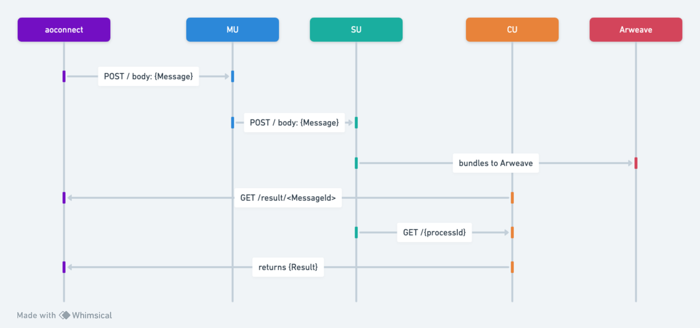

# Messages

The Message serves as the fundamental data protocol unit within ao, crafted from [ANS-104 DataItems](https://specs.g8way.io/?tx=xwOgX-MmqN5_-Ny_zNu2A8o-PnTGsoRb_3FrtiMAkuw), thereby aligning with the native structure of Arweave. When engaged in a Process, a Message is structured as follows:

```lua
{
    Cron = false,
    Data = "Hello aos",
    Epoch = 0,
    From = "5WzR7rJCuqCKEq02WUPhTjwnzllLjGu6SA7qhYpcKRs",
    Id = "ayVo53qvZswpvxLlhMf8xmGjwxN0LGuHzzQpTLT0_do",
    Nonce = 1,
    Owner = "z1pq2WzmaYnfDwvEFgUZBj48anUsxxN64ZjbWOsIn08",
    Signature = "...",
    Tags = {
        Type = "Message",
        Variant = "ao.TN.1",
        ["Data-Protocol"] = "ao",
        ["From-Module"] = "lXfdCypsU3BpYTWvupgTioLoZAEOZL2_Ihcqepz6RiQ",
        ["From-Process"] = "5WzR7rJCuqCKEq02WUPhTjwnzllLjGu6SA7qhYpcKRs"
    },
    Target = "5WzR7rJCuqCKEq02WUPhTjwnzllLjGu6SA7qhYpcKRs",
    Timestamp = 1704936415711,
    ["Block-Height"] = 1340762,
    ["Forwarded-By"] = "z1pq2WzmaYnfDwvEFgUZBj48anUsxxN64ZjbWOsIn08",
    ["Hash-Chain"] = "hJ0B-0yxKxeL3IIfaIIF7Yr6bFLG2vQayaF8G0EpjbY"
}
```

This architecture merges the Assignment Type with the Message Type, granting the Process a comprehensive understanding of the Message's context for effective processing.

When sending a message, here is a visual diagram of how the messages travels through the ao computer.



The message workflow initiates with the MU (Messenger Unit), where the message's signature is authenticated. Following this, the SU (Scheduler Unit) allocates an Epoch and Nonce to the message, bundles the message with an Assignment Type, and dispatches it to Arweave. Subsequently, the `aoconnect` library retrieves the outcome from the CU (Compute Unit). The CU then calls for all preceding messages leading up to the current Message Id from the SU (Scheduler Unit), processes them to deduce the result. Upon completion, the computed result is conveyed back to `aoconnect`, which is integrated within client interfaces such as `aos`.

## Ethereum Signed Message

If the Message [ANS-104 DataItem](https://specs.g8way.io/?tx=xwOgX-MmqN5_-Ny_zNu2A8o-PnTGsoRb_3FrtiMAkuw) was signed using Ethereum keys,
then the value in the `Owner` and `From` fields will be the
[EIP-55](https://github.com/ethereum/ercs/blob/master/ERCS/erc-55.md) Ethereum address of the signer.
For example: `0xfB6916095ca1df60bB79Ce92cE3Ea74c37c5d359`.

## Summary

Messages serve as the primary data protocol type for the ao network, leveraging ANS-104 Data-Items native to Arweave. Messages contain several fields including data content, origin, target, and cryptographic elements like signatures and nonces. They follow a journey starting at the Messenger Unit (MU), which ensures they are signed, through the Scheduler Unit (SU) that timestamps and sequences them, before being bundled and published to Arweave. The `aoconnect` library then reads the result from the Compute Unit (CU), which processes messages to calculate results and sends responses back through `aoconnect`, utilized by clients such as `aos`. The CU is the execution environment for these processes.
