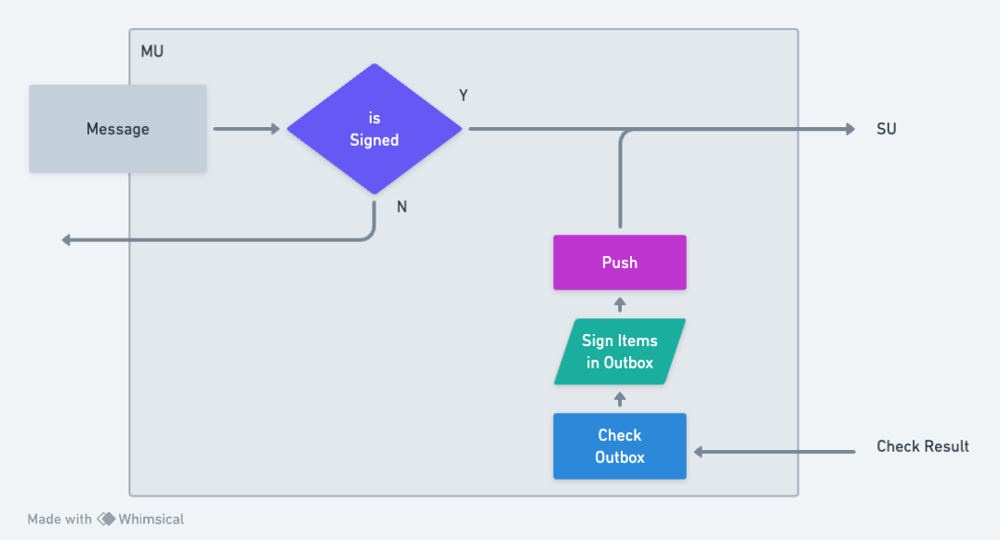
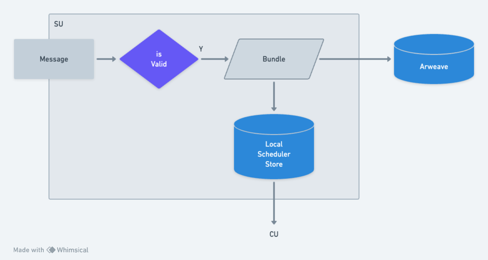
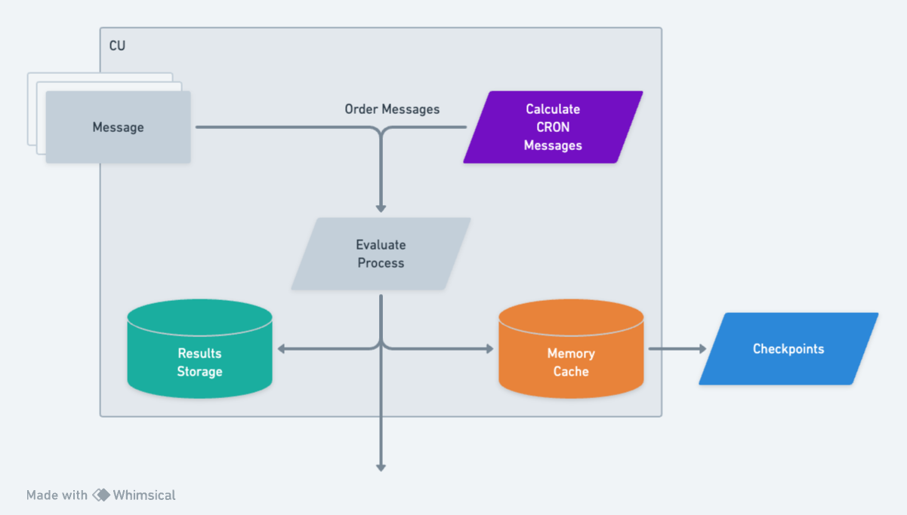

# Units

<svg width="100%" height="472" viewBox="0 0 830 472" fill="none" xmlns="http://www.w3.org/2000/svg">
<g clip-path="url(#clip0_238_127)">
<rect x="0.5" y="0.5" width="409" height="445" rx="9.5" fill="#E6E6E6"></rect>
<rect x="0.5" y="0.5" width="409" height="445" rx="9.5" stroke="#CACACA"></rect>
<rect x="10" y="10" width="190" height="426" rx="8" fill="#C3C3C3"></rect>
<path d="M74.7773 219.469L76.166 223.734L77.666 219.469H79.0137V228H77.959V224.596L78.0469 221.033L76.4707 225.627H75.8496L74.4023 221.156L74.4902 224.596V228H73.4355V219.469H74.7773ZM85.4883 224.057H81.9258V227.08H86.0801V228H80.8418V219.469H86.0273V220.395H81.9258V223.137H85.4883V224.057ZM92.4668 225.844C92.4668 225.582 92.4062 225.361 92.2852 225.182C92.168 225.002 92.0156 224.85 91.8281 224.725C91.6406 224.604 91.4336 224.502 91.207 224.42C90.9844 224.338 90.7695 224.264 90.5625 224.197C90.2617 224.1 89.9551 223.982 89.6426 223.846C89.334 223.705 89.0527 223.537 88.7988 223.342C88.541 223.143 88.3301 222.908 88.166 222.639C88.0059 222.365 87.9258 222.045 87.9258 221.678C87.9258 221.311 88.0059 220.982 88.166 220.693C88.3301 220.404 88.543 220.16 88.8047 219.961C89.0664 219.762 89.3633 219.611 89.6953 219.51C90.0273 219.404 90.3613 219.352 90.6973 219.352C91.0684 219.352 91.4258 219.414 91.7695 219.539C92.1133 219.66 92.418 219.832 92.6836 220.055C92.9492 220.277 93.1621 220.547 93.3223 220.863C93.4824 221.18 93.5664 221.533 93.5742 221.924H92.4609C92.4297 221.678 92.3691 221.455 92.2793 221.256C92.1895 221.053 92.0703 220.879 91.9219 220.734C91.7734 220.59 91.5957 220.479 91.3887 220.4C91.1855 220.318 90.9551 220.277 90.6973 220.277C90.4902 220.277 90.2871 220.307 90.0879 220.365C89.8926 220.424 89.7188 220.512 89.5664 220.629C89.4102 220.746 89.2852 220.891 89.1914 221.062C89.1016 221.234 89.0566 221.434 89.0566 221.66C89.0605 221.906 89.123 222.115 89.2441 222.287C89.3652 222.455 89.5195 222.598 89.707 222.715C89.8906 222.832 90.0898 222.93 90.3047 223.008C90.5234 223.086 90.7285 223.154 90.9199 223.213C91.2363 223.311 91.5527 223.43 91.8691 223.57C92.1855 223.707 92.4746 223.883 92.7363 224.098C92.9941 224.297 93.2012 224.541 93.3574 224.83C93.5176 225.119 93.5977 225.453 93.5977 225.832C93.5977 226.215 93.5117 226.549 93.3398 226.834C93.1719 227.119 92.9531 227.355 92.6836 227.543C92.4141 227.734 92.1094 227.879 91.7695 227.977C91.4297 228.07 91.0898 228.117 90.75 228.117C90.3438 228.117 89.9434 228.049 89.5488 227.912C89.1582 227.775 88.8184 227.578 88.5293 227.32C88.2715 227.098 88.0664 226.838 87.9141 226.541C87.7656 226.24 87.6855 225.906 87.6738 225.539H88.7812C88.8164 225.805 88.8887 226.041 88.998 226.248C89.1074 226.451 89.248 226.623 89.4199 226.764C89.5918 226.908 89.7891 227.018 90.0117 227.092C90.2383 227.162 90.4844 227.197 90.75 227.197C90.9609 227.197 91.168 227.172 91.3711 227.121C91.5781 227.066 91.7617 226.982 91.9219 226.869C92.082 226.76 92.2129 226.621 92.3145 226.453C92.416 226.281 92.4668 226.078 92.4668 225.844ZM99.6738 225.844C99.6738 225.582 99.6133 225.361 99.4922 225.182C99.375 225.002 99.2227 224.85 99.0352 224.725C98.8477 224.604 98.6406 224.502 98.4141 224.42C98.1914 224.338 97.9766 224.264 97.7695 224.197C97.4688 224.1 97.1621 223.982 96.8496 223.846C96.541 223.705 96.2598 223.537 96.0059 223.342C95.748 223.143 95.5371 222.908 95.373 222.639C95.2129 222.365 95.1328 222.045 95.1328 221.678C95.1328 221.311 95.2129 220.982 95.373 220.693C95.5371 220.404 95.75 220.16 96.0117 219.961C96.2734 219.762 96.5703 219.611 96.9023 219.51C97.2344 219.404 97.5684 219.352 97.9043 219.352C98.2754 219.352 98.6328 219.414 98.9766 219.539C99.3203 219.66 99.625 219.832 99.8906 220.055C100.156 220.277 100.369 220.547 100.529 220.863C100.689 221.18 100.773 221.533 100.781 221.924H99.668C99.6367 221.678 99.5762 221.455 99.4863 221.256C99.3965 221.053 99.2773 220.879 99.1289 220.734C98.9805 220.59 98.8027 220.479 98.5957 220.4C98.3926 220.318 98.1621 220.277 97.9043 220.277C97.6973 220.277 97.4941 220.307 97.2949 220.365C97.0996 220.424 96.9258 220.512 96.7734 220.629C96.6172 220.746 96.4922 220.891 96.3984 221.062C96.3086 221.234 96.2637 221.434 96.2637 221.66C96.2676 221.906 96.3301 222.115 96.4512 222.287C96.5723 222.455 96.7266 222.598 96.9141 222.715C97.0977 222.832 97.2969 222.93 97.5117 223.008C97.7305 223.086 97.9355 223.154 98.127 223.213C98.4434 223.311 98.7598 223.43 99.0762 223.57C99.3926 223.707 99.6816 223.883 99.9434 224.098C100.201 224.297 100.408 224.541 100.564 224.83C100.725 225.119 100.805 225.453 100.805 225.832C100.805 226.215 100.719 226.549 100.547 226.834C100.379 227.119 100.16 227.355 99.8906 227.543C99.6211 227.734 99.3164 227.879 98.9766 227.977C98.6367 228.07 98.2969 228.117 97.957 228.117C97.5508 228.117 97.1504 228.049 96.7559 227.912C96.3652 227.775 96.0254 227.578 95.7363 227.32C95.4785 227.098 95.2734 226.838 95.1211 226.541C94.9727 226.24 94.8926 225.906 94.8809 225.539H95.9883C96.0234 225.805 96.0957 226.041 96.2051 226.248C96.3145 226.451 96.4551 226.623 96.627 226.764C96.7988 226.908 96.9961 227.018 97.2188 227.092C97.4453 227.162 97.6914 227.197 97.957 227.197C98.168 227.197 98.375 227.172 98.5781 227.121C98.7852 227.066 98.9688 226.982 99.1289 226.869C99.2891 226.76 99.4199 226.621 99.5215 226.453C99.623 226.281 99.6738 226.078 99.6738 225.844ZM107.109 224.057H103.547V227.08H107.701V228H102.463V219.469H107.648V220.395H103.547V223.137H107.109V224.057ZM114.967 228H113.865L110.555 221.625L110.537 228H109.441V219.469H110.543L113.854 225.832L113.871 219.469H114.967V228ZM122.35 226.881C122.217 227.037 122.076 227.18 121.928 227.309C121.779 227.434 121.625 227.543 121.465 227.637C121.191 227.801 120.896 227.922 120.58 228C120.264 228.082 119.932 228.121 119.584 228.117C119.232 228.113 118.908 228.061 118.611 227.959C118.318 227.854 118.055 227.709 117.82 227.525C117.586 227.346 117.381 227.133 117.205 226.887C117.029 226.641 116.883 226.373 116.766 226.084C116.645 225.799 116.553 225.5 116.49 225.188C116.432 224.871 116.4 224.553 116.396 224.232V223.242C116.4 222.926 116.428 222.611 116.479 222.299C116.533 221.982 116.615 221.68 116.725 221.391C116.834 221.102 116.971 220.834 117.135 220.588C117.299 220.338 117.496 220.121 117.727 219.938C117.953 219.758 118.211 219.615 118.5 219.51C118.789 219.404 119.113 219.352 119.473 219.352C119.871 219.352 120.238 219.414 120.574 219.539C120.91 219.66 121.203 219.834 121.453 220.061C121.703 220.291 121.904 220.568 122.057 220.893C122.209 221.213 122.303 221.572 122.338 221.971H121.266C121.223 221.725 121.156 221.498 121.066 221.291C120.977 221.08 120.859 220.9 120.715 220.752C120.566 220.604 120.391 220.488 120.188 220.406C119.984 220.32 119.748 220.277 119.479 220.277C119.221 220.277 118.992 220.322 118.793 220.412C118.594 220.498 118.42 220.615 118.271 220.764C118.123 220.912 118 221.086 117.902 221.285C117.805 221.48 117.725 221.688 117.662 221.906C117.6 222.125 117.555 222.348 117.527 222.574C117.5 222.801 117.486 223.02 117.486 223.23V224.232C117.49 224.447 117.508 224.67 117.539 224.9C117.574 225.127 117.627 225.35 117.697 225.568C117.768 225.787 117.857 225.994 117.967 226.189C118.076 226.385 118.209 226.557 118.365 226.705C118.518 226.854 118.695 226.973 118.898 227.062C119.102 227.148 119.332 227.193 119.59 227.197C119.738 227.201 119.893 227.195 120.053 227.18C120.217 227.164 120.375 227.133 120.527 227.086C120.68 227.039 120.822 226.977 120.955 226.898C121.088 226.816 121.199 226.711 121.289 226.582L121.301 224.666H119.566V223.752H122.332L122.35 226.881ZM128.73 224.057H125.168V227.08H129.322V228H124.084V219.469H129.27V220.395H125.168V223.137H128.73V224.057ZM134.068 224.52H132.363V228H131.285V219.469H133.787C134.186 219.477 134.561 219.533 134.912 219.639C135.264 219.744 135.572 219.902 135.838 220.113C136.1 220.324 136.305 220.59 136.453 220.91C136.605 221.227 136.682 221.6 136.682 222.029C136.682 222.307 136.641 222.561 136.559 222.791C136.48 223.021 136.371 223.23 136.23 223.418C136.09 223.605 135.922 223.771 135.727 223.916C135.531 224.061 135.316 224.184 135.082 224.285L136.893 227.93L136.887 228H135.744L134.068 224.52ZM132.363 223.629H133.816C134.059 223.625 134.287 223.588 134.502 223.518C134.717 223.443 134.906 223.338 135.07 223.201C135.23 223.064 135.357 222.898 135.451 222.703C135.545 222.504 135.592 222.275 135.592 222.018C135.592 221.744 135.547 221.506 135.457 221.303C135.367 221.096 135.242 220.922 135.082 220.781C134.922 220.645 134.73 220.541 134.508 220.471C134.289 220.4 134.049 220.363 133.787 220.359H132.363V223.629Z" fill="black"></path>
<rect x="210" y="10" width="190" height="426" rx="8" fill="#C3C3C3"></rect>
<path d="M278.053 225.844C278.053 225.582 277.992 225.361 277.871 225.182C277.754 225.002 277.602 224.85 277.414 224.725C277.227 224.604 277.02 224.502 276.793 224.42C276.57 224.338 276.355 224.264 276.148 224.197C275.848 224.1 275.541 223.982 275.229 223.846C274.92 223.705 274.639 223.537 274.385 223.342C274.127 223.143 273.916 222.908 273.752 222.639C273.592 222.365 273.512 222.045 273.512 221.678C273.512 221.311 273.592 220.982 273.752 220.693C273.916 220.404 274.129 220.16 274.391 219.961C274.652 219.762 274.949 219.611 275.281 219.51C275.613 219.404 275.947 219.352 276.283 219.352C276.654 219.352 277.012 219.414 277.355 219.539C277.699 219.66 278.004 219.832 278.27 220.055C278.535 220.277 278.748 220.547 278.908 220.863C279.068 221.18 279.152 221.533 279.16 221.924H278.047C278.016 221.678 277.955 221.455 277.865 221.256C277.775 221.053 277.656 220.879 277.508 220.734C277.359 220.59 277.182 220.479 276.975 220.4C276.771 220.318 276.541 220.277 276.283 220.277C276.076 220.277 275.873 220.307 275.674 220.365C275.479 220.424 275.305 220.512 275.152 220.629C274.996 220.746 274.871 220.891 274.777 221.062C274.688 221.234 274.643 221.434 274.643 221.66C274.646 221.906 274.709 222.115 274.83 222.287C274.951 222.455 275.105 222.598 275.293 222.715C275.477 222.832 275.676 222.93 275.891 223.008C276.109 223.086 276.314 223.154 276.506 223.213C276.822 223.311 277.139 223.43 277.455 223.57C277.771 223.707 278.061 223.883 278.322 224.098C278.58 224.297 278.787 224.541 278.943 224.83C279.104 225.119 279.184 225.453 279.184 225.832C279.184 226.215 279.098 226.549 278.926 226.834C278.758 227.119 278.539 227.355 278.27 227.543C278 227.734 277.695 227.879 277.355 227.977C277.016 228.07 276.676 228.117 276.336 228.117C275.93 228.117 275.529 228.049 275.135 227.912C274.744 227.775 274.404 227.578 274.115 227.32C273.857 227.098 273.652 226.838 273.5 226.541C273.352 226.24 273.271 225.906 273.26 225.539H274.367C274.402 225.805 274.475 226.041 274.584 226.248C274.693 226.451 274.834 226.623 275.006 226.764C275.178 226.908 275.375 227.018 275.598 227.092C275.824 227.162 276.07 227.197 276.336 227.197C276.547 227.197 276.754 227.172 276.957 227.121C277.164 227.066 277.348 226.982 277.508 226.869C277.668 226.76 277.799 226.621 277.9 226.453C278.002 226.281 278.053 226.078 278.053 225.844ZM286.32 225.434C286.27 225.828 286.168 226.191 286.016 226.523C285.863 226.852 285.666 227.133 285.424 227.367C285.178 227.605 284.887 227.791 284.551 227.924C284.219 228.053 283.848 228.117 283.438 228.117C283.086 228.117 282.766 228.068 282.477 227.971C282.191 227.869 281.938 227.73 281.715 227.555C281.488 227.379 281.293 227.172 281.129 226.934C280.969 226.695 280.836 226.436 280.73 226.154C280.621 225.873 280.539 225.578 280.484 225.27C280.434 224.961 280.406 224.648 280.402 224.332V223.143C280.406 222.826 280.434 222.514 280.484 222.205C280.539 221.896 280.621 221.602 280.73 221.32C280.836 221.039 280.969 220.779 281.129 220.541C281.293 220.299 281.488 220.09 281.715 219.914C281.938 219.738 282.191 219.602 282.477 219.504C282.762 219.402 283.082 219.352 283.438 219.352C283.863 219.352 284.244 219.418 284.58 219.551C284.916 219.68 285.205 219.863 285.447 220.102C285.689 220.344 285.883 220.633 286.027 220.969C286.176 221.305 286.273 221.676 286.32 222.082H285.236C285.201 221.824 285.141 221.584 285.055 221.361C284.969 221.139 284.854 220.943 284.709 220.775C284.564 220.607 284.387 220.477 284.176 220.383C283.969 220.285 283.723 220.236 283.438 220.236C283.18 220.236 282.951 220.279 282.752 220.365C282.557 220.447 282.389 220.561 282.248 220.705C282.104 220.85 281.982 221.018 281.885 221.209C281.791 221.4 281.715 221.604 281.656 221.818C281.598 222.033 281.555 222.254 281.527 222.48C281.504 222.703 281.492 222.92 281.492 223.131V224.332C281.492 224.543 281.504 224.762 281.527 224.988C281.555 225.211 281.598 225.43 281.656 225.645C281.715 225.863 281.791 226.068 281.885 226.26C281.979 226.451 282.098 226.619 282.242 226.764C282.387 226.912 282.557 227.029 282.752 227.115C282.947 227.197 283.176 227.238 283.438 227.238C283.723 227.238 283.969 227.193 284.176 227.104C284.387 227.014 284.564 226.887 284.709 226.723C284.854 226.562 284.969 226.373 285.055 226.154C285.141 225.932 285.201 225.691 285.236 225.434H286.32ZM293.352 228H292.326V224.057H288.828V228H287.809V219.469H288.828V223.137H292.326V219.469H293.352V228ZM299.902 224.057H296.34V227.08H300.494V228H295.256V219.469H300.441V220.395H296.34V223.137H299.902V224.057ZM302.305 228V219.469H304.279C304.611 219.473 304.924 219.508 305.217 219.574C305.514 219.637 305.787 219.727 306.037 219.844C306.385 220.004 306.691 220.215 306.957 220.477C307.227 220.734 307.441 221.033 307.602 221.373C307.746 221.662 307.855 221.979 307.93 222.322C308.008 222.666 308.049 223.033 308.053 223.424V224.051C308.053 224.426 308.016 224.781 307.941 225.117C307.871 225.453 307.768 225.762 307.631 226.043C307.49 226.336 307.312 226.602 307.098 226.84C306.883 227.078 306.643 227.281 306.377 227.449C306.096 227.625 305.777 227.76 305.422 227.854C305.07 227.947 304.689 227.996 304.279 228H302.305ZM303.406 220.359V227.115H304.279C304.592 227.111 304.875 227.072 305.129 226.998C305.387 226.924 305.615 226.818 305.814 226.682C306.025 226.541 306.207 226.369 306.359 226.166C306.516 225.959 306.639 225.729 306.729 225.475C306.807 225.268 306.865 225.045 306.904 224.807C306.943 224.564 306.965 224.312 306.969 224.051V223.412C306.965 223.146 306.941 222.893 306.898 222.65C306.859 222.404 306.799 222.176 306.717 221.965C306.611 221.691 306.469 221.445 306.289 221.227C306.113 221.004 305.896 220.824 305.639 220.688C305.455 220.586 305.25 220.508 305.023 220.453C304.797 220.395 304.549 220.363 304.279 220.359H303.406ZM314.979 219.469L314.99 225.246C314.99 225.645 314.92 226.018 314.779 226.365C314.639 226.713 314.445 227.016 314.199 227.273C313.953 227.535 313.66 227.742 313.32 227.895C312.98 228.043 312.607 228.117 312.201 228.117C311.787 228.117 311.41 228.043 311.07 227.895C310.73 227.746 310.439 227.541 310.197 227.279C309.955 227.021 309.766 226.719 309.629 226.371C309.492 226.02 309.422 225.645 309.418 225.246L309.43 219.469H310.461L310.484 225.246C310.488 225.5 310.527 225.744 310.602 225.979C310.68 226.213 310.791 226.42 310.936 226.6C311.076 226.779 311.252 226.924 311.463 227.033C311.678 227.143 311.924 227.197 312.201 227.197C312.479 227.197 312.723 227.145 312.934 227.039C313.145 226.93 313.322 226.783 313.467 226.6C313.607 226.42 313.715 226.213 313.789 225.979C313.863 225.744 313.904 225.5 313.912 225.246L313.93 219.469H314.979ZM318.055 227.08H322.227V228H316.971V219.469H318.055V227.08ZM328.73 224.057H325.168V227.08H329.322V228H324.084V219.469H329.27V220.395H325.168V223.137H328.73V224.057ZM334.068 224.52H332.363V228H331.285V219.469H333.787C334.186 219.477 334.561 219.533 334.912 219.639C335.264 219.744 335.572 219.902 335.838 220.113C336.1 220.324 336.305 220.59 336.453 220.91C336.605 221.227 336.682 221.6 336.682 222.029C336.682 222.307 336.641 222.561 336.559 222.791C336.48 223.021 336.371 223.23 336.23 223.418C336.09 223.605 335.922 223.771 335.727 223.916C335.531 224.061 335.316 224.184 335.082 224.285L336.893 227.93L336.887 228H335.744L334.068 224.52ZM332.363 223.629H333.816C334.059 223.625 334.287 223.588 334.502 223.518C334.717 223.443 334.906 223.338 335.07 223.201C335.23 223.064 335.357 222.898 335.451 222.703C335.545 222.504 335.592 222.275 335.592 222.018C335.592 221.744 335.547 221.506 335.457 221.303C335.367 221.096 335.242 220.922 335.082 220.781C334.922 220.645 334.73 220.541 334.508 220.471C334.289 220.4 334.049 220.363 333.787 220.359H332.363V223.629Z" fill="black"></path>
<rect x="420.5" y="0.5" width="409" height="103" rx="9.5" fill="#D1D1D1"></rect>
<rect x="420.5" y="0.5" width="409" height="103" rx="9.5" stroke="#CACACA"></rect>
<path d="M435.454 17.8613C435.412 18.1901 435.327 18.4928 435.2 18.7695C435.073 19.043 434.909 19.2773 434.707 19.4727C434.502 19.6712 434.259 19.8258 433.979 19.9365C433.703 20.0439 433.394 20.0977 433.052 20.0977C432.759 20.0977 432.492 20.057 432.251 19.9756C432.013 19.891 431.802 19.7754 431.616 19.6289C431.427 19.4824 431.265 19.3099 431.128 19.1113C430.994 18.9128 430.884 18.6963 430.796 18.4619C430.705 18.2275 430.636 17.9818 430.591 17.7246C430.549 17.4674 430.526 17.207 430.522 16.9434V15.9521C430.526 15.6885 430.549 15.4281 430.591 15.1709C430.636 14.9137 430.705 14.668 430.796 14.4336C430.884 14.1992 430.994 13.9827 431.128 13.7842C431.265 13.5824 431.427 13.4082 431.616 13.2617C431.802 13.1152 432.013 13.0013 432.251 12.9199C432.489 12.8353 432.756 12.793 433.052 12.793C433.407 12.793 433.724 12.8483 434.004 12.959C434.284 13.0664 434.525 13.2194 434.727 13.418C434.928 13.6198 435.09 13.8607 435.21 14.1406C435.334 14.4206 435.415 14.7298 435.454 15.0684H434.551C434.521 14.8535 434.471 14.6533 434.399 14.4678C434.328 14.2822 434.232 14.1195 434.111 13.9795C433.991 13.8395 433.843 13.7305 433.667 13.6523C433.494 13.571 433.289 13.5303 433.052 13.5303C432.837 13.5303 432.646 13.5661 432.48 13.6377C432.318 13.7061 432.178 13.8005 432.061 13.9209C431.94 14.0413 431.839 14.1813 431.758 14.3408C431.68 14.5003 431.616 14.6696 431.567 14.8486C431.519 15.0277 431.483 15.2116 431.46 15.4004C431.44 15.5859 431.431 15.7666 431.431 15.9424V16.9434C431.431 17.1191 431.44 17.3014 431.46 17.4902C431.483 17.6758 431.519 17.8581 431.567 18.0371C431.616 18.2194 431.68 18.3903 431.758 18.5498C431.836 18.7093 431.935 18.8493 432.056 18.9697C432.176 19.0934 432.318 19.1911 432.48 19.2627C432.643 19.3311 432.834 19.3652 433.052 19.3652C433.289 19.3652 433.494 19.3278 433.667 19.2529C433.843 19.1781 433.991 19.0723 434.111 18.9355C434.232 18.8021 434.328 18.6442 434.399 18.4619C434.471 18.2764 434.521 18.0762 434.551 17.8613H435.454ZM441.479 16.8555C441.476 17.1094 441.453 17.3665 441.411 17.627C441.372 17.8841 441.31 18.1331 441.226 18.374C441.141 18.6149 441.032 18.8395 440.898 19.0479C440.768 19.2562 440.612 19.4385 440.43 19.5947C440.247 19.751 440.037 19.8747 439.8 19.9658C439.565 20.0537 439.302 20.0977 439.009 20.0977C438.716 20.0977 438.451 20.0537 438.213 19.9658C437.979 19.8747 437.77 19.751 437.588 19.5947C437.406 19.4385 437.248 19.2562 437.114 19.0479C436.981 18.8363 436.872 18.61 436.787 18.3691C436.699 18.1283 436.634 17.8792 436.592 17.6221C436.549 17.3649 436.527 17.1094 436.523 16.8555V16.0449C436.527 15.791 436.548 15.5355 436.587 15.2783C436.629 15.0179 436.694 14.7673 436.782 14.5264C436.867 14.2855 436.974 14.0609 437.104 13.8525C437.238 13.641 437.396 13.4554 437.578 13.2959C437.76 13.1396 437.969 13.0176 438.203 12.9297C438.441 12.8385 438.706 12.793 438.999 12.793C439.292 12.793 439.557 12.8385 439.795 12.9297C440.033 13.0176 440.243 13.1396 440.425 13.2959C440.607 13.4521 440.763 13.6361 440.894 13.8477C441.027 14.056 441.138 14.2806 441.226 14.5215C441.31 14.7624 441.372 15.013 441.411 15.2734C441.453 15.5339 441.476 15.791 441.479 16.0449V16.8555ZM440.586 16.0352C440.583 15.8659 440.571 15.6901 440.552 15.5078C440.532 15.3223 440.5 15.1383 440.454 14.9561C440.405 14.777 440.342 14.6061 440.264 14.4434C440.186 14.2773 440.088 14.1309 439.971 14.0039C439.854 13.8802 439.715 13.7826 439.556 13.7109C439.396 13.6361 439.211 13.5986 438.999 13.5986C438.791 13.5986 438.607 13.6361 438.447 13.7109C438.288 13.7858 438.149 13.8851 438.032 14.0088C437.915 14.1357 437.817 14.2822 437.739 14.4482C437.661 14.611 437.599 14.7819 437.554 14.9609C437.505 15.1432 437.469 15.3271 437.446 15.5127C437.427 15.695 437.415 15.8691 437.412 16.0352V16.8555C437.415 17.0215 437.427 17.1973 437.446 17.3828C437.469 17.5684 437.505 17.7507 437.554 17.9297C437.603 18.112 437.666 18.2861 437.744 18.4521C437.822 18.6182 437.92 18.763 438.037 18.8867C438.154 19.0137 438.293 19.1146 438.452 19.1895C438.612 19.2643 438.797 19.3018 439.009 19.3018C439.22 19.3018 439.406 19.2643 439.565 19.1895C439.728 19.1146 439.868 19.0137 439.985 18.8867C440.099 18.763 440.194 18.6198 440.269 18.457C440.347 18.291 440.41 18.1169 440.459 17.9346C440.505 17.7555 440.535 17.5732 440.552 17.3877C440.571 17.2021 440.583 17.0247 440.586 16.8555V16.0352ZM443.853 12.8906L445.01 16.4453L446.26 12.8906H447.383V20H446.504V17.1631L446.577 14.1943L445.264 18.0225H444.746L443.54 14.2969L443.613 17.1631V20H442.734V12.8906H443.853ZM449.854 17.1484V20H448.95V12.8906H451.255C451.574 12.8971 451.875 12.9476 452.158 13.042C452.445 13.1364 452.695 13.2731 452.91 13.4521C453.125 13.6312 453.294 13.8525 453.418 14.1162C453.545 14.3799 453.608 14.6826 453.608 15.0244C453.608 15.3662 453.545 15.6689 453.418 15.9326C453.294 16.193 453.125 16.4128 452.91 16.5918C452.695 16.7708 452.445 16.9076 452.158 17.002C451.875 17.0964 451.574 17.1452 451.255 17.1484H449.854ZM449.854 16.4062H451.255C451.463 16.403 451.655 16.3704 451.831 16.3086C452.007 16.2435 452.16 16.1523 452.29 16.0352C452.42 15.918 452.521 15.7764 452.593 15.6104C452.668 15.4411 452.705 15.249 452.705 15.0342C452.705 14.8193 452.668 14.6257 452.593 14.4531C452.521 14.2806 452.422 14.1341 452.295 14.0137C452.165 13.8932 452.01 13.8005 451.831 13.7354C451.655 13.6702 451.463 13.6361 451.255 13.6328H449.854V16.4062ZM459.336 12.8906L459.346 17.7051C459.346 18.0371 459.287 18.348 459.17 18.6377C459.053 18.9274 458.892 19.1797 458.687 19.3945C458.481 19.6126 458.237 19.7852 457.954 19.9121C457.671 20.0358 457.36 20.0977 457.021 20.0977C456.676 20.0977 456.362 20.0358 456.079 19.9121C455.796 19.7884 455.553 19.6175 455.352 19.3994C455.15 19.1846 454.992 18.9323 454.878 18.6426C454.764 18.3496 454.705 18.0371 454.702 17.7051L454.712 12.8906H455.571L455.591 17.7051C455.594 17.9167 455.627 18.1201 455.688 18.3154C455.754 18.5107 455.846 18.6833 455.967 18.833C456.084 18.9827 456.23 19.1032 456.406 19.1943C456.585 19.2855 456.79 19.3311 457.021 19.3311C457.253 19.3311 457.456 19.2871 457.632 19.1992C457.808 19.1081 457.956 18.986 458.076 18.833C458.193 18.6833 458.283 18.5107 458.345 18.3154C458.407 18.1201 458.441 17.9167 458.447 17.7051L458.462 12.8906H459.336ZM465.674 13.6621H463.477V20H462.598V13.6621H460.4V12.8906H465.674V13.6621ZM470.796 16.7139H467.827V19.2334H471.289V20H466.924V12.8906H471.245V13.6621H467.827V15.9473H470.796V16.7139ZM483.359 12.8906L483.369 17.7051C483.369 18.0371 483.311 18.348 483.193 18.6377C483.076 18.9274 482.915 19.1797 482.71 19.3945C482.505 19.6126 482.261 19.7852 481.978 19.9121C481.694 20.0358 481.383 20.0977 481.045 20.0977C480.7 20.0977 480.386 20.0358 480.103 19.9121C479.819 19.7884 479.577 19.6175 479.375 19.3994C479.173 19.1846 479.015 18.9323 478.901 18.6426C478.787 18.3496 478.729 18.0371 478.726 17.7051L478.735 12.8906H479.595L479.614 17.7051C479.618 17.9167 479.65 18.1201 479.712 18.3154C479.777 18.5107 479.87 18.6833 479.99 18.833C480.107 18.9827 480.254 19.1032 480.43 19.1943C480.609 19.2855 480.814 19.3311 481.045 19.3311C481.276 19.3311 481.479 19.2871 481.655 19.1992C481.831 19.1081 481.979 18.986 482.1 18.833C482.217 18.6833 482.306 18.5107 482.368 18.3154C482.43 18.1201 482.464 17.9167 482.471 17.7051L482.485 12.8906H483.359ZM489.355 20H488.438L485.679 14.6875L485.664 20H484.751V12.8906H485.669L488.428 18.1934L488.442 12.8906H489.355V20ZM490.908 12.8906H495.205V13.6768H493.501V19.2188H495.205V20H490.908V19.2188H492.573V13.6768H490.908V12.8906ZM501.709 13.6621H499.512V20H498.633V13.6621H496.436V12.8906H501.709V13.6621Z" fill="black"></path>
<rect x="430" y="33" width="190" height="25.5" rx="4" fill="#E6E6E6"></rect>
<path d="M494.771 47.3281V50.75H493.688V42.2188H496.453C496.836 42.2266 497.197 42.2871 497.537 42.4004C497.881 42.5137 498.182 42.6777 498.439 42.8926C498.697 43.1074 498.9 43.373 499.049 43.6895C499.201 44.0059 499.277 44.3691 499.277 44.7793C499.277 45.1895 499.201 45.5527 499.049 45.8691C498.9 46.1816 498.697 46.4453 498.439 46.6602C498.182 46.875 497.881 47.0391 497.537 47.1523C497.197 47.2656 496.836 47.3242 496.453 47.3281H494.771ZM494.771 46.4375H496.453C496.703 46.4336 496.934 46.3945 497.145 46.3203C497.355 46.2422 497.539 46.1328 497.695 45.9922C497.852 45.8516 497.973 45.6816 498.059 45.4824C498.148 45.2793 498.193 45.0488 498.193 44.791C498.193 44.5332 498.148 44.3008 498.059 44.0938C497.973 43.8867 497.854 43.7109 497.701 43.5664C497.545 43.4219 497.359 43.3105 497.145 43.2324C496.934 43.1543 496.703 43.1133 496.453 43.1094H494.771V46.4375ZM503.619 47.2695H501.914V50.75H500.836V42.2188H503.338C503.736 42.2266 504.111 42.2832 504.463 42.3887C504.814 42.4941 505.123 42.6523 505.389 42.8633C505.65 43.0742 505.855 43.3398 506.004 43.6602C506.156 43.9766 506.232 44.3496 506.232 44.7793C506.232 45.0566 506.191 45.3105 506.109 45.541C506.031 45.7715 505.922 45.9805 505.781 46.168C505.641 46.3555 505.473 46.5215 505.277 46.666C505.082 46.8105 504.867 46.9336 504.633 47.0352L506.443 50.6797L506.438 50.75H505.295L503.619 47.2695ZM501.914 46.3789H503.367C503.609 46.375 503.838 46.3379 504.053 46.2676C504.268 46.1934 504.457 46.0879 504.621 45.9512C504.781 45.8145 504.908 45.6484 505.002 45.4531C505.096 45.2539 505.143 45.0254 505.143 44.7676C505.143 44.4941 505.098 44.2559 505.008 44.0527C504.918 43.8457 504.793 43.6719 504.633 43.5312C504.473 43.3945 504.281 43.291 504.059 43.2207C503.84 43.1504 503.6 43.1133 503.338 43.1094H501.914V46.3789ZM513.551 46.9766C513.547 47.2812 513.52 47.5898 513.469 47.9023C513.422 48.2109 513.348 48.5098 513.246 48.7988C513.145 49.0879 513.014 49.3574 512.854 49.6074C512.697 49.8574 512.51 50.0762 512.291 50.2637C512.072 50.4512 511.82 50.5996 511.535 50.709C511.254 50.8145 510.938 50.8672 510.586 50.8672C510.234 50.8672 509.916 50.8145 509.631 50.709C509.35 50.5996 509.1 50.4512 508.881 50.2637C508.662 50.0762 508.473 49.8574 508.312 49.6074C508.152 49.3535 508.021 49.082 507.92 48.793C507.814 48.5039 507.736 48.2051 507.686 47.8965C507.635 47.5879 507.607 47.2812 507.604 46.9766V46.0039C507.607 45.6992 507.633 45.3926 507.68 45.084C507.73 44.7715 507.809 44.4707 507.914 44.1816C508.016 43.8926 508.145 43.623 508.301 43.373C508.461 43.1191 508.65 42.8965 508.869 42.7051C509.088 42.5176 509.338 42.3711 509.619 42.2656C509.904 42.1562 510.223 42.1016 510.574 42.1016C510.926 42.1016 511.244 42.1562 511.529 42.2656C511.814 42.3711 512.066 42.5176 512.285 42.7051C512.504 42.8926 512.691 43.1133 512.848 43.3672C513.008 43.6172 513.141 43.8867 513.246 44.1758C513.348 44.4648 513.422 44.7656 513.469 45.0781C513.52 45.3906 513.547 45.6992 513.551 46.0039V46.9766ZM512.479 45.9922C512.475 45.7891 512.461 45.5781 512.438 45.3594C512.414 45.1367 512.375 44.916 512.32 44.6973C512.262 44.4824 512.186 44.2773 512.092 44.082C511.998 43.8828 511.881 43.707 511.74 43.5547C511.6 43.4062 511.434 43.2891 511.242 43.2031C511.051 43.1133 510.828 43.0684 510.574 43.0684C510.324 43.0684 510.104 43.1133 509.912 43.2031C509.721 43.293 509.555 43.4121 509.414 43.5605C509.273 43.7129 509.156 43.8887 509.062 44.0879C508.969 44.2832 508.895 44.4883 508.84 44.7031C508.781 44.9219 508.738 45.1426 508.711 45.3652C508.688 45.584 508.674 45.793 508.67 45.9922V46.9766C508.674 47.1758 508.688 47.3867 508.711 47.6094C508.738 47.832 508.781 48.0508 508.84 48.2656C508.898 48.4844 508.975 48.6934 509.068 48.8926C509.162 49.0918 509.279 49.2656 509.42 49.4141C509.561 49.5664 509.727 49.6875 509.918 49.7773C510.109 49.8672 510.332 49.9121 510.586 49.9121C510.84 49.9121 511.062 49.8672 511.254 49.7773C511.449 49.6875 511.617 49.5664 511.758 49.4141C511.895 49.2656 512.008 49.0938 512.098 48.8984C512.191 48.6992 512.268 48.4902 512.326 48.2715C512.381 48.0566 512.418 47.8379 512.438 47.6152C512.461 47.3926 512.475 47.1797 512.479 46.9766V45.9922ZM520.734 48.1836C520.684 48.5781 520.582 48.9414 520.43 49.2734C520.277 49.6016 520.08 49.8828 519.838 50.1172C519.592 50.3555 519.301 50.541 518.965 50.6738C518.633 50.8027 518.262 50.8672 517.852 50.8672C517.5 50.8672 517.18 50.8184 516.891 50.7207C516.605 50.6191 516.352 50.4805 516.129 50.3047C515.902 50.1289 515.707 49.9219 515.543 49.6836C515.383 49.4453 515.25 49.1855 515.145 48.9043C515.035 48.623 514.953 48.3281 514.898 48.0195C514.848 47.7109 514.82 47.3984 514.816 47.082V45.8926C514.82 45.5762 514.848 45.2637 514.898 44.9551C514.953 44.6465 515.035 44.3516 515.145 44.0703C515.25 43.7891 515.383 43.5293 515.543 43.291C515.707 43.0488 515.902 42.8398 516.129 42.6641C516.352 42.4883 516.605 42.3516 516.891 42.2539C517.176 42.1523 517.496 42.1016 517.852 42.1016C518.277 42.1016 518.658 42.168 518.994 42.3008C519.33 42.4297 519.619 42.6133 519.861 42.8516C520.104 43.0938 520.297 43.3828 520.441 43.7188C520.59 44.0547 520.688 44.4258 520.734 44.832H519.65C519.615 44.5742 519.555 44.334 519.469 44.1113C519.383 43.8887 519.268 43.6934 519.123 43.5254C518.979 43.3574 518.801 43.2266 518.59 43.1328C518.383 43.0352 518.137 42.9863 517.852 42.9863C517.594 42.9863 517.365 43.0293 517.166 43.1152C516.971 43.1973 516.803 43.3105 516.662 43.4551C516.518 43.5996 516.396 43.7676 516.299 43.959C516.205 44.1504 516.129 44.3535 516.07 44.5684C516.012 44.7832 515.969 45.0039 515.941 45.2305C515.918 45.4531 515.906 45.6699 515.906 45.8809V47.082C515.906 47.293 515.918 47.5117 515.941 47.7383C515.969 47.9609 516.012 48.1797 516.07 48.3945C516.129 48.6133 516.205 48.8184 516.299 49.0098C516.393 49.2012 516.512 49.3691 516.656 49.5137C516.801 49.6621 516.971 49.7793 517.166 49.8652C517.361 49.9473 517.59 49.9883 517.852 49.9883C518.137 49.9883 518.383 49.9434 518.59 49.8535C518.801 49.7637 518.979 49.6367 519.123 49.4727C519.268 49.3125 519.383 49.123 519.469 48.9043C519.555 48.6816 519.615 48.4414 519.65 48.1836H520.734ZM527.109 46.8066H523.547V49.8301H527.701V50.75H522.463V42.2188H527.648V43.1445H523.547V45.8867H527.109V46.8066ZM534.088 48.5938C534.088 48.332 534.027 48.1113 533.906 47.9316C533.789 47.752 533.637 47.5996 533.449 47.4746C533.262 47.3535 533.055 47.252 532.828 47.1699C532.605 47.0879 532.391 47.0137 532.184 46.9473C531.883 46.8496 531.576 46.7324 531.264 46.5957C530.955 46.4551 530.674 46.2871 530.42 46.0918C530.162 45.8926 529.951 45.6582 529.787 45.3887C529.627 45.1152 529.547 44.7949 529.547 44.4277C529.547 44.0605 529.627 43.7324 529.787 43.4434C529.951 43.1543 530.164 42.9102 530.426 42.7109C530.688 42.5117 530.984 42.3613 531.316 42.2598C531.648 42.1543 531.982 42.1016 532.318 42.1016C532.689 42.1016 533.047 42.1641 533.391 42.2891C533.734 42.4102 534.039 42.582 534.305 42.8047C534.57 43.0273 534.783 43.2969 534.943 43.6133C535.104 43.9297 535.188 44.2832 535.195 44.6738H534.082C534.051 44.4277 533.99 44.2051 533.9 44.0059C533.811 43.8027 533.691 43.6289 533.543 43.4844C533.395 43.3398 533.217 43.2285 533.01 43.1504C532.807 43.0684 532.576 43.0273 532.318 43.0273C532.111 43.0273 531.908 43.0566 531.709 43.1152C531.514 43.1738 531.34 43.2617 531.188 43.3789C531.031 43.4961 530.906 43.6406 530.812 43.8125C530.723 43.9844 530.678 44.1836 530.678 44.4102C530.682 44.6562 530.744 44.8652 530.865 45.0371C530.986 45.2051 531.141 45.3477 531.328 45.4648C531.512 45.582 531.711 45.6797 531.926 45.7578C532.145 45.8359 532.35 45.9043 532.541 45.9629C532.857 46.0605 533.174 46.1797 533.49 46.3203C533.807 46.457 534.096 46.6328 534.357 46.8477C534.615 47.0469 534.822 47.291 534.979 47.5801C535.139 47.8691 535.219 48.2031 535.219 48.582C535.219 48.9648 535.133 49.2988 534.961 49.584C534.793 49.8691 534.574 50.1055 534.305 50.293C534.035 50.4844 533.73 50.6289 533.391 50.7266C533.051 50.8203 532.711 50.8672 532.371 50.8672C531.965 50.8672 531.564 50.7988 531.17 50.6621C530.779 50.5254 530.439 50.3281 530.15 50.0703C529.893 49.8477 529.688 49.5879 529.535 49.291C529.387 48.9902 529.307 48.6562 529.295 48.2891H530.402C530.438 48.5547 530.51 48.791 530.619 48.998C530.729 49.2012 530.869 49.373 531.041 49.5137C531.213 49.6582 531.41 49.7676 531.633 49.8418C531.859 49.9121 532.105 49.9473 532.371 49.9473C532.582 49.9473 532.789 49.9219 532.992 49.8711C533.199 49.8164 533.383 49.7324 533.543 49.6191C533.703 49.5098 533.834 49.3711 533.936 49.2031C534.037 49.0312 534.088 48.8281 534.088 48.5938ZM541.295 48.5938C541.295 48.332 541.234 48.1113 541.113 47.9316C540.996 47.752 540.844 47.5996 540.656 47.4746C540.469 47.3535 540.262 47.252 540.035 47.1699C539.812 47.0879 539.598 47.0137 539.391 46.9473C539.09 46.8496 538.783 46.7324 538.471 46.5957C538.162 46.4551 537.881 46.2871 537.627 46.0918C537.369 45.8926 537.158 45.6582 536.994 45.3887C536.834 45.1152 536.754 44.7949 536.754 44.4277C536.754 44.0605 536.834 43.7324 536.994 43.4434C537.158 43.1543 537.371 42.9102 537.633 42.7109C537.895 42.5117 538.191 42.3613 538.523 42.2598C538.855 42.1543 539.189 42.1016 539.525 42.1016C539.896 42.1016 540.254 42.1641 540.598 42.2891C540.941 42.4102 541.246 42.582 541.512 42.8047C541.777 43.0273 541.99 43.2969 542.15 43.6133C542.311 43.9297 542.395 44.2832 542.402 44.6738H541.289C541.258 44.4277 541.197 44.2051 541.107 44.0059C541.018 43.8027 540.898 43.6289 540.75 43.4844C540.602 43.3398 540.424 43.2285 540.217 43.1504C540.014 43.0684 539.783 43.0273 539.525 43.0273C539.318 43.0273 539.115 43.0566 538.916 43.1152C538.721 43.1738 538.547 43.2617 538.395 43.3789C538.238 43.4961 538.113 43.6406 538.02 43.8125C537.93 43.9844 537.885 44.1836 537.885 44.4102C537.889 44.6562 537.951 44.8652 538.072 45.0371C538.193 45.2051 538.348 45.3477 538.535 45.4648C538.719 45.582 538.918 45.6797 539.133 45.7578C539.352 45.8359 539.557 45.9043 539.748 45.9629C540.064 46.0605 540.381 46.1797 540.697 46.3203C541.014 46.457 541.303 46.6328 541.564 46.8477C541.822 47.0469 542.029 47.291 542.186 47.5801C542.346 47.8691 542.426 48.2031 542.426 48.582C542.426 48.9648 542.34 49.2988 542.168 49.584C542 49.8691 541.781 50.1055 541.512 50.293C541.242 50.4844 540.938 50.6289 540.598 50.7266C540.258 50.8203 539.918 50.8672 539.578 50.8672C539.172 50.8672 538.771 50.7988 538.377 50.6621C537.986 50.5254 537.646 50.3281 537.357 50.0703C537.1 49.8477 536.895 49.5879 536.742 49.291C536.594 48.9902 536.514 48.6562 536.502 48.2891H537.609C537.645 48.5547 537.717 48.791 537.826 48.998C537.936 49.2012 538.076 49.373 538.248 49.5137C538.42 49.6582 538.617 49.7676 538.84 49.8418C539.066 49.9121 539.312 49.9473 539.578 49.9473C539.789 49.9473 539.996 49.9219 540.199 49.8711C540.406 49.8164 540.59 49.7324 540.75 49.6191C540.91 49.5098 541.041 49.3711 541.143 49.2031C541.244 49.0312 541.295 48.8281 541.295 48.5938ZM554.76 50.75H553.676V43.6016L551.443 44.4512V43.4609L554.672 42.2188H554.76V50.75Z" fill="black"></path>
<rect x="630" y="33" width="190" height="25.5" rx="4" fill="#E6E6E6"></rect>
<path d="M694.771 47.3281V50.75H693.688V42.2188H696.453C696.836 42.2266 697.197 42.2871 697.537 42.4004C697.881 42.5137 698.182 42.6777 698.439 42.8926C698.697 43.1074 698.9 43.373 699.049 43.6895C699.201 44.0059 699.277 44.3691 699.277 44.7793C699.277 45.1895 699.201 45.5527 699.049 45.8691C698.9 46.1816 698.697 46.4453 698.439 46.6602C698.182 46.875 697.881 47.0391 697.537 47.1523C697.197 47.2656 696.836 47.3242 696.453 47.3281H694.771ZM694.771 46.4375H696.453C696.703 46.4336 696.934 46.3945 697.145 46.3203C697.355 46.2422 697.539 46.1328 697.695 45.9922C697.852 45.8516 697.973 45.6816 698.059 45.4824C698.148 45.2793 698.193 45.0488 698.193 44.791C698.193 44.5332 698.148 44.3008 698.059 44.0938C697.973 43.8867 697.854 43.7109 697.701 43.5664C697.545 43.4219 697.359 43.3105 697.145 43.2324C696.934 43.1543 696.703 43.1133 696.453 43.1094H694.771V46.4375ZM703.619 47.2695H701.914V50.75H700.836V42.2188H703.338C703.736 42.2266 704.111 42.2832 704.463 42.3887C704.814 42.4941 705.123 42.6523 705.389 42.8633C705.65 43.0742 705.855 43.3398 706.004 43.6602C706.156 43.9766 706.232 44.3496 706.232 44.7793C706.232 45.0566 706.191 45.3105 706.109 45.541C706.031 45.7715 705.922 45.9805 705.781 46.168C705.641 46.3555 705.473 46.5215 705.277 46.666C705.082 46.8105 704.867 46.9336 704.633 47.0352L706.443 50.6797L706.438 50.75H705.295L703.619 47.2695ZM701.914 46.3789H703.367C703.609 46.375 703.838 46.3379 704.053 46.2676C704.268 46.1934 704.457 46.0879 704.621 45.9512C704.781 45.8145 704.908 45.6484 705.002 45.4531C705.096 45.2539 705.143 45.0254 705.143 44.7676C705.143 44.4941 705.098 44.2559 705.008 44.0527C704.918 43.8457 704.793 43.6719 704.633 43.5312C704.473 43.3945 704.281 43.291 704.059 43.2207C703.84 43.1504 703.6 43.1133 703.338 43.1094H701.914V46.3789ZM713.551 46.9766C713.547 47.2812 713.52 47.5898 713.469 47.9023C713.422 48.2109 713.348 48.5098 713.246 48.7988C713.145 49.0879 713.014 49.3574 712.854 49.6074C712.697 49.8574 712.51 50.0762 712.291 50.2637C712.072 50.4512 711.82 50.5996 711.535 50.709C711.254 50.8145 710.938 50.8672 710.586 50.8672C710.234 50.8672 709.916 50.8145 709.631 50.709C709.35 50.5996 709.1 50.4512 708.881 50.2637C708.662 50.0762 708.473 49.8574 708.312 49.6074C708.152 49.3535 708.021 49.082 707.92 48.793C707.814 48.5039 707.736 48.2051 707.686 47.8965C707.635 47.5879 707.607 47.2812 707.604 46.9766V46.0039C707.607 45.6992 707.633 45.3926 707.68 45.084C707.73 44.7715 707.809 44.4707 707.914 44.1816C708.016 43.8926 708.145 43.623 708.301 43.373C708.461 43.1191 708.65 42.8965 708.869 42.7051C709.088 42.5176 709.338 42.3711 709.619 42.2656C709.904 42.1562 710.223 42.1016 710.574 42.1016C710.926 42.1016 711.244 42.1562 711.529 42.2656C711.814 42.3711 712.066 42.5176 712.285 42.7051C712.504 42.8926 712.691 43.1133 712.848 43.3672C713.008 43.6172 713.141 43.8867 713.246 44.1758C713.348 44.4648 713.422 44.7656 713.469 45.0781C713.52 45.3906 713.547 45.6992 713.551 46.0039V46.9766ZM712.479 45.9922C712.475 45.7891 712.461 45.5781 712.438 45.3594C712.414 45.1367 712.375 44.916 712.32 44.6973C712.262 44.4824 712.186 44.2773 712.092 44.082C711.998 43.8828 711.881 43.707 711.74 43.5547C711.6 43.4062 711.434 43.2891 711.242 43.2031C711.051 43.1133 710.828 43.0684 710.574 43.0684C710.324 43.0684 710.104 43.1133 709.912 43.2031C709.721 43.293 709.555 43.4121 709.414 43.5605C709.273 43.7129 709.156 43.8887 709.062 44.0879C708.969 44.2832 708.895 44.4883 708.84 44.7031C708.781 44.9219 708.738 45.1426 708.711 45.3652C708.688 45.584 708.674 45.793 708.67 45.9922V46.9766C708.674 47.1758 708.688 47.3867 708.711 47.6094C708.738 47.832 708.781 48.0508 708.84 48.2656C708.898 48.4844 708.975 48.6934 709.068 48.8926C709.162 49.0918 709.279 49.2656 709.42 49.4141C709.561 49.5664 709.727 49.6875 709.918 49.7773C710.109 49.8672 710.332 49.9121 710.586 49.9121C710.84 49.9121 711.062 49.8672 711.254 49.7773C711.449 49.6875 711.617 49.5664 711.758 49.4141C711.895 49.2656 712.008 49.0938 712.098 48.8984C712.191 48.6992 712.268 48.4902 712.326 48.2715C712.381 48.0566 712.418 47.8379 712.438 47.6152C712.461 47.3926 712.475 47.1797 712.479 46.9766V45.9922ZM720.734 48.1836C720.684 48.5781 720.582 48.9414 720.43 49.2734C720.277 49.6016 720.08 49.8828 719.838 50.1172C719.592 50.3555 719.301 50.541 718.965 50.6738C718.633 50.8027 718.262 50.8672 717.852 50.8672C717.5 50.8672 717.18 50.8184 716.891 50.7207C716.605 50.6191 716.352 50.4805 716.129 50.3047C715.902 50.1289 715.707 49.9219 715.543 49.6836C715.383 49.4453 715.25 49.1855 715.145 48.9043C715.035 48.623 714.953 48.3281 714.898 48.0195C714.848 47.7109 714.82 47.3984 714.816 47.082V45.8926C714.82 45.5762 714.848 45.2637 714.898 44.9551C714.953 44.6465 715.035 44.3516 715.145 44.0703C715.25 43.7891 715.383 43.5293 715.543 43.291C715.707 43.0488 715.902 42.8398 716.129 42.6641C716.352 42.4883 716.605 42.3516 716.891 42.2539C717.176 42.1523 717.496 42.1016 717.852 42.1016C718.277 42.1016 718.658 42.168 718.994 42.3008C719.33 42.4297 719.619 42.6133 719.861 42.8516C720.104 43.0938 720.297 43.3828 720.441 43.7188C720.59 44.0547 720.688 44.4258 720.734 44.832H719.65C719.615 44.5742 719.555 44.334 719.469 44.1113C719.383 43.8887 719.268 43.6934 719.123 43.5254C718.979 43.3574 718.801 43.2266 718.59 43.1328C718.383 43.0352 718.137 42.9863 717.852 42.9863C717.594 42.9863 717.365 43.0293 717.166 43.1152C716.971 43.1973 716.803 43.3105 716.662 43.4551C716.518 43.5996 716.396 43.7676 716.299 43.959C716.205 44.1504 716.129 44.3535 716.07 44.5684C716.012 44.7832 715.969 45.0039 715.941 45.2305C715.918 45.4531 715.906 45.6699 715.906 45.8809V47.082C715.906 47.293 715.918 47.5117 715.941 47.7383C715.969 47.9609 716.012 48.1797 716.07 48.3945C716.129 48.6133 716.205 48.8184 716.299 49.0098C716.393 49.2012 716.512 49.3691 716.656 49.5137C716.801 49.6621 716.971 49.7793 717.166 49.8652C717.361 49.9473 717.59 49.9883 717.852 49.9883C718.137 49.9883 718.383 49.9434 718.59 49.8535C718.801 49.7637 718.979 49.6367 719.123 49.4727C719.268 49.3125 719.383 49.123 719.469 48.9043C719.555 48.6816 719.615 48.4414 719.65 48.1836H720.734ZM727.109 46.8066H723.547V49.8301H727.701V50.75H722.463V42.2188H727.648V43.1445H723.547V45.8867H727.109V46.8066ZM734.088 48.5938C734.088 48.332 734.027 48.1113 733.906 47.9316C733.789 47.752 733.637 47.5996 733.449 47.4746C733.262 47.3535 733.055 47.252 732.828 47.1699C732.605 47.0879 732.391 47.0137 732.184 46.9473C731.883 46.8496 731.576 46.7324 731.264 46.5957C730.955 46.4551 730.674 46.2871 730.42 46.0918C730.162 45.8926 729.951 45.6582 729.787 45.3887C729.627 45.1152 729.547 44.7949 729.547 44.4277C729.547 44.0605 729.627 43.7324 729.787 43.4434C729.951 43.1543 730.164 42.9102 730.426 42.7109C730.688 42.5117 730.984 42.3613 731.316 42.2598C731.648 42.1543 731.982 42.1016 732.318 42.1016C732.689 42.1016 733.047 42.1641 733.391 42.2891C733.734 42.4102 734.039 42.582 734.305 42.8047C734.57 43.0273 734.783 43.2969 734.943 43.6133C735.104 43.9297 735.188 44.2832 735.195 44.6738H734.082C734.051 44.4277 733.99 44.2051 733.9 44.0059C733.811 43.8027 733.691 43.6289 733.543 43.4844C733.395 43.3398 733.217 43.2285 733.01 43.1504C732.807 43.0684 732.576 43.0273 732.318 43.0273C732.111 43.0273 731.908 43.0566 731.709 43.1152C731.514 43.1738 731.34 43.2617 731.188 43.3789C731.031 43.4961 730.906 43.6406 730.812 43.8125C730.723 43.9844 730.678 44.1836 730.678 44.4102C730.682 44.6562 730.744 44.8652 730.865 45.0371C730.986 45.2051 731.141 45.3477 731.328 45.4648C731.512 45.582 731.711 45.6797 731.926 45.7578C732.145 45.8359 732.35 45.9043 732.541 45.9629C732.857 46.0605 733.174 46.1797 733.49 46.3203C733.807 46.457 734.096 46.6328 734.357 46.8477C734.615 47.0469 734.822 47.291 734.979 47.5801C735.139 47.8691 735.219 48.2031 735.219 48.582C735.219 48.9648 735.133 49.2988 734.961 49.584C734.793 49.8691 734.574 50.1055 734.305 50.293C734.035 50.4844 733.73 50.6289 733.391 50.7266C733.051 50.8203 732.711 50.8672 732.371 50.8672C731.965 50.8672 731.564 50.7988 731.17 50.6621C730.779 50.5254 730.439 50.3281 730.15 50.0703C729.893 49.8477 729.688 49.5879 729.535 49.291C729.387 48.9902 729.307 48.6562 729.295 48.2891H730.402C730.438 48.5547 730.51 48.791 730.619 48.998C730.729 49.2012 730.869 49.373 731.041 49.5137C731.213 49.6582 731.41 49.7676 731.633 49.8418C731.859 49.9121 732.105 49.9473 732.371 49.9473C732.582 49.9473 732.789 49.9219 732.992 49.8711C733.199 49.8164 733.383 49.7324 733.543 49.6191C733.703 49.5098 733.834 49.3711 733.936 49.2031C734.037 49.0312 734.088 48.8281 734.088 48.5938ZM741.295 48.5938C741.295 48.332 741.234 48.1113 741.113 47.9316C740.996 47.752 740.844 47.5996 740.656 47.4746C740.469 47.3535 740.262 47.252 740.035 47.1699C739.812 47.0879 739.598 47.0137 739.391 46.9473C739.09 46.8496 738.783 46.7324 738.471 46.5957C738.162 46.4551 737.881 46.2871 737.627 46.0918C737.369 45.8926 737.158 45.6582 736.994 45.3887C736.834 45.1152 736.754 44.7949 736.754 44.4277C736.754 44.0605 736.834 43.7324 736.994 43.4434C737.158 43.1543 737.371 42.9102 737.633 42.7109C737.895 42.5117 738.191 42.3613 738.523 42.2598C738.855 42.1543 739.189 42.1016 739.525 42.1016C739.896 42.1016 740.254 42.1641 740.598 42.2891C740.941 42.4102 741.246 42.582 741.512 42.8047C741.777 43.0273 741.99 43.2969 742.15 43.6133C742.311 43.9297 742.395 44.2832 742.402 44.6738H741.289C741.258 44.4277 741.197 44.2051 741.107 44.0059C741.018 43.8027 740.898 43.6289 740.75 43.4844C740.602 43.3398 740.424 43.2285 740.217 43.1504C740.014 43.0684 739.783 43.0273 739.525 43.0273C739.318 43.0273 739.115 43.0566 738.916 43.1152C738.721 43.1738 738.547 43.2617 738.395 43.3789C738.238 43.4961 738.113 43.6406 738.02 43.8125C737.93 43.9844 737.885 44.1836 737.885 44.4102C737.889 44.6562 737.951 44.8652 738.072 45.0371C738.193 45.2051 738.348 45.3477 738.535 45.4648C738.719 45.582 738.918 45.6797 739.133 45.7578C739.352 45.8359 739.557 45.9043 739.748 45.9629C740.064 46.0605 740.381 46.1797 740.697 46.3203C741.014 46.457 741.303 46.6328 741.564 46.8477C741.822 47.0469 742.029 47.291 742.186 47.5801C742.346 47.8691 742.426 48.2031 742.426 48.582C742.426 48.9648 742.34 49.2988 742.168 49.584C742 49.8691 741.781 50.1055 741.512 50.293C741.242 50.4844 740.938 50.6289 740.598 50.7266C740.258 50.8203 739.918 50.8672 739.578 50.8672C739.172 50.8672 738.771 50.7988 738.377 50.6621C737.986 50.5254 737.646 50.3281 737.357 50.0703C737.1 49.8477 736.895 49.5879 736.742 49.291C736.594 48.9902 736.514 48.6562 736.502 48.2891H737.609C737.645 48.5547 737.717 48.791 737.826 48.998C737.936 49.2012 738.076 49.373 738.248 49.5137C738.42 49.6582 738.617 49.7676 738.84 49.8418C739.066 49.9121 739.312 49.9473 739.578 49.9473C739.789 49.9473 739.996 49.9219 740.199 49.8711C740.406 49.8164 740.59 49.7324 740.75 49.6191C740.91 49.5098 741.041 49.3711 741.143 49.2031C741.244 49.0312 741.295 48.8281 741.295 48.5938ZM756.477 50.75H750.887V49.9707L753.682 46.8652C753.932 46.5879 754.141 46.3418 754.309 46.127C754.477 45.9121 754.611 45.7129 754.713 45.5293C754.814 45.3496 754.887 45.1797 754.93 45.0195C754.973 44.8555 754.994 44.6875 754.994 44.5156C754.994 44.3047 754.959 44.1074 754.889 43.9238C754.822 43.7363 754.725 43.5742 754.596 43.4375C754.463 43.3008 754.303 43.1934 754.115 43.1152C753.932 43.0332 753.723 42.9922 753.488 42.9922C753.203 42.9922 752.955 43.0332 752.744 43.1152C752.537 43.1973 752.365 43.3125 752.229 43.4609C752.088 43.6133 751.982 43.7969 751.912 44.0117C751.846 44.2266 751.812 44.4668 751.812 44.7324H750.723C750.723 44.373 750.785 44.0352 750.91 43.7188C751.035 43.3984 751.217 43.1191 751.455 42.8809C751.689 42.6426 751.977 42.4531 752.316 42.3125C752.66 42.1719 753.051 42.1016 753.488 42.1016C753.891 42.1016 754.252 42.1621 754.572 42.2832C754.896 42.4004 755.17 42.5645 755.393 42.7754C755.615 42.9863 755.785 43.2363 755.902 43.5254C756.023 43.8145 756.084 44.1289 756.084 44.4688C756.084 44.7227 756.041 44.9746 755.955 45.2246C755.869 45.4707 755.754 45.7148 755.609 45.957C755.461 46.1992 755.289 46.4395 755.094 46.6777C754.902 46.9121 754.699 47.1465 754.484 47.3809L752.193 49.8652H756.477V50.75Z" fill="black"></path>
<rect x="430" y="68.5" width="190" height="25.5" rx="4" fill="#E6E6E6"></rect>
<path d="M494.771 82.8281V86.25H493.688V77.7188H496.453C496.836 77.7266 497.197 77.7871 497.537 77.9004C497.881 78.0137 498.182 78.1777 498.439 78.3926C498.697 78.6074 498.9 78.873 499.049 79.1895C499.201 79.5059 499.277 79.8691 499.277 80.2793C499.277 80.6895 499.201 81.0527 499.049 81.3691C498.9 81.6816 498.697 81.9453 498.439 82.1602C498.182 82.375 497.881 82.5391 497.537 82.6523C497.197 82.7656 496.836 82.8242 496.453 82.8281H494.771ZM494.771 81.9375H496.453C496.703 81.9336 496.934 81.8945 497.145 81.8203C497.355 81.7422 497.539 81.6328 497.695 81.4922C497.852 81.3516 497.973 81.1816 498.059 80.9824C498.148 80.7793 498.193 80.5488 498.193 80.291C498.193 80.0332 498.148 79.8008 498.059 79.5938C497.973 79.3867 497.854 79.2109 497.701 79.0664C497.545 78.9219 497.359 78.8105 497.145 78.7324C496.934 78.6543 496.703 78.6133 496.453 78.6094H494.771V81.9375ZM503.619 82.7695H501.914V86.25H500.836V77.7188H503.338C503.736 77.7266 504.111 77.7832 504.463 77.8887C504.814 77.9941 505.123 78.1523 505.389 78.3633C505.65 78.5742 505.855 78.8398 506.004 79.1602C506.156 79.4766 506.232 79.8496 506.232 80.2793C506.232 80.5566 506.191 80.8105 506.109 81.041C506.031 81.2715 505.922 81.4805 505.781 81.668C505.641 81.8555 505.473 82.0215 505.277 82.166C505.082 82.3105 504.867 82.4336 504.633 82.5352L506.443 86.1797L506.438 86.25H505.295L503.619 82.7695ZM501.914 81.8789H503.367C503.609 81.875 503.838 81.8379 504.053 81.7676C504.268 81.6934 504.457 81.5879 504.621 81.4512C504.781 81.3145 504.908 81.1484 505.002 80.9531C505.096 80.7539 505.143 80.5254 505.143 80.2676C505.143 79.9941 505.098 79.7559 505.008 79.5527C504.918 79.3457 504.793 79.1719 504.633 79.0312C504.473 78.8945 504.281 78.791 504.059 78.7207C503.84 78.6504 503.6 78.6133 503.338 78.6094H501.914V81.8789ZM513.551 82.4766C513.547 82.7812 513.52 83.0898 513.469 83.4023C513.422 83.7109 513.348 84.0098 513.246 84.2988C513.145 84.5879 513.014 84.8574 512.854 85.1074C512.697 85.3574 512.51 85.5762 512.291 85.7637C512.072 85.9512 511.82 86.0996 511.535 86.209C511.254 86.3145 510.938 86.3672 510.586 86.3672C510.234 86.3672 509.916 86.3145 509.631 86.209C509.35 86.0996 509.1 85.9512 508.881 85.7637C508.662 85.5762 508.473 85.3574 508.312 85.1074C508.152 84.8535 508.021 84.582 507.92 84.293C507.814 84.0039 507.736 83.7051 507.686 83.3965C507.635 83.0879 507.607 82.7812 507.604 82.4766V81.5039C507.607 81.1992 507.633 80.8926 507.68 80.584C507.73 80.2715 507.809 79.9707 507.914 79.6816C508.016 79.3926 508.145 79.123 508.301 78.873C508.461 78.6191 508.65 78.3965 508.869 78.2051C509.088 78.0176 509.338 77.8711 509.619 77.7656C509.904 77.6562 510.223 77.6016 510.574 77.6016C510.926 77.6016 511.244 77.6562 511.529 77.7656C511.814 77.8711 512.066 78.0176 512.285 78.2051C512.504 78.3926 512.691 78.6133 512.848 78.8672C513.008 79.1172 513.141 79.3867 513.246 79.6758C513.348 79.9648 513.422 80.2656 513.469 80.5781C513.52 80.8906 513.547 81.1992 513.551 81.5039V82.4766ZM512.479 81.4922C512.475 81.2891 512.461 81.0781 512.438 80.8594C512.414 80.6367 512.375 80.416 512.32 80.1973C512.262 79.9824 512.186 79.7773 512.092 79.582C511.998 79.3828 511.881 79.207 511.74 79.0547C511.6 78.9062 511.434 78.7891 511.242 78.7031C511.051 78.6133 510.828 78.5684 510.574 78.5684C510.324 78.5684 510.104 78.6133 509.912 78.7031C509.721 78.793 509.555 78.9121 509.414 79.0605C509.273 79.2129 509.156 79.3887 509.062 79.5879C508.969 79.7832 508.895 79.9883 508.84 80.2031C508.781 80.4219 508.738 80.6426 508.711 80.8652C508.688 81.084 508.674 81.293 508.67 81.4922V82.4766C508.674 82.6758 508.688 82.8867 508.711 83.1094C508.738 83.332 508.781 83.5508 508.84 83.7656C508.898 83.9844 508.975 84.1934 509.068 84.3926C509.162 84.5918 509.279 84.7656 509.42 84.9141C509.561 85.0664 509.727 85.1875 509.918 85.2773C510.109 85.3672 510.332 85.4121 510.586 85.4121C510.84 85.4121 511.062 85.3672 511.254 85.2773C511.449 85.1875 511.617 85.0664 511.758 84.9141C511.895 84.7656 512.008 84.5938 512.098 84.3984C512.191 84.1992 512.268 83.9902 512.326 83.7715C512.381 83.5566 512.418 83.3379 512.438 83.1152C512.461 82.8926 512.475 82.6797 512.479 82.4766V81.4922ZM520.734 83.6836C520.684 84.0781 520.582 84.4414 520.43 84.7734C520.277 85.1016 520.08 85.3828 519.838 85.6172C519.592 85.8555 519.301 86.041 518.965 86.1738C518.633 86.3027 518.262 86.3672 517.852 86.3672C517.5 86.3672 517.18 86.3184 516.891 86.2207C516.605 86.1191 516.352 85.9805 516.129 85.8047C515.902 85.6289 515.707 85.4219 515.543 85.1836C515.383 84.9453 515.25 84.6855 515.145 84.4043C515.035 84.123 514.953 83.8281 514.898 83.5195C514.848 83.2109 514.82 82.8984 514.816 82.582V81.3926C514.82 81.0762 514.848 80.7637 514.898 80.4551C514.953 80.1465 515.035 79.8516 515.145 79.5703C515.25 79.2891 515.383 79.0293 515.543 78.791C515.707 78.5488 515.902 78.3398 516.129 78.1641C516.352 77.9883 516.605 77.8516 516.891 77.7539C517.176 77.6523 517.496 77.6016 517.852 77.6016C518.277 77.6016 518.658 77.668 518.994 77.8008C519.33 77.9297 519.619 78.1133 519.861 78.3516C520.104 78.5938 520.297 78.8828 520.441 79.2188C520.59 79.5547 520.688 79.9258 520.734 80.332H519.65C519.615 80.0742 519.555 79.834 519.469 79.6113C519.383 79.3887 519.268 79.1934 519.123 79.0254C518.979 78.8574 518.801 78.7266 518.59 78.6328C518.383 78.5352 518.137 78.4863 517.852 78.4863C517.594 78.4863 517.365 78.5293 517.166 78.6152C516.971 78.6973 516.803 78.8105 516.662 78.9551C516.518 79.0996 516.396 79.2676 516.299 79.459C516.205 79.6504 516.129 79.8535 516.07 80.0684C516.012 80.2832 515.969 80.5039 515.941 80.7305C515.918 80.9531 515.906 81.1699 515.906 81.3809V82.582C515.906 82.793 515.918 83.0117 515.941 83.2383C515.969 83.4609 516.012 83.6797 516.07 83.8945C516.129 84.1133 516.205 84.3184 516.299 84.5098C516.393 84.7012 516.512 84.8691 516.656 85.0137C516.801 85.1621 516.971 85.2793 517.166 85.3652C517.361 85.4473 517.59 85.4883 517.852 85.4883C518.137 85.4883 518.383 85.4434 518.59 85.3535C518.801 85.2637 518.979 85.1367 519.123 84.9727C519.268 84.8125 519.383 84.623 519.469 84.4043C519.555 84.1816 519.615 83.9414 519.65 83.6836H520.734ZM527.109 82.3066H523.547V85.3301H527.701V86.25H522.463V77.7188H527.648V78.6445H523.547V81.3867H527.109V82.3066ZM534.088 84.0938C534.088 83.832 534.027 83.6113 533.906 83.4316C533.789 83.252 533.637 83.0996 533.449 82.9746C533.262 82.8535 533.055 82.752 532.828 82.6699C532.605 82.5879 532.391 82.5137 532.184 82.4473C531.883 82.3496 531.576 82.2324 531.264 82.0957C530.955 81.9551 530.674 81.7871 530.42 81.5918C530.162 81.3926 529.951 81.1582 529.787 80.8887C529.627 80.6152 529.547 80.2949 529.547 79.9277C529.547 79.5605 529.627 79.2324 529.787 78.9434C529.951 78.6543 530.164 78.4102 530.426 78.2109C530.688 78.0117 530.984 77.8613 531.316 77.7598C531.648 77.6543 531.982 77.6016 532.318 77.6016C532.689 77.6016 533.047 77.6641 533.391 77.7891C533.734 77.9102 534.039 78.082 534.305 78.3047C534.57 78.5273 534.783 78.7969 534.943 79.1133C535.104 79.4297 535.188 79.7832 535.195 80.1738H534.082C534.051 79.9277 533.99 79.7051 533.9 79.5059C533.811 79.3027 533.691 79.1289 533.543 78.9844C533.395 78.8398 533.217 78.7285 533.01 78.6504C532.807 78.5684 532.576 78.5273 532.318 78.5273C532.111 78.5273 531.908 78.5566 531.709 78.6152C531.514 78.6738 531.34 78.7617 531.188 78.8789C531.031 78.9961 530.906 79.1406 530.812 79.3125C530.723 79.4844 530.678 79.6836 530.678 79.9102C530.682 80.1562 530.744 80.3652 530.865 80.5371C530.986 80.7051 531.141 80.8477 531.328 80.9648C531.512 81.082 531.711 81.1797 531.926 81.2578C532.145 81.3359 532.35 81.4043 532.541 81.4629C532.857 81.5605 533.174 81.6797 533.49 81.8203C533.807 81.957 534.096 82.1328 534.357 82.3477C534.615 82.5469 534.822 82.791 534.979 83.0801C535.139 83.3691 535.219 83.7031 535.219 84.082C535.219 84.4648 535.133 84.7988 534.961 85.084C534.793 85.3691 534.574 85.6055 534.305 85.793C534.035 85.9844 533.73 86.1289 533.391 86.2266C533.051 86.3203 532.711 86.3672 532.371 86.3672C531.965 86.3672 531.564 86.2988 531.17 86.1621C530.779 86.0254 530.439 85.8281 530.15 85.5703C529.893 85.3477 529.688 85.0879 529.535 84.791C529.387 84.4902 529.307 84.1562 529.295 83.7891H530.402C530.438 84.0547 530.51 84.291 530.619 84.498C530.729 84.7012 530.869 84.873 531.041 85.0137C531.213 85.1582 531.41 85.2676 531.633 85.3418C531.859 85.4121 532.105 85.4473 532.371 85.4473C532.582 85.4473 532.789 85.4219 532.992 85.3711C533.199 85.3164 533.383 85.2324 533.543 85.1191C533.703 85.0098 533.834 84.8711 533.936 84.7031C534.037 84.5312 534.088 84.3281 534.088 84.0938ZM541.295 84.0938C541.295 83.832 541.234 83.6113 541.113 83.4316C540.996 83.252 540.844 83.0996 540.656 82.9746C540.469 82.8535 540.262 82.752 540.035 82.6699C539.812 82.5879 539.598 82.5137 539.391 82.4473C539.09 82.3496 538.783 82.2324 538.471 82.0957C538.162 81.9551 537.881 81.7871 537.627 81.5918C537.369 81.3926 537.158 81.1582 536.994 80.8887C536.834 80.6152 536.754 80.2949 536.754 79.9277C536.754 79.5605 536.834 79.2324 536.994 78.9434C537.158 78.6543 537.371 78.4102 537.633 78.2109C537.895 78.0117 538.191 77.8613 538.523 77.7598C538.855 77.6543 539.189 77.6016 539.525 77.6016C539.896 77.6016 540.254 77.6641 540.598 77.7891C540.941 77.9102 541.246 78.082 541.512 78.3047C541.777 78.5273 541.99 78.7969 542.15 79.1133C542.311 79.4297 542.395 79.7832 542.402 80.1738H541.289C541.258 79.9277 541.197 79.7051 541.107 79.5059C541.018 79.3027 540.898 79.1289 540.75 78.9844C540.602 78.8398 540.424 78.7285 540.217 78.6504C540.014 78.5684 539.783 78.5273 539.525 78.5273C539.318 78.5273 539.115 78.5566 538.916 78.6152C538.721 78.6738 538.547 78.7617 538.395 78.8789C538.238 78.9961 538.113 79.1406 538.02 79.3125C537.93 79.4844 537.885 79.6836 537.885 79.9102C537.889 80.1562 537.951 80.3652 538.072 80.5371C538.193 80.7051 538.348 80.8477 538.535 80.9648C538.719 81.082 538.918 81.1797 539.133 81.2578C539.352 81.3359 539.557 81.4043 539.748 81.4629C540.064 81.5605 540.381 81.6797 540.697 81.8203C541.014 81.957 541.303 82.1328 541.564 82.3477C541.822 82.5469 542.029 82.791 542.186 83.0801C542.346 83.3691 542.426 83.7031 542.426 84.082C542.426 84.4648 542.34 84.7988 542.168 85.084C542 85.3691 541.781 85.6055 541.512 85.793C541.242 85.9844 540.938 86.1289 540.598 86.2266C540.258 86.3203 539.918 86.3672 539.578 86.3672C539.172 86.3672 538.771 86.2988 538.377 86.1621C537.986 86.0254 537.646 85.8281 537.357 85.5703C537.1 85.3477 536.895 85.0879 536.742 84.791C536.594 84.4902 536.514 84.1562 536.502 83.7891H537.609C537.645 84.0547 537.717 84.291 537.826 84.498C537.936 84.7012 538.076 84.873 538.248 85.0137C538.42 85.1582 538.617 85.2676 538.84 85.3418C539.066 85.4121 539.312 85.4473 539.578 85.4473C539.789 85.4473 539.996 85.4219 540.199 85.3711C540.406 85.3164 540.59 85.2324 540.75 85.1191C540.91 85.0098 541.041 84.8711 541.143 84.7031C541.244 84.5312 541.295 84.3281 541.295 84.0938ZM552.51 81.4629H553.283C553.557 81.4629 553.797 81.4258 554.004 81.3516C554.215 81.2773 554.393 81.1758 554.537 81.0469C554.678 80.918 554.785 80.7637 554.859 80.584C554.934 80.4043 554.971 80.207 554.971 79.9922C554.971 79.7383 554.938 79.5176 554.871 79.3301C554.805 79.1387 554.707 78.9805 554.578 78.8555C554.453 78.7344 554.297 78.6445 554.109 78.5859C553.926 78.5234 553.715 78.4922 553.477 78.4922C553.246 78.4922 553.035 78.5273 552.844 78.5977C552.656 78.6641 552.496 78.7617 552.363 78.8906C552.227 79.0195 552.121 79.1738 552.047 79.3535C551.973 79.5332 551.936 79.7344 551.936 79.957H550.846C550.846 79.6328 550.908 79.3281 551.033 79.043C551.162 78.7539 551.342 78.502 551.572 78.2871C551.803 78.0762 552.078 77.9102 552.398 77.7891C552.723 77.6641 553.082 77.6016 553.477 77.6016C553.859 77.6016 554.209 77.6543 554.525 77.7598C554.842 77.8613 555.113 78.0137 555.34 78.2168C555.566 78.4199 555.742 78.6719 555.867 78.9727C555.992 79.2734 556.055 79.6211 556.055 80.0156C556.055 80.1797 556.029 80.3496 555.979 80.5254C555.928 80.7012 555.85 80.8711 555.744 81.0352C555.639 81.2031 555.502 81.3613 555.334 81.5098C555.17 81.6543 554.973 81.7754 554.742 81.873C555.02 81.9629 555.25 82.0801 555.434 82.2246C555.621 82.3691 555.771 82.5312 555.885 82.7109C555.994 82.8906 556.07 83.0801 556.113 83.2793C556.16 83.4785 556.184 83.6758 556.184 83.8711C556.184 84.2695 556.115 84.623 555.979 84.9316C555.842 85.2402 555.652 85.5 555.41 85.7109C555.168 85.9258 554.881 86.0898 554.549 86.2031C554.221 86.3125 553.865 86.3672 553.482 86.3672C553.107 86.3672 552.754 86.3145 552.422 86.209C552.094 86.1035 551.809 85.9492 551.566 85.7461C551.324 85.543 551.131 85.2949 550.986 85.002C550.846 84.709 550.775 84.375 550.775 84H551.859C551.859 84.2227 551.896 84.4258 551.971 84.6094C552.049 84.793 552.158 84.9492 552.299 85.0781C552.439 85.207 552.609 85.3066 552.809 85.377C553.012 85.4473 553.236 85.4824 553.482 85.4824C553.729 85.4824 553.951 85.4512 554.15 85.3887C554.35 85.3223 554.52 85.2227 554.66 85.0898C554.801 84.957 554.908 84.793 554.982 84.5977C555.061 84.3984 555.1 84.1641 555.1 83.8945C555.1 83.6289 555.055 83.4004 554.965 83.209C554.879 83.0137 554.758 82.8516 554.602 82.7227C554.441 82.5938 554.248 82.498 554.021 82.4355C553.799 82.373 553.553 82.3418 553.283 82.3418H552.51V81.4629Z" fill="black"></path>
<rect x="630" y="68.5" width="190" height="25.5" rx="4" fill="#E6E6E6"></rect>
<path d="M694.771 82.8281V86.25H693.688V77.7188H696.453C696.836 77.7266 697.197 77.7871 697.537 77.9004C697.881 78.0137 698.182 78.1777 698.439 78.3926C698.697 78.6074 698.9 78.873 699.049 79.1895C699.201 79.5059 699.277 79.8691 699.277 80.2793C699.277 80.6895 699.201 81.0527 699.049 81.3691C698.9 81.6816 698.697 81.9453 698.439 82.1602C698.182 82.375 697.881 82.5391 697.537 82.6523C697.197 82.7656 696.836 82.8242 696.453 82.8281H694.771ZM694.771 81.9375H696.453C696.703 81.9336 696.934 81.8945 697.145 81.8203C697.355 81.7422 697.539 81.6328 697.695 81.4922C697.852 81.3516 697.973 81.1816 698.059 80.9824C698.148 80.7793 698.193 80.5488 698.193 80.291C698.193 80.0332 698.148 79.8008 698.059 79.5938C697.973 79.3867 697.854 79.2109 697.701 79.0664C697.545 78.9219 697.359 78.8105 697.145 78.7324C696.934 78.6543 696.703 78.6133 696.453 78.6094H694.771V81.9375ZM703.619 82.7695H701.914V86.25H700.836V77.7188H703.338C703.736 77.7266 704.111 77.7832 704.463 77.8887C704.814 77.9941 705.123 78.1523 705.389 78.3633C705.65 78.5742 705.855 78.8398 706.004 79.1602C706.156 79.4766 706.232 79.8496 706.232 80.2793C706.232 80.5566 706.191 80.8105 706.109 81.041C706.031 81.2715 705.922 81.4805 705.781 81.668C705.641 81.8555 705.473 82.0215 705.277 82.166C705.082 82.3105 704.867 82.4336 704.633 82.5352L706.443 86.1797L706.438 86.25H705.295L703.619 82.7695ZM701.914 81.8789H703.367C703.609 81.875 703.838 81.8379 704.053 81.7676C704.268 81.6934 704.457 81.5879 704.621 81.4512C704.781 81.3145 704.908 81.1484 705.002 80.9531C705.096 80.7539 705.143 80.5254 705.143 80.2676C705.143 79.9941 705.098 79.7559 705.008 79.5527C704.918 79.3457 704.793 79.1719 704.633 79.0312C704.473 78.8945 704.281 78.791 704.059 78.7207C703.84 78.6504 703.6 78.6133 703.338 78.6094H701.914V81.8789ZM713.551 82.4766C713.547 82.7812 713.52 83.0898 713.469 83.4023C713.422 83.7109 713.348 84.0098 713.246 84.2988C713.145 84.5879 713.014 84.8574 712.854 85.1074C712.697 85.3574 712.51 85.5762 712.291 85.7637C712.072 85.9512 711.82 86.0996 711.535 86.209C711.254 86.3145 710.938 86.3672 710.586 86.3672C710.234 86.3672 709.916 86.3145 709.631 86.209C709.35 86.0996 709.1 85.9512 708.881 85.7637C708.662 85.5762 708.473 85.3574 708.312 85.1074C708.152 84.8535 708.021 84.582 707.92 84.293C707.814 84.0039 707.736 83.7051 707.686 83.3965C707.635 83.0879 707.607 82.7812 707.604 82.4766V81.5039C707.607 81.1992 707.633 80.8926 707.68 80.584C707.73 80.2715 707.809 79.9707 707.914 79.6816C708.016 79.3926 708.145 79.123 708.301 78.873C708.461 78.6191 708.65 78.3965 708.869 78.2051C709.088 78.0176 709.338 77.8711 709.619 77.7656C709.904 77.6562 710.223 77.6016 710.574 77.6016C710.926 77.6016 711.244 77.6562 711.529 77.7656C711.814 77.8711 712.066 78.0176 712.285 78.2051C712.504 78.3926 712.691 78.6133 712.848 78.8672C713.008 79.1172 713.141 79.3867 713.246 79.6758C713.348 79.9648 713.422 80.2656 713.469 80.5781C713.52 80.8906 713.547 81.1992 713.551 81.5039V82.4766ZM712.479 81.4922C712.475 81.2891 712.461 81.0781 712.438 80.8594C712.414 80.6367 712.375 80.416 712.32 80.1973C712.262 79.9824 712.186 79.7773 712.092 79.582C711.998 79.3828 711.881 79.207 711.74 79.0547C711.6 78.9062 711.434 78.7891 711.242 78.7031C711.051 78.6133 710.828 78.5684 710.574 78.5684C710.324 78.5684 710.104 78.6133 709.912 78.7031C709.721 78.793 709.555 78.9121 709.414 79.0605C709.273 79.2129 709.156 79.3887 709.062 79.5879C708.969 79.7832 708.895 79.9883 708.84 80.2031C708.781 80.4219 708.738 80.6426 708.711 80.8652C708.688 81.084 708.674 81.293 708.67 81.4922V82.4766C708.674 82.6758 708.688 82.8867 708.711 83.1094C708.738 83.332 708.781 83.5508 708.84 83.7656C708.898 83.9844 708.975 84.1934 709.068 84.3926C709.162 84.5918 709.279 84.7656 709.42 84.9141C709.561 85.0664 709.727 85.1875 709.918 85.2773C710.109 85.3672 710.332 85.4121 710.586 85.4121C710.84 85.4121 711.062 85.3672 711.254 85.2773C711.449 85.1875 711.617 85.0664 711.758 84.9141C711.895 84.7656 712.008 84.5938 712.098 84.3984C712.191 84.1992 712.268 83.9902 712.326 83.7715C712.381 83.5566 712.418 83.3379 712.438 83.1152C712.461 82.8926 712.475 82.6797 712.479 82.4766V81.4922ZM720.734 83.6836C720.684 84.0781 720.582 84.4414 720.43 84.7734C720.277 85.1016 720.08 85.3828 719.838 85.6172C719.592 85.8555 719.301 86.041 718.965 86.1738C718.633 86.3027 718.262 86.3672 717.852 86.3672C717.5 86.3672 717.18 86.3184 716.891 86.2207C716.605 86.1191 716.352 85.9805 716.129 85.8047C715.902 85.6289 715.707 85.4219 715.543 85.1836C715.383 84.9453 715.25 84.6855 715.145 84.4043C715.035 84.123 714.953 83.8281 714.898 83.5195C714.848 83.2109 714.82 82.8984 714.816 82.582V81.3926C714.82 81.0762 714.848 80.7637 714.898 80.4551C714.953 80.1465 715.035 79.8516 715.145 79.5703C715.25 79.2891 715.383 79.0293 715.543 78.791C715.707 78.5488 715.902 78.3398 716.129 78.1641C716.352 77.9883 716.605 77.8516 716.891 77.7539C717.176 77.6523 717.496 77.6016 717.852 77.6016C718.277 77.6016 718.658 77.668 718.994 77.8008C719.33 77.9297 719.619 78.1133 719.861 78.3516C720.104 78.5938 720.297 78.8828 720.441 79.2188C720.59 79.5547 720.688 79.9258 720.734 80.332H719.65C719.615 80.0742 719.555 79.834 719.469 79.6113C719.383 79.3887 719.268 79.1934 719.123 79.0254C718.979 78.8574 718.801 78.7266 718.59 78.6328C718.383 78.5352 718.137 78.4863 717.852 78.4863C717.594 78.4863 717.365 78.5293 717.166 78.6152C716.971 78.6973 716.803 78.8105 716.662 78.9551C716.518 79.0996 716.396 79.2676 716.299 79.459C716.205 79.6504 716.129 79.8535 716.07 80.0684C716.012 80.2832 715.969 80.5039 715.941 80.7305C715.918 80.9531 715.906 81.1699 715.906 81.3809V82.582C715.906 82.793 715.918 83.0117 715.941 83.2383C715.969 83.4609 716.012 83.6797 716.07 83.8945C716.129 84.1133 716.205 84.3184 716.299 84.5098C716.393 84.7012 716.512 84.8691 716.656 85.0137C716.801 85.1621 716.971 85.2793 717.166 85.3652C717.361 85.4473 717.59 85.4883 717.852 85.4883C718.137 85.4883 718.383 85.4434 718.59 85.3535C718.801 85.2637 718.979 85.1367 719.123 84.9727C719.268 84.8125 719.383 84.623 719.469 84.4043C719.555 84.1816 719.615 83.9414 719.65 83.6836H720.734ZM727.109 82.3066H723.547V85.3301H727.701V86.25H722.463V77.7188H727.648V78.6445H723.547V81.3867H727.109V82.3066ZM734.088 84.0938C734.088 83.832 734.027 83.6113 733.906 83.4316C733.789 83.252 733.637 83.0996 733.449 82.9746C733.262 82.8535 733.055 82.752 732.828 82.6699C732.605 82.5879 732.391 82.5137 732.184 82.4473C731.883 82.3496 731.576 82.2324 731.264 82.0957C730.955 81.9551 730.674 81.7871 730.42 81.5918C730.162 81.3926 729.951 81.1582 729.787 80.8887C729.627 80.6152 729.547 80.2949 729.547 79.9277C729.547 79.5605 729.627 79.2324 729.787 78.9434C729.951 78.6543 730.164 78.4102 730.426 78.2109C730.688 78.0117 730.984 77.8613 731.316 77.7598C731.648 77.6543 731.982 77.6016 732.318 77.6016C732.689 77.6016 733.047 77.6641 733.391 77.7891C733.734 77.9102 734.039 78.082 734.305 78.3047C734.57 78.5273 734.783 78.7969 734.943 79.1133C735.104 79.4297 735.188 79.7832 735.195 80.1738H734.082C734.051 79.9277 733.99 79.7051 733.9 79.5059C733.811 79.3027 733.691 79.1289 733.543 78.9844C733.395 78.8398 733.217 78.7285 733.01 78.6504C732.807 78.5684 732.576 78.5273 732.318 78.5273C732.111 78.5273 731.908 78.5566 731.709 78.6152C731.514 78.6738 731.34 78.7617 731.188 78.8789C731.031 78.9961 730.906 79.1406 730.812 79.3125C730.723 79.4844 730.678 79.6836 730.678 79.9102C730.682 80.1562 730.744 80.3652 730.865 80.5371C730.986 80.7051 731.141 80.8477 731.328 80.9648C731.512 81.082 731.711 81.1797 731.926 81.2578C732.145 81.3359 732.35 81.4043 732.541 81.4629C732.857 81.5605 733.174 81.6797 733.49 81.8203C733.807 81.957 734.096 82.1328 734.357 82.3477C734.615 82.5469 734.822 82.791 734.979 83.0801C735.139 83.3691 735.219 83.7031 735.219 84.082C735.219 84.4648 735.133 84.7988 734.961 85.084C734.793 85.3691 734.574 85.6055 734.305 85.793C734.035 85.9844 733.73 86.1289 733.391 86.2266C733.051 86.3203 732.711 86.3672 732.371 86.3672C731.965 86.3672 731.564 86.2988 731.17 86.1621C730.779 86.0254 730.439 85.8281 730.15 85.5703C729.893 85.3477 729.688 85.0879 729.535 84.791C729.387 84.4902 729.307 84.1562 729.295 83.7891H730.402C730.438 84.0547 730.51 84.291 730.619 84.498C730.729 84.7012 730.869 84.873 731.041 85.0137C731.213 85.1582 731.41 85.2676 731.633 85.3418C731.859 85.4121 732.105 85.4473 732.371 85.4473C732.582 85.4473 732.789 85.4219 732.992 85.3711C733.199 85.3164 733.383 85.2324 733.543 85.1191C733.703 85.0098 733.834 84.8711 733.936 84.7031C734.037 84.5312 734.088 84.3281 734.088 84.0938ZM741.295 84.0938C741.295 83.832 741.234 83.6113 741.113 83.4316C740.996 83.252 740.844 83.0996 740.656 82.9746C740.469 82.8535 740.262 82.752 740.035 82.6699C739.812 82.5879 739.598 82.5137 739.391 82.4473C739.09 82.3496 738.783 82.2324 738.471 82.0957C738.162 81.9551 737.881 81.7871 737.627 81.5918C737.369 81.3926 737.158 81.1582 736.994 80.8887C736.834 80.6152 736.754 80.2949 736.754 79.9277C736.754 79.5605 736.834 79.2324 736.994 78.9434C737.158 78.6543 737.371 78.4102 737.633 78.2109C737.895 78.0117 738.191 77.8613 738.523 77.7598C738.855 77.6543 739.189 77.6016 739.525 77.6016C739.896 77.6016 740.254 77.6641 740.598 77.7891C740.941 77.9102 741.246 78.082 741.512 78.3047C741.777 78.5273 741.99 78.7969 742.15 79.1133C742.311 79.4297 742.395 79.7832 742.402 80.1738H741.289C741.258 79.9277 741.197 79.7051 741.107 79.5059C741.018 79.3027 740.898 79.1289 740.75 78.9844C740.602 78.8398 740.424 78.7285 740.217 78.6504C740.014 78.5684 739.783 78.5273 739.525 78.5273C739.318 78.5273 739.115 78.5566 738.916 78.6152C738.721 78.6738 738.547 78.7617 738.395 78.8789C738.238 78.9961 738.113 79.1406 738.02 79.3125C737.93 79.4844 737.885 79.6836 737.885 79.9102C737.889 80.1562 737.951 80.3652 738.072 80.5371C738.193 80.7051 738.348 80.8477 738.535 80.9648C738.719 81.082 738.918 81.1797 739.133 81.2578C739.352 81.3359 739.557 81.4043 739.748 81.4629C740.064 81.5605 740.381 81.6797 740.697 81.8203C741.014 81.957 741.303 82.1328 741.564 82.3477C741.822 82.5469 742.029 82.791 742.186 83.0801C742.346 83.3691 742.426 83.7031 742.426 84.082C742.426 84.4648 742.34 84.7988 742.168 85.084C742 85.3691 741.781 85.6055 741.512 85.793C741.242 85.9844 740.938 86.1289 740.598 86.2266C740.258 86.3203 739.918 86.3672 739.578 86.3672C739.172 86.3672 738.771 86.2988 738.377 86.1621C737.986 86.0254 737.646 85.8281 737.357 85.5703C737.1 85.3477 736.895 85.0879 736.742 84.791C736.594 84.4902 736.514 84.1562 736.502 83.7891H737.609C737.645 84.0547 737.717 84.291 737.826 84.498C737.936 84.7012 738.076 84.873 738.248 85.0137C738.42 85.1582 738.617 85.2676 738.84 85.3418C739.066 85.4121 739.312 85.4473 739.578 85.4473C739.789 85.4473 739.996 85.4219 740.199 85.3711C740.406 85.3164 740.59 85.2324 740.75 85.1191C740.91 85.0098 741.041 84.8711 741.143 84.7031C741.244 84.5312 741.295 84.3281 741.295 84.0938ZM755.639 83.3848H756.828V84.2695H755.639V86.25H754.555V84.2695H750.664V83.6309L754.484 77.7188H755.639V83.3848ZM751.865 83.3848H754.555V79.1602L754.379 79.4883L751.865 83.3848Z" fill="black"></path>
<rect x="420.5" y="114.5" width="409" height="103" rx="7.5" fill="#D1D1D1"></rect>
<rect x="420.5" y="114.5" width="409" height="103" rx="7.5" stroke="#CACACA"></rect>
<path d="M435.454 131.861C435.412 132.19 435.327 132.493 435.2 132.77C435.073 133.043 434.909 133.277 434.707 133.473C434.502 133.671 434.259 133.826 433.979 133.937C433.703 134.044 433.394 134.098 433.052 134.098C432.759 134.098 432.492 134.057 432.251 133.976C432.013 133.891 431.802 133.775 431.616 133.629C431.427 133.482 431.265 133.31 431.128 133.111C430.994 132.913 430.884 132.696 430.796 132.462C430.705 132.228 430.636 131.982 430.591 131.725C430.549 131.467 430.526 131.207 430.522 130.943V129.952C430.526 129.688 430.549 129.428 430.591 129.171C430.636 128.914 430.705 128.668 430.796 128.434C430.884 128.199 430.994 127.983 431.128 127.784C431.265 127.582 431.427 127.408 431.616 127.262C431.802 127.115 432.013 127.001 432.251 126.92C432.489 126.835 432.756 126.793 433.052 126.793C433.407 126.793 433.724 126.848 434.004 126.959C434.284 127.066 434.525 127.219 434.727 127.418C434.928 127.62 435.09 127.861 435.21 128.141C435.334 128.421 435.415 128.73 435.454 129.068H434.551C434.521 128.854 434.471 128.653 434.399 128.468C434.328 128.282 434.232 128.119 434.111 127.979C433.991 127.84 433.843 127.73 433.667 127.652C433.494 127.571 433.289 127.53 433.052 127.53C432.837 127.53 432.646 127.566 432.48 127.638C432.318 127.706 432.178 127.8 432.061 127.921C431.94 128.041 431.839 128.181 431.758 128.341C431.68 128.5 431.616 128.67 431.567 128.849C431.519 129.028 431.483 129.212 431.46 129.4C431.44 129.586 431.431 129.767 431.431 129.942V130.943C431.431 131.119 431.44 131.301 431.46 131.49C431.483 131.676 431.519 131.858 431.567 132.037C431.616 132.219 431.68 132.39 431.758 132.55C431.836 132.709 431.935 132.849 432.056 132.97C432.176 133.093 432.318 133.191 432.48 133.263C432.643 133.331 432.834 133.365 433.052 133.365C433.289 133.365 433.494 133.328 433.667 133.253C433.843 133.178 433.991 133.072 434.111 132.936C434.232 132.802 434.328 132.644 434.399 132.462C434.471 132.276 434.521 132.076 434.551 131.861H435.454ZM441.479 130.855C441.476 131.109 441.453 131.367 441.411 131.627C441.372 131.884 441.31 132.133 441.226 132.374C441.141 132.615 441.032 132.84 440.898 133.048C440.768 133.256 440.612 133.438 440.43 133.595C440.247 133.751 440.037 133.875 439.8 133.966C439.565 134.054 439.302 134.098 439.009 134.098C438.716 134.098 438.451 134.054 438.213 133.966C437.979 133.875 437.77 133.751 437.588 133.595C437.406 133.438 437.248 133.256 437.114 133.048C436.981 132.836 436.872 132.61 436.787 132.369C436.699 132.128 436.634 131.879 436.592 131.622C436.549 131.365 436.527 131.109 436.523 130.855V130.045C436.527 129.791 436.548 129.535 436.587 129.278C436.629 129.018 436.694 128.767 436.782 128.526C436.867 128.285 436.974 128.061 437.104 127.853C437.238 127.641 437.396 127.455 437.578 127.296C437.76 127.14 437.969 127.018 438.203 126.93C438.441 126.839 438.706 126.793 438.999 126.793C439.292 126.793 439.557 126.839 439.795 126.93C440.033 127.018 440.243 127.14 440.425 127.296C440.607 127.452 440.763 127.636 440.894 127.848C441.027 128.056 441.138 128.281 441.226 128.521C441.31 128.762 441.372 129.013 441.411 129.273C441.453 129.534 441.476 129.791 441.479 130.045V130.855ZM440.586 130.035C440.583 129.866 440.571 129.69 440.552 129.508C440.532 129.322 440.5 129.138 440.454 128.956C440.405 128.777 440.342 128.606 440.264 128.443C440.186 128.277 440.088 128.131 439.971 128.004C439.854 127.88 439.715 127.783 439.556 127.711C439.396 127.636 439.211 127.599 438.999 127.599C438.791 127.599 438.607 127.636 438.447 127.711C438.288 127.786 438.149 127.885 438.032 128.009C437.915 128.136 437.817 128.282 437.739 128.448C437.661 128.611 437.599 128.782 437.554 128.961C437.505 129.143 437.469 129.327 437.446 129.513C437.427 129.695 437.415 129.869 437.412 130.035V130.855C437.415 131.021 437.427 131.197 437.446 131.383C437.469 131.568 437.505 131.751 437.554 131.93C437.603 132.112 437.666 132.286 437.744 132.452C437.822 132.618 437.92 132.763 438.037 132.887C438.154 133.014 438.293 133.115 438.452 133.189C438.612 133.264 438.797 133.302 439.009 133.302C439.22 133.302 439.406 133.264 439.565 133.189C439.728 133.115 439.868 133.014 439.985 132.887C440.099 132.763 440.194 132.62 440.269 132.457C440.347 132.291 440.41 132.117 440.459 131.935C440.505 131.756 440.535 131.573 440.552 131.388C440.571 131.202 440.583 131.025 440.586 130.855V130.035ZM443.853 126.891L445.01 130.445L446.26 126.891H447.383V134H446.504V131.163L446.577 128.194L445.264 132.022H444.746L443.54 128.297L443.613 131.163V134H442.734V126.891H443.853ZM449.854 131.148V134H448.95V126.891H451.255C451.574 126.897 451.875 126.948 452.158 127.042C452.445 127.136 452.695 127.273 452.91 127.452C453.125 127.631 453.294 127.853 453.418 128.116C453.545 128.38 453.608 128.683 453.608 129.024C453.608 129.366 453.545 129.669 453.418 129.933C453.294 130.193 453.125 130.413 452.91 130.592C452.695 130.771 452.445 130.908 452.158 131.002C451.875 131.096 451.574 131.145 451.255 131.148H449.854ZM449.854 130.406H451.255C451.463 130.403 451.655 130.37 451.831 130.309C452.007 130.243 452.16 130.152 452.29 130.035C452.42 129.918 452.521 129.776 452.593 129.61C452.668 129.441 452.705 129.249 452.705 129.034C452.705 128.819 452.668 128.626 452.593 128.453C452.521 128.281 452.422 128.134 452.295 128.014C452.165 127.893 452.01 127.8 451.831 127.735C451.655 127.67 451.463 127.636 451.255 127.633H449.854V130.406ZM459.336 126.891L459.346 131.705C459.346 132.037 459.287 132.348 459.17 132.638C459.053 132.927 458.892 133.18 458.687 133.395C458.481 133.613 458.237 133.785 457.954 133.912C457.671 134.036 457.36 134.098 457.021 134.098C456.676 134.098 456.362 134.036 456.079 133.912C455.796 133.788 455.553 133.618 455.352 133.399C455.15 133.185 454.992 132.932 454.878 132.643C454.764 132.35 454.705 132.037 454.702 131.705L454.712 126.891H455.571L455.591 131.705C455.594 131.917 455.627 132.12 455.688 132.315C455.754 132.511 455.846 132.683 455.967 132.833C456.084 132.983 456.23 133.103 456.406 133.194C456.585 133.285 456.79 133.331 457.021 133.331C457.253 133.331 457.456 133.287 457.632 133.199C457.808 133.108 457.956 132.986 458.076 132.833C458.193 132.683 458.283 132.511 458.345 132.315C458.407 132.12 458.441 131.917 458.447 131.705L458.462 126.891H459.336ZM465.674 127.662H463.477V134H462.598V127.662H460.4V126.891H465.674V127.662ZM470.796 130.714H467.827V133.233H471.289V134H466.924V126.891H471.245V127.662H467.827V129.947H470.796V130.714ZM483.359 126.891L483.369 131.705C483.369 132.037 483.311 132.348 483.193 132.638C483.076 132.927 482.915 133.18 482.71 133.395C482.505 133.613 482.261 133.785 481.978 133.912C481.694 134.036 481.383 134.098 481.045 134.098C480.7 134.098 480.386 134.036 480.103 133.912C479.819 133.788 479.577 133.618 479.375 133.399C479.173 133.185 479.015 132.932 478.901 132.643C478.787 132.35 478.729 132.037 478.726 131.705L478.735 126.891H479.595L479.614 131.705C479.618 131.917 479.65 132.12 479.712 132.315C479.777 132.511 479.87 132.683 479.99 132.833C480.107 132.983 480.254 133.103 480.43 133.194C480.609 133.285 480.814 133.331 481.045 133.331C481.276 133.331 481.479 133.287 481.655 133.199C481.831 133.108 481.979 132.986 482.1 132.833C482.217 132.683 482.306 132.511 482.368 132.315C482.43 132.12 482.464 131.917 482.471 131.705L482.485 126.891H483.359ZM489.355 134H488.438L485.679 128.688L485.664 134H484.751V126.891H485.669L488.428 132.193L488.442 126.891H489.355V134ZM490.908 126.891H495.205V127.677H493.501V133.219H495.205V134H490.908V133.219H492.573V127.677H490.908V126.891ZM501.709 127.662H499.512V134H498.633V127.662H496.436V126.891H501.709V127.662Z" fill="black"></path>
<rect x="430" y="147" width="190" height="25.5" rx="4" fill="#E6E6E6"></rect>
<path d="M494.771 161.328V164.75H493.688V156.219H496.453C496.836 156.227 497.197 156.287 497.537 156.4C497.881 156.514 498.182 156.678 498.439 156.893C498.697 157.107 498.9 157.373 499.049 157.689C499.201 158.006 499.277 158.369 499.277 158.779C499.277 159.189 499.201 159.553 499.049 159.869C498.9 160.182 498.697 160.445 498.439 160.66C498.182 160.875 497.881 161.039 497.537 161.152C497.197 161.266 496.836 161.324 496.453 161.328H494.771ZM494.771 160.438H496.453C496.703 160.434 496.934 160.395 497.145 160.32C497.355 160.242 497.539 160.133 497.695 159.992C497.852 159.852 497.973 159.682 498.059 159.482C498.148 159.279 498.193 159.049 498.193 158.791C498.193 158.533 498.148 158.301 498.059 158.094C497.973 157.887 497.854 157.711 497.701 157.566C497.545 157.422 497.359 157.311 497.145 157.232C496.934 157.154 496.703 157.113 496.453 157.109H494.771V160.438ZM503.619 161.27H501.914V164.75H500.836V156.219H503.338C503.736 156.227 504.111 156.283 504.463 156.389C504.814 156.494 505.123 156.652 505.389 156.863C505.65 157.074 505.855 157.34 506.004 157.66C506.156 157.977 506.232 158.35 506.232 158.779C506.232 159.057 506.191 159.311 506.109 159.541C506.031 159.771 505.922 159.98 505.781 160.168C505.641 160.355 505.473 160.521 505.277 160.666C505.082 160.811 504.867 160.934 504.633 161.035L506.443 164.68L506.438 164.75H505.295L503.619 161.27ZM501.914 160.379H503.367C503.609 160.375 503.838 160.338 504.053 160.268C504.268 160.193 504.457 160.088 504.621 159.951C504.781 159.814 504.908 159.648 505.002 159.453C505.096 159.254 505.143 159.025 505.143 158.768C505.143 158.494 505.098 158.256 505.008 158.053C504.918 157.846 504.793 157.672 504.633 157.531C504.473 157.395 504.281 157.291 504.059 157.221C503.84 157.15 503.6 157.113 503.338 157.109H501.914V160.379ZM513.551 160.977C513.547 161.281 513.52 161.59 513.469 161.902C513.422 162.211 513.348 162.51 513.246 162.799C513.145 163.088 513.014 163.357 512.854 163.607C512.697 163.857 512.51 164.076 512.291 164.264C512.072 164.451 511.82 164.6 511.535 164.709C511.254 164.814 510.938 164.867 510.586 164.867C510.234 164.867 509.916 164.814 509.631 164.709C509.35 164.6 509.1 164.451 508.881 164.264C508.662 164.076 508.473 163.857 508.312 163.607C508.152 163.354 508.021 163.082 507.92 162.793C507.814 162.504 507.736 162.205 507.686 161.896C507.635 161.588 507.607 161.281 507.604 160.977V160.004C507.607 159.699 507.633 159.393 507.68 159.084C507.73 158.771 507.809 158.471 507.914 158.182C508.016 157.893 508.145 157.623 508.301 157.373C508.461 157.119 508.65 156.896 508.869 156.705C509.088 156.518 509.338 156.371 509.619 156.266C509.904 156.156 510.223 156.102 510.574 156.102C510.926 156.102 511.244 156.156 511.529 156.266C511.814 156.371 512.066 156.518 512.285 156.705C512.504 156.893 512.691 157.113 512.848 157.367C513.008 157.617 513.141 157.887 513.246 158.176C513.348 158.465 513.422 158.766 513.469 159.078C513.52 159.391 513.547 159.699 513.551 160.004V160.977ZM512.479 159.992C512.475 159.789 512.461 159.578 512.438 159.359C512.414 159.137 512.375 158.916 512.32 158.697C512.262 158.482 512.186 158.277 512.092 158.082C511.998 157.883 511.881 157.707 511.74 157.555C511.6 157.406 511.434 157.289 511.242 157.203C511.051 157.113 510.828 157.068 510.574 157.068C510.324 157.068 510.104 157.113 509.912 157.203C509.721 157.293 509.555 157.412 509.414 157.561C509.273 157.713 509.156 157.889 509.062 158.088C508.969 158.283 508.895 158.488 508.84 158.703C508.781 158.922 508.738 159.143 508.711 159.365C508.688 159.584 508.674 159.793 508.67 159.992V160.977C508.674 161.176 508.688 161.387 508.711 161.609C508.738 161.832 508.781 162.051 508.84 162.266C508.898 162.484 508.975 162.693 509.068 162.893C509.162 163.092 509.279 163.266 509.42 163.414C509.561 163.566 509.727 163.688 509.918 163.777C510.109 163.867 510.332 163.912 510.586 163.912C510.84 163.912 511.062 163.867 511.254 163.777C511.449 163.688 511.617 163.566 511.758 163.414C511.895 163.266 512.008 163.094 512.098 162.898C512.191 162.699 512.268 162.49 512.326 162.271C512.381 162.057 512.418 161.838 512.438 161.615C512.461 161.393 512.475 161.18 512.479 160.977V159.992ZM520.734 162.184C520.684 162.578 520.582 162.941 520.43 163.273C520.277 163.602 520.08 163.883 519.838 164.117C519.592 164.355 519.301 164.541 518.965 164.674C518.633 164.803 518.262 164.867 517.852 164.867C517.5 164.867 517.18 164.818 516.891 164.721C516.605 164.619 516.352 164.48 516.129 164.305C515.902 164.129 515.707 163.922 515.543 163.684C515.383 163.445 515.25 163.186 515.145 162.904C515.035 162.623 514.953 162.328 514.898 162.02C514.848 161.711 514.82 161.398 514.816 161.082V159.893C514.82 159.576 514.848 159.264 514.898 158.955C514.953 158.646 515.035 158.352 515.145 158.07C515.25 157.789 515.383 157.529 515.543 157.291C515.707 157.049 515.902 156.84 516.129 156.664C516.352 156.488 516.605 156.352 516.891 156.254C517.176 156.152 517.496 156.102 517.852 156.102C518.277 156.102 518.658 156.168 518.994 156.301C519.33 156.43 519.619 156.613 519.861 156.852C520.104 157.094 520.297 157.383 520.441 157.719C520.59 158.055 520.688 158.426 520.734 158.832H519.65C519.615 158.574 519.555 158.334 519.469 158.111C519.383 157.889 519.268 157.693 519.123 157.525C518.979 157.357 518.801 157.227 518.59 157.133C518.383 157.035 518.137 156.986 517.852 156.986C517.594 156.986 517.365 157.029 517.166 157.115C516.971 157.197 516.803 157.311 516.662 157.455C516.518 157.6 516.396 157.768 516.299 157.959C516.205 158.15 516.129 158.354 516.07 158.568C516.012 158.783 515.969 159.004 515.941 159.23C515.918 159.453 515.906 159.67 515.906 159.881V161.082C515.906 161.293 515.918 161.512 515.941 161.738C515.969 161.961 516.012 162.18 516.07 162.395C516.129 162.613 516.205 162.818 516.299 163.01C516.393 163.201 516.512 163.369 516.656 163.514C516.801 163.662 516.971 163.779 517.166 163.865C517.361 163.947 517.59 163.988 517.852 163.988C518.137 163.988 518.383 163.943 518.59 163.854C518.801 163.764 518.979 163.637 519.123 163.473C519.268 163.312 519.383 163.123 519.469 162.904C519.555 162.682 519.615 162.441 519.65 162.184H520.734ZM527.109 160.807H523.547V163.83H527.701V164.75H522.463V156.219H527.648V157.145H523.547V159.887H527.109V160.807ZM534.088 162.594C534.088 162.332 534.027 162.111 533.906 161.932C533.789 161.752 533.637 161.6 533.449 161.475C533.262 161.354 533.055 161.252 532.828 161.17C532.605 161.088 532.391 161.014 532.184 160.947C531.883 160.85 531.576 160.732 531.264 160.596C530.955 160.455 530.674 160.287 530.42 160.092C530.162 159.893 529.951 159.658 529.787 159.389C529.627 159.115 529.547 158.795 529.547 158.428C529.547 158.061 529.627 157.732 529.787 157.443C529.951 157.154 530.164 156.91 530.426 156.711C530.688 156.512 530.984 156.361 531.316 156.26C531.648 156.154 531.982 156.102 532.318 156.102C532.689 156.102 533.047 156.164 533.391 156.289C533.734 156.41 534.039 156.582 534.305 156.805C534.57 157.027 534.783 157.297 534.943 157.613C535.104 157.93 535.188 158.283 535.195 158.674H534.082C534.051 158.428 533.99 158.205 533.9 158.006C533.811 157.803 533.691 157.629 533.543 157.484C533.395 157.34 533.217 157.229 533.01 157.15C532.807 157.068 532.576 157.027 532.318 157.027C532.111 157.027 531.908 157.057 531.709 157.115C531.514 157.174 531.34 157.262 531.188 157.379C531.031 157.496 530.906 157.641 530.812 157.812C530.723 157.984 530.678 158.184 530.678 158.41C530.682 158.656 530.744 158.865 530.865 159.037C530.986 159.205 531.141 159.348 531.328 159.465C531.512 159.582 531.711 159.68 531.926 159.758C532.145 159.836 532.35 159.904 532.541 159.963C532.857 160.061 533.174 160.18 533.49 160.32C533.807 160.457 534.096 160.633 534.357 160.848C534.615 161.047 534.822 161.291 534.979 161.58C535.139 161.869 535.219 162.203 535.219 162.582C535.219 162.965 535.133 163.299 534.961 163.584C534.793 163.869 534.574 164.105 534.305 164.293C534.035 164.484 533.73 164.629 533.391 164.727C533.051 164.82 532.711 164.867 532.371 164.867C531.965 164.867 531.564 164.799 531.17 164.662C530.779 164.525 530.439 164.328 530.15 164.07C529.893 163.848 529.688 163.588 529.535 163.291C529.387 162.99 529.307 162.656 529.295 162.289H530.402C530.438 162.555 530.51 162.791 530.619 162.998C530.729 163.201 530.869 163.373 531.041 163.514C531.213 163.658 531.41 163.768 531.633 163.842C531.859 163.912 532.105 163.947 532.371 163.947C532.582 163.947 532.789 163.922 532.992 163.871C533.199 163.816 533.383 163.732 533.543 163.619C533.703 163.51 533.834 163.371 533.936 163.203C534.037 163.031 534.088 162.828 534.088 162.594ZM541.295 162.594C541.295 162.332 541.234 162.111 541.113 161.932C540.996 161.752 540.844 161.6 540.656 161.475C540.469 161.354 540.262 161.252 540.035 161.17C539.812 161.088 539.598 161.014 539.391 160.947C539.09 160.85 538.783 160.732 538.471 160.596C538.162 160.455 537.881 160.287 537.627 160.092C537.369 159.893 537.158 159.658 536.994 159.389C536.834 159.115 536.754 158.795 536.754 158.428C536.754 158.061 536.834 157.732 536.994 157.443C537.158 157.154 537.371 156.91 537.633 156.711C537.895 156.512 538.191 156.361 538.523 156.26C538.855 156.154 539.189 156.102 539.525 156.102C539.896 156.102 540.254 156.164 540.598 156.289C540.941 156.41 541.246 156.582 541.512 156.805C541.777 157.027 541.99 157.297 542.15 157.613C542.311 157.93 542.395 158.283 542.402 158.674H541.289C541.258 158.428 541.197 158.205 541.107 158.006C541.018 157.803 540.898 157.629 540.75 157.484C540.602 157.34 540.424 157.229 540.217 157.15C540.014 157.068 539.783 157.027 539.525 157.027C539.318 157.027 539.115 157.057 538.916 157.115C538.721 157.174 538.547 157.262 538.395 157.379C538.238 157.496 538.113 157.641 538.02 157.812C537.93 157.984 537.885 158.184 537.885 158.41C537.889 158.656 537.951 158.865 538.072 159.037C538.193 159.205 538.348 159.348 538.535 159.465C538.719 159.582 538.918 159.68 539.133 159.758C539.352 159.836 539.557 159.904 539.748 159.963C540.064 160.061 540.381 160.18 540.697 160.32C541.014 160.457 541.303 160.633 541.564 160.848C541.822 161.047 542.029 161.291 542.186 161.58C542.346 161.869 542.426 162.203 542.426 162.582C542.426 162.965 542.34 163.299 542.168 163.584C542 163.869 541.781 164.105 541.512 164.293C541.242 164.484 540.938 164.629 540.598 164.727C540.258 164.82 539.918 164.867 539.578 164.867C539.172 164.867 538.771 164.799 538.377 164.662C537.986 164.525 537.646 164.328 537.357 164.07C537.1 163.848 536.895 163.588 536.742 163.291C536.594 162.99 536.514 162.656 536.502 162.289H537.609C537.645 162.555 537.717 162.791 537.826 162.998C537.936 163.201 538.076 163.373 538.248 163.514C538.42 163.658 538.617 163.768 538.84 163.842C539.066 163.912 539.312 163.947 539.578 163.947C539.789 163.947 539.996 163.922 540.199 163.871C540.406 163.816 540.59 163.732 540.75 163.619C540.91 163.51 541.041 163.371 541.143 163.203C541.244 163.031 541.295 162.828 541.295 162.594ZM551.631 160.473L552.059 156.219H556.436V157.273H552.973L552.732 159.547C552.9 159.449 553.102 159.363 553.336 159.289C553.57 159.215 553.842 159.178 554.15 159.178C554.545 159.178 554.898 159.246 555.211 159.383C555.523 159.52 555.789 159.711 556.008 159.957C556.227 160.207 556.395 160.508 556.512 160.859C556.629 161.211 556.688 161.602 556.688 162.031C556.688 162.438 556.633 162.814 556.523 163.162C556.414 163.51 556.25 163.809 556.031 164.059C555.809 164.312 555.529 164.512 555.193 164.656C554.857 164.797 554.463 164.867 554.01 164.867C553.662 164.867 553.334 164.818 553.025 164.721C552.717 164.623 552.443 164.477 552.205 164.281C551.963 164.086 551.764 163.84 551.607 163.543C551.455 163.246 551.359 162.9 551.32 162.506H552.352C552.418 162.99 552.596 163.357 552.885 163.607C553.178 163.857 553.553 163.982 554.01 163.982C554.268 163.982 554.496 163.938 554.695 163.848C554.895 163.754 555.062 163.621 555.199 163.449C555.332 163.281 555.432 163.078 555.498 162.84C555.568 162.602 555.604 162.336 555.604 162.043C555.604 161.777 555.564 161.529 555.486 161.299C555.412 161.068 555.303 160.867 555.158 160.695C555.014 160.527 554.836 160.395 554.625 160.297C554.414 160.199 554.172 160.15 553.898 160.15C553.719 160.15 553.562 160.164 553.43 160.191C553.301 160.215 553.184 160.25 553.078 160.297C552.973 160.344 552.873 160.4 552.779 160.467C552.689 160.533 552.596 160.609 552.498 160.695L551.631 160.473Z" fill="black"></path>
<rect x="630" y="147" width="190" height="25.5" rx="4" fill="#E6E6E6"></rect>
<path d="M694.771 161.328V164.75H693.688V156.219H696.453C696.836 156.227 697.197 156.287 697.537 156.4C697.881 156.514 698.182 156.678 698.439 156.893C698.697 157.107 698.9 157.373 699.049 157.689C699.201 158.006 699.277 158.369 699.277 158.779C699.277 159.189 699.201 159.553 699.049 159.869C698.9 160.182 698.697 160.445 698.439 160.66C698.182 160.875 697.881 161.039 697.537 161.152C697.197 161.266 696.836 161.324 696.453 161.328H694.771ZM694.771 160.438H696.453C696.703 160.434 696.934 160.395 697.145 160.32C697.355 160.242 697.539 160.133 697.695 159.992C697.852 159.852 697.973 159.682 698.059 159.482C698.148 159.279 698.193 159.049 698.193 158.791C698.193 158.533 698.148 158.301 698.059 158.094C697.973 157.887 697.854 157.711 697.701 157.566C697.545 157.422 697.359 157.311 697.145 157.232C696.934 157.154 696.703 157.113 696.453 157.109H694.771V160.438ZM703.619 161.27H701.914V164.75H700.836V156.219H703.338C703.736 156.227 704.111 156.283 704.463 156.389C704.814 156.494 705.123 156.652 705.389 156.863C705.65 157.074 705.855 157.34 706.004 157.66C706.156 157.977 706.232 158.35 706.232 158.779C706.232 159.057 706.191 159.311 706.109 159.541C706.031 159.771 705.922 159.98 705.781 160.168C705.641 160.355 705.473 160.521 705.277 160.666C705.082 160.811 704.867 160.934 704.633 161.035L706.443 164.68L706.438 164.75H705.295L703.619 161.27ZM701.914 160.379H703.367C703.609 160.375 703.838 160.338 704.053 160.268C704.268 160.193 704.457 160.088 704.621 159.951C704.781 159.814 704.908 159.648 705.002 159.453C705.096 159.254 705.143 159.025 705.143 158.768C705.143 158.494 705.098 158.256 705.008 158.053C704.918 157.846 704.793 157.672 704.633 157.531C704.473 157.395 704.281 157.291 704.059 157.221C703.84 157.15 703.6 157.113 703.338 157.109H701.914V160.379ZM713.551 160.977C713.547 161.281 713.52 161.59 713.469 161.902C713.422 162.211 713.348 162.51 713.246 162.799C713.145 163.088 713.014 163.357 712.854 163.607C712.697 163.857 712.51 164.076 712.291 164.264C712.072 164.451 711.82 164.6 711.535 164.709C711.254 164.814 710.938 164.867 710.586 164.867C710.234 164.867 709.916 164.814 709.631 164.709C709.35 164.6 709.1 164.451 708.881 164.264C708.662 164.076 708.473 163.857 708.312 163.607C708.152 163.354 708.021 163.082 707.92 162.793C707.814 162.504 707.736 162.205 707.686 161.896C707.635 161.588 707.607 161.281 707.604 160.977V160.004C707.607 159.699 707.633 159.393 707.68 159.084C707.73 158.771 707.809 158.471 707.914 158.182C708.016 157.893 708.145 157.623 708.301 157.373C708.461 157.119 708.65 156.896 708.869 156.705C709.088 156.518 709.338 156.371 709.619 156.266C709.904 156.156 710.223 156.102 710.574 156.102C710.926 156.102 711.244 156.156 711.529 156.266C711.814 156.371 712.066 156.518 712.285 156.705C712.504 156.893 712.691 157.113 712.848 157.367C713.008 157.617 713.141 157.887 713.246 158.176C713.348 158.465 713.422 158.766 713.469 159.078C713.52 159.391 713.547 159.699 713.551 160.004V160.977ZM712.479 159.992C712.475 159.789 712.461 159.578 712.438 159.359C712.414 159.137 712.375 158.916 712.32 158.697C712.262 158.482 712.186 158.277 712.092 158.082C711.998 157.883 711.881 157.707 711.74 157.555C711.6 157.406 711.434 157.289 711.242 157.203C711.051 157.113 710.828 157.068 710.574 157.068C710.324 157.068 710.104 157.113 709.912 157.203C709.721 157.293 709.555 157.412 709.414 157.561C709.273 157.713 709.156 157.889 709.062 158.088C708.969 158.283 708.895 158.488 708.84 158.703C708.781 158.922 708.738 159.143 708.711 159.365C708.688 159.584 708.674 159.793 708.67 159.992V160.977C708.674 161.176 708.688 161.387 708.711 161.609C708.738 161.832 708.781 162.051 708.84 162.266C708.898 162.484 708.975 162.693 709.068 162.893C709.162 163.092 709.279 163.266 709.42 163.414C709.561 163.566 709.727 163.688 709.918 163.777C710.109 163.867 710.332 163.912 710.586 163.912C710.84 163.912 711.062 163.867 711.254 163.777C711.449 163.688 711.617 163.566 711.758 163.414C711.895 163.266 712.008 163.094 712.098 162.898C712.191 162.699 712.268 162.49 712.326 162.271C712.381 162.057 712.418 161.838 712.438 161.615C712.461 161.393 712.475 161.18 712.479 160.977V159.992ZM720.734 162.184C720.684 162.578 720.582 162.941 720.43 163.273C720.277 163.602 720.08 163.883 719.838 164.117C719.592 164.355 719.301 164.541 718.965 164.674C718.633 164.803 718.262 164.867 717.852 164.867C717.5 164.867 717.18 164.818 716.891 164.721C716.605 164.619 716.352 164.48 716.129 164.305C715.902 164.129 715.707 163.922 715.543 163.684C715.383 163.445 715.25 163.186 715.145 162.904C715.035 162.623 714.953 162.328 714.898 162.02C714.848 161.711 714.82 161.398 714.816 161.082V159.893C714.82 159.576 714.848 159.264 714.898 158.955C714.953 158.646 715.035 158.352 715.145 158.07C715.25 157.789 715.383 157.529 715.543 157.291C715.707 157.049 715.902 156.84 716.129 156.664C716.352 156.488 716.605 156.352 716.891 156.254C717.176 156.152 717.496 156.102 717.852 156.102C718.277 156.102 718.658 156.168 718.994 156.301C719.33 156.43 719.619 156.613 719.861 156.852C720.104 157.094 720.297 157.383 720.441 157.719C720.59 158.055 720.688 158.426 720.734 158.832H719.65C719.615 158.574 719.555 158.334 719.469 158.111C719.383 157.889 719.268 157.693 719.123 157.525C718.979 157.357 718.801 157.227 718.59 157.133C718.383 157.035 718.137 156.986 717.852 156.986C717.594 156.986 717.365 157.029 717.166 157.115C716.971 157.197 716.803 157.311 716.662 157.455C716.518 157.6 716.396 157.768 716.299 157.959C716.205 158.15 716.129 158.354 716.07 158.568C716.012 158.783 715.969 159.004 715.941 159.23C715.918 159.453 715.906 159.67 715.906 159.881V161.082C715.906 161.293 715.918 161.512 715.941 161.738C715.969 161.961 716.012 162.18 716.07 162.395C716.129 162.613 716.205 162.818 716.299 163.01C716.393 163.201 716.512 163.369 716.656 163.514C716.801 163.662 716.971 163.779 717.166 163.865C717.361 163.947 717.59 163.988 717.852 163.988C718.137 163.988 718.383 163.943 718.59 163.854C718.801 163.764 718.979 163.637 719.123 163.473C719.268 163.312 719.383 163.123 719.469 162.904C719.555 162.682 719.615 162.441 719.65 162.184H720.734ZM727.109 160.807H723.547V163.83H727.701V164.75H722.463V156.219H727.648V157.145H723.547V159.887H727.109V160.807ZM734.088 162.594C734.088 162.332 734.027 162.111 733.906 161.932C733.789 161.752 733.637 161.6 733.449 161.475C733.262 161.354 733.055 161.252 732.828 161.17C732.605 161.088 732.391 161.014 732.184 160.947C731.883 160.85 731.576 160.732 731.264 160.596C730.955 160.455 730.674 160.287 730.42 160.092C730.162 159.893 729.951 159.658 729.787 159.389C729.627 159.115 729.547 158.795 729.547 158.428C729.547 158.061 729.627 157.732 729.787 157.443C729.951 157.154 730.164 156.91 730.426 156.711C730.688 156.512 730.984 156.361 731.316 156.26C731.648 156.154 731.982 156.102 732.318 156.102C732.689 156.102 733.047 156.164 733.391 156.289C733.734 156.41 734.039 156.582 734.305 156.805C734.57 157.027 734.783 157.297 734.943 157.613C735.104 157.93 735.188 158.283 735.195 158.674H734.082C734.051 158.428 733.99 158.205 733.9 158.006C733.811 157.803 733.691 157.629 733.543 157.484C733.395 157.34 733.217 157.229 733.01 157.15C732.807 157.068 732.576 157.027 732.318 157.027C732.111 157.027 731.908 157.057 731.709 157.115C731.514 157.174 731.34 157.262 731.188 157.379C731.031 157.496 730.906 157.641 730.812 157.812C730.723 157.984 730.678 158.184 730.678 158.41C730.682 158.656 730.744 158.865 730.865 159.037C730.986 159.205 731.141 159.348 731.328 159.465C731.512 159.582 731.711 159.68 731.926 159.758C732.145 159.836 732.35 159.904 732.541 159.963C732.857 160.061 733.174 160.18 733.49 160.32C733.807 160.457 734.096 160.633 734.357 160.848C734.615 161.047 734.822 161.291 734.979 161.58C735.139 161.869 735.219 162.203 735.219 162.582C735.219 162.965 735.133 163.299 734.961 163.584C734.793 163.869 734.574 164.105 734.305 164.293C734.035 164.484 733.73 164.629 733.391 164.727C733.051 164.82 732.711 164.867 732.371 164.867C731.965 164.867 731.564 164.799 731.17 164.662C730.779 164.525 730.439 164.328 730.15 164.07C729.893 163.848 729.688 163.588 729.535 163.291C729.387 162.99 729.307 162.656 729.295 162.289H730.402C730.438 162.555 730.51 162.791 730.619 162.998C730.729 163.201 730.869 163.373 731.041 163.514C731.213 163.658 731.41 163.768 731.633 163.842C731.859 163.912 732.105 163.947 732.371 163.947C732.582 163.947 732.789 163.922 732.992 163.871C733.199 163.816 733.383 163.732 733.543 163.619C733.703 163.51 733.834 163.371 733.936 163.203C734.037 163.031 734.088 162.828 734.088 162.594ZM741.295 162.594C741.295 162.332 741.234 162.111 741.113 161.932C740.996 161.752 740.844 161.6 740.656 161.475C740.469 161.354 740.262 161.252 740.035 161.17C739.812 161.088 739.598 161.014 739.391 160.947C739.09 160.85 738.783 160.732 738.471 160.596C738.162 160.455 737.881 160.287 737.627 160.092C737.369 159.893 737.158 159.658 736.994 159.389C736.834 159.115 736.754 158.795 736.754 158.428C736.754 158.061 736.834 157.732 736.994 157.443C737.158 157.154 737.371 156.91 737.633 156.711C737.895 156.512 738.191 156.361 738.523 156.26C738.855 156.154 739.189 156.102 739.525 156.102C739.896 156.102 740.254 156.164 740.598 156.289C740.941 156.41 741.246 156.582 741.512 156.805C741.777 157.027 741.99 157.297 742.15 157.613C742.311 157.93 742.395 158.283 742.402 158.674H741.289C741.258 158.428 741.197 158.205 741.107 158.006C741.018 157.803 740.898 157.629 740.75 157.484C740.602 157.34 740.424 157.229 740.217 157.15C740.014 157.068 739.783 157.027 739.525 157.027C739.318 157.027 739.115 157.057 738.916 157.115C738.721 157.174 738.547 157.262 738.395 157.379C738.238 157.496 738.113 157.641 738.02 157.812C737.93 157.984 737.885 158.184 737.885 158.41C737.889 158.656 737.951 158.865 738.072 159.037C738.193 159.205 738.348 159.348 738.535 159.465C738.719 159.582 738.918 159.68 739.133 159.758C739.352 159.836 739.557 159.904 739.748 159.963C740.064 160.061 740.381 160.18 740.697 160.32C741.014 160.457 741.303 160.633 741.564 160.848C741.822 161.047 742.029 161.291 742.186 161.58C742.346 161.869 742.426 162.203 742.426 162.582C742.426 162.965 742.34 163.299 742.168 163.584C742 163.869 741.781 164.105 741.512 164.293C741.242 164.484 740.938 164.629 740.598 164.727C740.258 164.82 739.918 164.867 739.578 164.867C739.172 164.867 738.771 164.799 738.377 164.662C737.986 164.525 737.646 164.328 737.357 164.07C737.1 163.848 736.895 163.588 736.742 163.291C736.594 162.99 736.514 162.656 736.502 162.289H737.609C737.645 162.555 737.717 162.791 737.826 162.998C737.936 163.201 738.076 163.373 738.248 163.514C738.42 163.658 738.617 163.768 738.84 163.842C739.066 163.912 739.312 163.947 739.578 163.947C739.789 163.947 739.996 163.922 740.199 163.871C740.406 163.816 740.59 163.732 740.75 163.619C740.91 163.51 741.041 163.371 741.143 163.203C741.244 163.031 741.295 162.828 741.295 162.594ZM755.24 156.213V157.186H755.146C754.631 157.186 754.193 157.26 753.834 157.408C753.475 157.553 753.178 157.748 752.943 157.994C752.697 158.252 752.51 158.559 752.381 158.914C752.256 159.27 752.182 159.635 752.158 160.01C752.26 159.889 752.377 159.777 752.51 159.676C752.643 159.57 752.787 159.479 752.943 159.4C753.096 159.326 753.26 159.268 753.436 159.225C753.615 159.178 753.803 159.154 753.998 159.154C754.424 159.154 754.791 159.236 755.1 159.4C755.408 159.561 755.662 159.773 755.861 160.039C756.061 160.305 756.207 160.605 756.301 160.941C756.395 161.277 756.441 161.619 756.441 161.967C756.441 162.365 756.385 162.74 756.271 163.092C756.162 163.443 755.996 163.75 755.773 164.012C755.551 164.277 755.273 164.486 754.941 164.639C754.613 164.791 754.232 164.867 753.799 164.867C753.361 164.867 752.977 164.779 752.645 164.604C752.312 164.428 752.033 164.199 751.807 163.918C751.553 163.609 751.363 163.25 751.238 162.84C751.113 162.426 751.051 162.012 751.051 161.598V161.088C751.051 160.377 751.135 159.678 751.303 158.99C751.471 158.303 751.799 157.715 752.287 157.227C752.623 156.891 753.031 156.639 753.512 156.471C753.992 156.299 754.537 156.213 755.146 156.213H755.24ZM753.822 160.057C753.639 160.057 753.461 160.086 753.289 160.145C753.117 160.203 752.957 160.285 752.809 160.391C752.66 160.496 752.529 160.623 752.416 160.771C752.303 160.92 752.213 161.084 752.146 161.264V161.627C752.146 162.002 752.191 162.336 752.281 162.629C752.371 162.918 752.492 163.162 752.645 163.361C752.797 163.561 752.973 163.713 753.172 163.818C753.371 163.92 753.58 163.971 753.799 163.971C754.053 163.971 754.277 163.922 754.473 163.824C754.668 163.727 754.834 163.592 754.971 163.42C755.104 163.248 755.203 163.043 755.27 162.805C755.34 162.562 755.375 162.301 755.375 162.02C755.375 161.77 755.344 161.527 755.281 161.293C755.219 161.055 755.123 160.844 754.994 160.66C754.865 160.477 754.703 160.33 754.508 160.221C754.312 160.111 754.084 160.057 753.822 160.057Z" fill="black"></path>
<rect x="430" y="182.5" width="190" height="25.5" rx="4" fill="#E6E6E6"></rect>
<path d="M494.771 196.828V200.25H493.688V191.719H496.453C496.836 191.727 497.197 191.787 497.537 191.9C497.881 192.014 498.182 192.178 498.439 192.393C498.697 192.607 498.9 192.873 499.049 193.189C499.201 193.506 499.277 193.869 499.277 194.279C499.277 194.689 499.201 195.053 499.049 195.369C498.9 195.682 498.697 195.945 498.439 196.16C498.182 196.375 497.881 196.539 497.537 196.652C497.197 196.766 496.836 196.824 496.453 196.828H494.771ZM494.771 195.938H496.453C496.703 195.934 496.934 195.895 497.145 195.82C497.355 195.742 497.539 195.633 497.695 195.492C497.852 195.352 497.973 195.182 498.059 194.982C498.148 194.779 498.193 194.549 498.193 194.291C498.193 194.033 498.148 193.801 498.059 193.594C497.973 193.387 497.854 193.211 497.701 193.066C497.545 192.922 497.359 192.811 497.145 192.732C496.934 192.654 496.703 192.613 496.453 192.609H494.771V195.938ZM503.619 196.77H501.914V200.25H500.836V191.719H503.338C503.736 191.727 504.111 191.783 504.463 191.889C504.814 191.994 505.123 192.152 505.389 192.363C505.65 192.574 505.855 192.84 506.004 193.16C506.156 193.477 506.232 193.85 506.232 194.279C506.232 194.557 506.191 194.811 506.109 195.041C506.031 195.271 505.922 195.48 505.781 195.668C505.641 195.855 505.473 196.021 505.277 196.166C505.082 196.311 504.867 196.434 504.633 196.535L506.443 200.18L506.438 200.25H505.295L503.619 196.77ZM501.914 195.879H503.367C503.609 195.875 503.838 195.838 504.053 195.768C504.268 195.693 504.457 195.588 504.621 195.451C504.781 195.314 504.908 195.148 505.002 194.953C505.096 194.754 505.143 194.525 505.143 194.268C505.143 193.994 505.098 193.756 505.008 193.553C504.918 193.346 504.793 193.172 504.633 193.031C504.473 192.895 504.281 192.791 504.059 192.721C503.84 192.65 503.6 192.613 503.338 192.609H501.914V195.879ZM513.551 196.477C513.547 196.781 513.52 197.09 513.469 197.402C513.422 197.711 513.348 198.01 513.246 198.299C513.145 198.588 513.014 198.857 512.854 199.107C512.697 199.357 512.51 199.576 512.291 199.764C512.072 199.951 511.82 200.1 511.535 200.209C511.254 200.314 510.938 200.367 510.586 200.367C510.234 200.367 509.916 200.314 509.631 200.209C509.35 200.1 509.1 199.951 508.881 199.764C508.662 199.576 508.473 199.357 508.312 199.107C508.152 198.854 508.021 198.582 507.92 198.293C507.814 198.004 507.736 197.705 507.686 197.396C507.635 197.088 507.607 196.781 507.604 196.477V195.504C507.607 195.199 507.633 194.893 507.68 194.584C507.73 194.271 507.809 193.971 507.914 193.682C508.016 193.393 508.145 193.123 508.301 192.873C508.461 192.619 508.65 192.396 508.869 192.205C509.088 192.018 509.338 191.871 509.619 191.766C509.904 191.656 510.223 191.602 510.574 191.602C510.926 191.602 511.244 191.656 511.529 191.766C511.814 191.871 512.066 192.018 512.285 192.205C512.504 192.393 512.691 192.613 512.848 192.867C513.008 193.117 513.141 193.387 513.246 193.676C513.348 193.965 513.422 194.266 513.469 194.578C513.52 194.891 513.547 195.199 513.551 195.504V196.477ZM512.479 195.492C512.475 195.289 512.461 195.078 512.438 194.859C512.414 194.637 512.375 194.416 512.32 194.197C512.262 193.982 512.186 193.777 512.092 193.582C511.998 193.383 511.881 193.207 511.74 193.055C511.6 192.906 511.434 192.789 511.242 192.703C511.051 192.613 510.828 192.568 510.574 192.568C510.324 192.568 510.104 192.613 509.912 192.703C509.721 192.793 509.555 192.912 509.414 193.061C509.273 193.213 509.156 193.389 509.062 193.588C508.969 193.783 508.895 193.988 508.84 194.203C508.781 194.422 508.738 194.643 508.711 194.865C508.688 195.084 508.674 195.293 508.67 195.492V196.477C508.674 196.676 508.688 196.887 508.711 197.109C508.738 197.332 508.781 197.551 508.84 197.766C508.898 197.984 508.975 198.193 509.068 198.393C509.162 198.592 509.279 198.766 509.42 198.914C509.561 199.066 509.727 199.188 509.918 199.277C510.109 199.367 510.332 199.412 510.586 199.412C510.84 199.412 511.062 199.367 511.254 199.277C511.449 199.188 511.617 199.066 511.758 198.914C511.895 198.766 512.008 198.594 512.098 198.398C512.191 198.199 512.268 197.99 512.326 197.771C512.381 197.557 512.418 197.338 512.438 197.115C512.461 196.893 512.475 196.68 512.479 196.477V195.492ZM520.734 197.684C520.684 198.078 520.582 198.441 520.43 198.773C520.277 199.102 520.08 199.383 519.838 199.617C519.592 199.855 519.301 200.041 518.965 200.174C518.633 200.303 518.262 200.367 517.852 200.367C517.5 200.367 517.18 200.318 516.891 200.221C516.605 200.119 516.352 199.98 516.129 199.805C515.902 199.629 515.707 199.422 515.543 199.184C515.383 198.945 515.25 198.686 515.145 198.404C515.035 198.123 514.953 197.828 514.898 197.52C514.848 197.211 514.82 196.898 514.816 196.582V195.393C514.82 195.076 514.848 194.764 514.898 194.455C514.953 194.146 515.035 193.852 515.145 193.57C515.25 193.289 515.383 193.029 515.543 192.791C515.707 192.549 515.902 192.34 516.129 192.164C516.352 191.988 516.605 191.852 516.891 191.754C517.176 191.652 517.496 191.602 517.852 191.602C518.277 191.602 518.658 191.668 518.994 191.801C519.33 191.93 519.619 192.113 519.861 192.352C520.104 192.594 520.297 192.883 520.441 193.219C520.59 193.555 520.688 193.926 520.734 194.332H519.65C519.615 194.074 519.555 193.834 519.469 193.611C519.383 193.389 519.268 193.193 519.123 193.025C518.979 192.857 518.801 192.727 518.59 192.633C518.383 192.535 518.137 192.486 517.852 192.486C517.594 192.486 517.365 192.529 517.166 192.615C516.971 192.697 516.803 192.811 516.662 192.955C516.518 193.1 516.396 193.268 516.299 193.459C516.205 193.65 516.129 193.854 516.07 194.068C516.012 194.283 515.969 194.504 515.941 194.73C515.918 194.953 515.906 195.17 515.906 195.381V196.582C515.906 196.793 515.918 197.012 515.941 197.238C515.969 197.461 516.012 197.68 516.07 197.895C516.129 198.113 516.205 198.318 516.299 198.51C516.393 198.701 516.512 198.869 516.656 199.014C516.801 199.162 516.971 199.279 517.166 199.365C517.361 199.447 517.59 199.488 517.852 199.488C518.137 199.488 518.383 199.443 518.59 199.354C518.801 199.264 518.979 199.137 519.123 198.973C519.268 198.812 519.383 198.623 519.469 198.404C519.555 198.182 519.615 197.941 519.65 197.684H520.734ZM527.109 196.307H523.547V199.33H527.701V200.25H522.463V191.719H527.648V192.645H523.547V195.387H527.109V196.307ZM534.088 198.094C534.088 197.832 534.027 197.611 533.906 197.432C533.789 197.252 533.637 197.1 533.449 196.975C533.262 196.854 533.055 196.752 532.828 196.67C532.605 196.588 532.391 196.514 532.184 196.447C531.883 196.35 531.576 196.232 531.264 196.096C530.955 195.955 530.674 195.787 530.42 195.592C530.162 195.393 529.951 195.158 529.787 194.889C529.627 194.615 529.547 194.295 529.547 193.928C529.547 193.561 529.627 193.232 529.787 192.943C529.951 192.654 530.164 192.41 530.426 192.211C530.688 192.012 530.984 191.861 531.316 191.76C531.648 191.654 531.982 191.602 532.318 191.602C532.689 191.602 533.047 191.664 533.391 191.789C533.734 191.91 534.039 192.082 534.305 192.305C534.57 192.527 534.783 192.797 534.943 193.113C535.104 193.43 535.188 193.783 535.195 194.174H534.082C534.051 193.928 533.99 193.705 533.9 193.506C533.811 193.303 533.691 193.129 533.543 192.984C533.395 192.84 533.217 192.729 533.01 192.65C532.807 192.568 532.576 192.527 532.318 192.527C532.111 192.527 531.908 192.557 531.709 192.615C531.514 192.674 531.34 192.762 531.188 192.879C531.031 192.996 530.906 193.141 530.812 193.312C530.723 193.484 530.678 193.684 530.678 193.91C530.682 194.156 530.744 194.365 530.865 194.537C530.986 194.705 531.141 194.848 531.328 194.965C531.512 195.082 531.711 195.18 531.926 195.258C532.145 195.336 532.35 195.404 532.541 195.463C532.857 195.561 533.174 195.68 533.49 195.82C533.807 195.957 534.096 196.133 534.357 196.348C534.615 196.547 534.822 196.791 534.979 197.08C535.139 197.369 535.219 197.703 535.219 198.082C535.219 198.465 535.133 198.799 534.961 199.084C534.793 199.369 534.574 199.605 534.305 199.793C534.035 199.984 533.73 200.129 533.391 200.227C533.051 200.32 532.711 200.367 532.371 200.367C531.965 200.367 531.564 200.299 531.17 200.162C530.779 200.025 530.439 199.828 530.15 199.57C529.893 199.348 529.688 199.088 529.535 198.791C529.387 198.49 529.307 198.156 529.295 197.789H530.402C530.438 198.055 530.51 198.291 530.619 198.498C530.729 198.701 530.869 198.873 531.041 199.014C531.213 199.158 531.41 199.268 531.633 199.342C531.859 199.412 532.105 199.447 532.371 199.447C532.582 199.447 532.789 199.422 532.992 199.371C533.199 199.316 533.383 199.232 533.543 199.119C533.703 199.01 533.834 198.871 533.936 198.703C534.037 198.531 534.088 198.328 534.088 198.094ZM541.295 198.094C541.295 197.832 541.234 197.611 541.113 197.432C540.996 197.252 540.844 197.1 540.656 196.975C540.469 196.854 540.262 196.752 540.035 196.67C539.812 196.588 539.598 196.514 539.391 196.447C539.09 196.35 538.783 196.232 538.471 196.096C538.162 195.955 537.881 195.787 537.627 195.592C537.369 195.393 537.158 195.158 536.994 194.889C536.834 194.615 536.754 194.295 536.754 193.928C536.754 193.561 536.834 193.232 536.994 192.943C537.158 192.654 537.371 192.41 537.633 192.211C537.895 192.012 538.191 191.861 538.523 191.76C538.855 191.654 539.189 191.602 539.525 191.602C539.896 191.602 540.254 191.664 540.598 191.789C540.941 191.91 541.246 192.082 541.512 192.305C541.777 192.527 541.99 192.797 542.15 193.113C542.311 193.43 542.395 193.783 542.402 194.174H541.289C541.258 193.928 541.197 193.705 541.107 193.506C541.018 193.303 540.898 193.129 540.75 192.984C540.602 192.84 540.424 192.729 540.217 192.65C540.014 192.568 539.783 192.527 539.525 192.527C539.318 192.527 539.115 192.557 538.916 192.615C538.721 192.674 538.547 192.762 538.395 192.879C538.238 192.996 538.113 193.141 538.02 193.312C537.93 193.484 537.885 193.684 537.885 193.91C537.889 194.156 537.951 194.365 538.072 194.537C538.193 194.705 538.348 194.848 538.535 194.965C538.719 195.082 538.918 195.18 539.133 195.258C539.352 195.336 539.557 195.404 539.748 195.463C540.064 195.561 540.381 195.68 540.697 195.82C541.014 195.957 541.303 196.133 541.564 196.348C541.822 196.547 542.029 196.791 542.186 197.08C542.346 197.369 542.426 197.703 542.426 198.082C542.426 198.465 542.34 198.799 542.168 199.084C542 199.369 541.781 199.605 541.512 199.793C541.242 199.984 540.938 200.129 540.598 200.227C540.258 200.32 539.918 200.367 539.578 200.367C539.172 200.367 538.771 200.299 538.377 200.162C537.986 200.025 537.646 199.828 537.357 199.57C537.1 199.348 536.895 199.088 536.742 198.791C536.594 198.49 536.514 198.156 536.502 197.789H537.609C537.645 198.055 537.717 198.291 537.826 198.498C537.936 198.701 538.076 198.873 538.248 199.014C538.42 199.158 538.617 199.268 538.84 199.342C539.066 199.412 539.312 199.447 539.578 199.447C539.789 199.447 539.996 199.422 540.199 199.371C540.406 199.316 540.59 199.232 540.75 199.119C540.91 199.01 541.041 198.871 541.143 198.703C541.244 198.531 541.295 198.328 541.295 198.094ZM556.646 192.328L553.113 200.25H551.977L555.498 192.668H550.881V191.719H556.646V192.328Z" fill="black"></path>
<rect x="630" y="182.5" width="190" height="25.5" rx="4" fill="#E6E6E6"></rect>
<path d="M694.771 196.828V200.25H693.688V191.719H696.453C696.836 191.727 697.197 191.787 697.537 191.9C697.881 192.014 698.182 192.178 698.439 192.393C698.697 192.607 698.9 192.873 699.049 193.189C699.201 193.506 699.277 193.869 699.277 194.279C699.277 194.689 699.201 195.053 699.049 195.369C698.9 195.682 698.697 195.945 698.439 196.16C698.182 196.375 697.881 196.539 697.537 196.652C697.197 196.766 696.836 196.824 696.453 196.828H694.771ZM694.771 195.938H696.453C696.703 195.934 696.934 195.895 697.145 195.82C697.355 195.742 697.539 195.633 697.695 195.492C697.852 195.352 697.973 195.182 698.059 194.982C698.148 194.779 698.193 194.549 698.193 194.291C698.193 194.033 698.148 193.801 698.059 193.594C697.973 193.387 697.854 193.211 697.701 193.066C697.545 192.922 697.359 192.811 697.145 192.732C696.934 192.654 696.703 192.613 696.453 192.609H694.771V195.938ZM703.619 196.77H701.914V200.25H700.836V191.719H703.338C703.736 191.727 704.111 191.783 704.463 191.889C704.814 191.994 705.123 192.152 705.389 192.363C705.65 192.574 705.855 192.84 706.004 193.16C706.156 193.477 706.232 193.85 706.232 194.279C706.232 194.557 706.191 194.811 706.109 195.041C706.031 195.271 705.922 195.48 705.781 195.668C705.641 195.855 705.473 196.021 705.277 196.166C705.082 196.311 704.867 196.434 704.633 196.535L706.443 200.18L706.438 200.25H705.295L703.619 196.77ZM701.914 195.879H703.367C703.609 195.875 703.838 195.838 704.053 195.768C704.268 195.693 704.457 195.588 704.621 195.451C704.781 195.314 704.908 195.148 705.002 194.953C705.096 194.754 705.143 194.525 705.143 194.268C705.143 193.994 705.098 193.756 705.008 193.553C704.918 193.346 704.793 193.172 704.633 193.031C704.473 192.895 704.281 192.791 704.059 192.721C703.84 192.65 703.6 192.613 703.338 192.609H701.914V195.879ZM713.551 196.477C713.547 196.781 713.52 197.09 713.469 197.402C713.422 197.711 713.348 198.01 713.246 198.299C713.145 198.588 713.014 198.857 712.854 199.107C712.697 199.357 712.51 199.576 712.291 199.764C712.072 199.951 711.82 200.1 711.535 200.209C711.254 200.314 710.938 200.367 710.586 200.367C710.234 200.367 709.916 200.314 709.631 200.209C709.35 200.1 709.1 199.951 708.881 199.764C708.662 199.576 708.473 199.357 708.312 199.107C708.152 198.854 708.021 198.582 707.92 198.293C707.814 198.004 707.736 197.705 707.686 197.396C707.635 197.088 707.607 196.781 707.604 196.477V195.504C707.607 195.199 707.633 194.893 707.68 194.584C707.73 194.271 707.809 193.971 707.914 193.682C708.016 193.393 708.145 193.123 708.301 192.873C708.461 192.619 708.65 192.396 708.869 192.205C709.088 192.018 709.338 191.871 709.619 191.766C709.904 191.656 710.223 191.602 710.574 191.602C710.926 191.602 711.244 191.656 711.529 191.766C711.814 191.871 712.066 192.018 712.285 192.205C712.504 192.393 712.691 192.613 712.848 192.867C713.008 193.117 713.141 193.387 713.246 193.676C713.348 193.965 713.422 194.266 713.469 194.578C713.52 194.891 713.547 195.199 713.551 195.504V196.477ZM712.479 195.492C712.475 195.289 712.461 195.078 712.438 194.859C712.414 194.637 712.375 194.416 712.32 194.197C712.262 193.982 712.186 193.777 712.092 193.582C711.998 193.383 711.881 193.207 711.74 193.055C711.6 192.906 711.434 192.789 711.242 192.703C711.051 192.613 710.828 192.568 710.574 192.568C710.324 192.568 710.104 192.613 709.912 192.703C709.721 192.793 709.555 192.912 709.414 193.061C709.273 193.213 709.156 193.389 709.062 193.588C708.969 193.783 708.895 193.988 708.84 194.203C708.781 194.422 708.738 194.643 708.711 194.865C708.688 195.084 708.674 195.293 708.67 195.492V196.477C708.674 196.676 708.688 196.887 708.711 197.109C708.738 197.332 708.781 197.551 708.84 197.766C708.898 197.984 708.975 198.193 709.068 198.393C709.162 198.592 709.279 198.766 709.42 198.914C709.561 199.066 709.727 199.188 709.918 199.277C710.109 199.367 710.332 199.412 710.586 199.412C710.84 199.412 711.062 199.367 711.254 199.277C711.449 199.188 711.617 199.066 711.758 198.914C711.895 198.766 712.008 198.594 712.098 198.398C712.191 198.199 712.268 197.99 712.326 197.771C712.381 197.557 712.418 197.338 712.438 197.115C712.461 196.893 712.475 196.68 712.479 196.477V195.492ZM720.734 197.684C720.684 198.078 720.582 198.441 720.43 198.773C720.277 199.102 720.08 199.383 719.838 199.617C719.592 199.855 719.301 200.041 718.965 200.174C718.633 200.303 718.262 200.367 717.852 200.367C717.5 200.367 717.18 200.318 716.891 200.221C716.605 200.119 716.352 199.98 716.129 199.805C715.902 199.629 715.707 199.422 715.543 199.184C715.383 198.945 715.25 198.686 715.145 198.404C715.035 198.123 714.953 197.828 714.898 197.52C714.848 197.211 714.82 196.898 714.816 196.582V195.393C714.82 195.076 714.848 194.764 714.898 194.455C714.953 194.146 715.035 193.852 715.145 193.57C715.25 193.289 715.383 193.029 715.543 192.791C715.707 192.549 715.902 192.34 716.129 192.164C716.352 191.988 716.605 191.852 716.891 191.754C717.176 191.652 717.496 191.602 717.852 191.602C718.277 191.602 718.658 191.668 718.994 191.801C719.33 191.93 719.619 192.113 719.861 192.352C720.104 192.594 720.297 192.883 720.441 193.219C720.59 193.555 720.688 193.926 720.734 194.332H719.65C719.615 194.074 719.555 193.834 719.469 193.611C719.383 193.389 719.268 193.193 719.123 193.025C718.979 192.857 718.801 192.727 718.59 192.633C718.383 192.535 718.137 192.486 717.852 192.486C717.594 192.486 717.365 192.529 717.166 192.615C716.971 192.697 716.803 192.811 716.662 192.955C716.518 193.1 716.396 193.268 716.299 193.459C716.205 193.65 716.129 193.854 716.07 194.068C716.012 194.283 715.969 194.504 715.941 194.73C715.918 194.953 715.906 195.17 715.906 195.381V196.582C715.906 196.793 715.918 197.012 715.941 197.238C715.969 197.461 716.012 197.68 716.07 197.895C716.129 198.113 716.205 198.318 716.299 198.51C716.393 198.701 716.512 198.869 716.656 199.014C716.801 199.162 716.971 199.279 717.166 199.365C717.361 199.447 717.59 199.488 717.852 199.488C718.137 199.488 718.383 199.443 718.59 199.354C718.801 199.264 718.979 199.137 719.123 198.973C719.268 198.812 719.383 198.623 719.469 198.404C719.555 198.182 719.615 197.941 719.65 197.684H720.734ZM727.109 196.307H723.547V199.33H727.701V200.25H722.463V191.719H727.648V192.645H723.547V195.387H727.109V196.307ZM734.088 198.094C734.088 197.832 734.027 197.611 733.906 197.432C733.789 197.252 733.637 197.1 733.449 196.975C733.262 196.854 733.055 196.752 732.828 196.67C732.605 196.588 732.391 196.514 732.184 196.447C731.883 196.35 731.576 196.232 731.264 196.096C730.955 195.955 730.674 195.787 730.42 195.592C730.162 195.393 729.951 195.158 729.787 194.889C729.627 194.615 729.547 194.295 729.547 193.928C729.547 193.561 729.627 193.232 729.787 192.943C729.951 192.654 730.164 192.41 730.426 192.211C730.688 192.012 730.984 191.861 731.316 191.76C731.648 191.654 731.982 191.602 732.318 191.602C732.689 191.602 733.047 191.664 733.391 191.789C733.734 191.91 734.039 192.082 734.305 192.305C734.57 192.527 734.783 192.797 734.943 193.113C735.104 193.43 735.188 193.783 735.195 194.174H734.082C734.051 193.928 733.99 193.705 733.9 193.506C733.811 193.303 733.691 193.129 733.543 192.984C733.395 192.84 733.217 192.729 733.01 192.65C732.807 192.568 732.576 192.527 732.318 192.527C732.111 192.527 731.908 192.557 731.709 192.615C731.514 192.674 731.34 192.762 731.188 192.879C731.031 192.996 730.906 193.141 730.812 193.312C730.723 193.484 730.678 193.684 730.678 193.91C730.682 194.156 730.744 194.365 730.865 194.537C730.986 194.705 731.141 194.848 731.328 194.965C731.512 195.082 731.711 195.18 731.926 195.258C732.145 195.336 732.35 195.404 732.541 195.463C732.857 195.561 733.174 195.68 733.49 195.82C733.807 195.957 734.096 196.133 734.357 196.348C734.615 196.547 734.822 196.791 734.979 197.08C735.139 197.369 735.219 197.703 735.219 198.082C735.219 198.465 735.133 198.799 734.961 199.084C734.793 199.369 734.574 199.605 734.305 199.793C734.035 199.984 733.73 200.129 733.391 200.227C733.051 200.32 732.711 200.367 732.371 200.367C731.965 200.367 731.564 200.299 731.17 200.162C730.779 200.025 730.439 199.828 730.15 199.57C729.893 199.348 729.688 199.088 729.535 198.791C729.387 198.49 729.307 198.156 729.295 197.789H730.402C730.438 198.055 730.51 198.291 730.619 198.498C730.729 198.701 730.869 198.873 731.041 199.014C731.213 199.158 731.41 199.268 731.633 199.342C731.859 199.412 732.105 199.447 732.371 199.447C732.582 199.447 732.789 199.422 732.992 199.371C733.199 199.316 733.383 199.232 733.543 199.119C733.703 199.01 733.834 198.871 733.936 198.703C734.037 198.531 734.088 198.328 734.088 198.094ZM741.295 198.094C741.295 197.832 741.234 197.611 741.113 197.432C740.996 197.252 740.844 197.1 740.656 196.975C740.469 196.854 740.262 196.752 740.035 196.67C739.812 196.588 739.598 196.514 739.391 196.447C739.09 196.35 738.783 196.232 738.471 196.096C738.162 195.955 737.881 195.787 737.627 195.592C737.369 195.393 737.158 195.158 736.994 194.889C736.834 194.615 736.754 194.295 736.754 193.928C736.754 193.561 736.834 193.232 736.994 192.943C737.158 192.654 737.371 192.41 737.633 192.211C737.895 192.012 738.191 191.861 738.523 191.76C738.855 191.654 739.189 191.602 739.525 191.602C739.896 191.602 740.254 191.664 740.598 191.789C740.941 191.91 741.246 192.082 741.512 192.305C741.777 192.527 741.99 192.797 742.15 193.113C742.311 193.43 742.395 193.783 742.402 194.174H741.289C741.258 193.928 741.197 193.705 741.107 193.506C741.018 193.303 740.898 193.129 740.75 192.984C740.602 192.84 740.424 192.729 740.217 192.65C740.014 192.568 739.783 192.527 739.525 192.527C739.318 192.527 739.115 192.557 738.916 192.615C738.721 192.674 738.547 192.762 738.395 192.879C738.238 192.996 738.113 193.141 738.02 193.312C737.93 193.484 737.885 193.684 737.885 193.91C737.889 194.156 737.951 194.365 738.072 194.537C738.193 194.705 738.348 194.848 738.535 194.965C738.719 195.082 738.918 195.18 739.133 195.258C739.352 195.336 739.557 195.404 739.748 195.463C740.064 195.561 740.381 195.68 740.697 195.82C741.014 195.957 741.303 196.133 741.564 196.348C741.822 196.547 742.029 196.791 742.186 197.08C742.346 197.369 742.426 197.703 742.426 198.082C742.426 198.465 742.34 198.799 742.168 199.084C742 199.369 741.781 199.605 741.512 199.793C741.242 199.984 740.938 200.129 740.598 200.227C740.258 200.32 739.918 200.367 739.578 200.367C739.172 200.367 738.771 200.299 738.377 200.162C737.986 200.025 737.646 199.828 737.357 199.57C737.1 199.348 736.895 199.088 736.742 198.791C736.594 198.49 736.514 198.156 736.502 197.789H737.609C737.645 198.055 737.717 198.291 737.826 198.498C737.936 198.701 738.076 198.873 738.248 199.014C738.42 199.158 738.617 199.268 738.84 199.342C739.066 199.412 739.312 199.447 739.578 199.447C739.789 199.447 739.996 199.422 740.199 199.371C740.406 199.316 740.59 199.232 740.75 199.119C740.91 199.01 741.041 198.871 741.143 198.703C741.244 198.531 741.295 198.328 741.295 198.094ZM756.494 193.945C756.49 194.23 756.436 194.498 756.33 194.748C756.225 194.994 756.078 195.211 755.891 195.398C755.801 195.488 755.701 195.572 755.592 195.65C755.482 195.729 755.365 195.799 755.24 195.861C755.459 195.955 755.656 196.072 755.832 196.213C756.012 196.35 756.166 196.508 756.295 196.688C756.42 196.867 756.516 197.062 756.582 197.273C756.652 197.484 756.688 197.709 756.688 197.947C756.688 198.334 756.615 198.678 756.471 198.979C756.33 199.279 756.139 199.531 755.896 199.734C755.65 199.941 755.363 200.1 755.035 200.209C754.707 200.314 754.355 200.367 753.98 200.367C753.598 200.367 753.24 200.314 752.908 200.209C752.58 200.104 752.295 199.947 752.053 199.74C751.807 199.537 751.613 199.285 751.473 198.984C751.332 198.684 751.262 198.338 751.262 197.947C751.262 197.709 751.295 197.484 751.361 197.273C751.428 197.059 751.523 196.861 751.648 196.682C751.773 196.506 751.924 196.348 752.1 196.207C752.275 196.066 752.473 195.949 752.691 195.855C752.504 195.762 752.334 195.65 752.182 195.521C752.029 195.389 751.9 195.24 751.795 195.076C751.689 194.916 751.607 194.74 751.549 194.549C751.49 194.357 751.461 194.156 751.461 193.945C751.461 193.574 751.523 193.244 751.648 192.955C751.773 192.662 751.947 192.416 752.17 192.217C752.389 192.018 752.65 191.865 752.955 191.76C753.264 191.654 753.6 191.602 753.963 191.602C754.322 191.602 754.656 191.654 754.965 191.76C755.273 191.865 755.541 192.018 755.768 192.217C755.994 192.416 756.172 192.662 756.301 192.955C756.43 193.244 756.494 193.574 756.494 193.945ZM755.604 197.924C755.604 197.686 755.562 197.467 755.48 197.268C755.402 197.068 755.291 196.896 755.146 196.752C755.002 196.611 754.828 196.502 754.625 196.424C754.426 196.346 754.207 196.307 753.969 196.307C753.723 196.307 753.5 196.346 753.301 196.424C753.102 196.502 752.932 196.611 752.791 196.752C752.65 196.896 752.541 197.068 752.463 197.268C752.389 197.467 752.352 197.686 752.352 197.924C752.352 198.17 752.389 198.391 752.463 198.586C752.541 198.777 752.65 198.939 752.791 199.072C752.932 199.205 753.102 199.307 753.301 199.377C753.504 199.447 753.73 199.482 753.98 199.482C754.219 199.482 754.438 199.447 754.637 199.377C754.836 199.307 755.008 199.205 755.152 199.072C755.293 198.939 755.402 198.777 755.48 198.586C755.562 198.391 755.604 198.17 755.604 197.924ZM755.404 193.963C755.404 193.748 755.367 193.551 755.293 193.371C755.223 193.191 755.125 193.035 755 192.902C754.871 192.773 754.719 192.674 754.543 192.604C754.367 192.529 754.174 192.492 753.963 192.492C753.752 192.492 753.561 192.527 753.389 192.598C753.217 192.664 753.068 192.762 752.943 192.891C752.818 193.02 752.721 193.176 752.65 193.359C752.584 193.539 752.551 193.74 752.551 193.963C752.551 194.186 752.584 194.387 752.65 194.566C752.721 194.742 752.82 194.893 752.949 195.018C753.074 195.146 753.223 195.246 753.395 195.316C753.57 195.383 753.764 195.416 753.975 195.416C754.182 195.416 754.373 195.383 754.549 195.316C754.725 195.246 754.877 195.146 755.006 195.018C755.131 194.893 755.229 194.74 755.299 194.561C755.369 194.381 755.404 194.182 755.404 193.963Z" fill="black"></path>
<rect x="420.5" y="228.5" width="409" height="217" rx="9.5" fill="#FDEEDF"></rect>
<rect x="420.5" y="228.5" width="409" height="217" rx="9.5" stroke="#CACACA"></rect>
<path d="M604.867 339.791H602.02L601.334 342H600.25L603.004 333.469H603.912L606.619 342H605.541L604.867 339.791ZM602.312 338.848H604.58L603.455 335.145L602.312 338.848ZM610.826 338.52H609.121V342H608.043V333.469H610.545C610.943 333.477 611.318 333.533 611.67 333.639C612.021 333.744 612.33 333.902 612.596 334.113C612.857 334.324 613.062 334.59 613.211 334.91C613.363 335.227 613.439 335.6 613.439 336.029C613.439 336.307 613.398 336.561 613.316 336.791C613.238 337.021 613.129 337.23 612.988 337.418C612.848 337.605 612.68 337.771 612.484 337.916C612.289 338.061 612.074 338.184 611.84 338.285L613.65 341.93L613.645 342H612.502L610.826 338.52ZM609.121 337.629H610.574C610.816 337.625 611.045 337.588 611.26 337.518C611.475 337.443 611.664 337.338 611.828 337.201C611.988 337.064 612.115 336.898 612.209 336.703C612.303 336.504 612.35 336.275 612.35 336.018C612.35 335.744 612.305 335.506 612.215 335.303C612.125 335.096 612 334.922 611.84 334.781C611.68 334.645 611.488 334.541 611.266 334.471C611.047 334.4 610.807 334.363 610.545 334.359H609.121V337.629ZM615.654 342L614.617 333.469H615.648L616.264 339.352L616.299 339.691L616.363 339.34L617.395 333.469H618.338L619.375 339.346L619.439 339.691L619.475 339.34L620.09 333.469H621.115L620.078 342H618.971L617.934 335.93L617.875 335.572L617.811 335.936L616.768 342H615.654ZM627.109 338.057H623.547V341.08H627.701V342H622.463V333.469H627.648V334.395H623.547V337.137H627.109V338.057ZM633.695 339.791H630.848L630.162 342H629.078L631.832 333.469H632.74L635.447 342H634.369L633.695 339.791ZM631.141 338.848H633.408L632.283 335.145L631.141 338.848ZM638.922 342L636.227 333.469H637.387L639.262 339.838L639.385 340.254L639.514 339.826L641.4 333.469H642.555L639.865 342H638.922ZM648.73 338.057H645.168V341.08H649.322V342H644.084V333.469H649.27V334.395H645.168V337.137H648.73V338.057Z" fill="black"></path>
</g>
<path d="M402 340L407 342.887L407 337.113L402 340ZM442 340L437 337.113L437 342.887L442 340ZM406.5 340.5L437.5 340.5L437.5 339.5L406.5 339.5L406.5 340.5Z" fill="#FF7A00"></path>
<path d="M380 30L385 32.8868L385 27.1132L380 30ZM426 30L421 27.1133L421 32.8868L426 30ZM384.5 30.5L421.5 30.5L421.5 29.5L384.5 29.5L384.5 30.5Z" fill="#753800"></path>
<path d="M380 143L385 145.887L385 140.113L380 143ZM426 143L421 140.113L421 145.887L426 143ZM384.5 143.5L421.5 143.5L421.5 142.5L384.5 142.5L384.5 143.5Z" fill="#753800"></path>
<path d="M182 81L187 83.8868L187 78.1132L182 81ZM427 81L422 78.1133L422 83.8868L427 81ZM186.5 81.5L422.5 81.5L422.5 80.5L186.5 80.5L186.5 81.5Z" fill="#753800"></path>
<path d="M182 194L187 196.887L187 191.113L182 194ZM427 194L422 191.113L422 196.887L427 194ZM186.5 194.5L422.5 194.5L422.5 193.5L186.5 193.5L186.5 194.5Z" fill="#753800"></path>
<path d="M625 204L622.113 209L627.887 209L625 204ZM625 250L627.887 245L622.113 245L625 250ZM624.5 208.5L624.5 245.5L625.5 245.5L625.5 208.5L624.5 208.5Z" fill="#FF7A00"></path>
<path d="M624 466L629 468.887L629 463.113L624 466ZM664 466L659 463.113L659 468.887L664 466ZM628.5 466.5L659.5 466.5L659.5 465.5L628.5 465.5L628.5 466.5Z" fill="#FF7A00"></path>
<path d="M731 466L736 468.887L736 463.113L731 466ZM771 466L766 463.113L766 468.887L771 466ZM735.5 466.5L766.5 466.5L766.5 465.5L735.5 465.5L735.5 466.5Z" fill="black"></path>
<path d="M677.76 468.844C677.76 468.582 677.699 468.361 677.578 468.182C677.461 468.002 677.309 467.85 677.121 467.725C676.934 467.604 676.727 467.502 676.5 467.42C676.277 467.338 676.062 467.264 675.855 467.197C675.555 467.1 675.248 466.982 674.936 466.846C674.627 466.705 674.346 466.537 674.092 466.342C673.834 466.143 673.623 465.908 673.459 465.639C673.299 465.365 673.219 465.045 673.219 464.678C673.219 464.311 673.299 463.982 673.459 463.693C673.623 463.404 673.836 463.16 674.098 462.961C674.359 462.762 674.656 462.611 674.988 462.51C675.32 462.404 675.654 462.352 675.99 462.352C676.361 462.352 676.719 462.414 677.062 462.539C677.406 462.66 677.711 462.832 677.977 463.055C678.242 463.277 678.455 463.547 678.615 463.863C678.775 464.18 678.859 464.533 678.867 464.924H677.754C677.723 464.678 677.662 464.455 677.572 464.256C677.482 464.053 677.363 463.879 677.215 463.734C677.066 463.59 676.889 463.479 676.682 463.4C676.479 463.318 676.248 463.277 675.99 463.277C675.783 463.277 675.58 463.307 675.381 463.365C675.186 463.424 675.012 463.512 674.859 463.629C674.703 463.746 674.578 463.891 674.484 464.062C674.395 464.234 674.35 464.434 674.35 464.66C674.354 464.906 674.416 465.115 674.537 465.287C674.658 465.455 674.812 465.598 675 465.715C675.184 465.832 675.383 465.93 675.598 466.008C675.816 466.086 676.021 466.154 676.213 466.213C676.529 466.311 676.846 466.43 677.162 466.57C677.479 466.707 677.768 466.883 678.029 467.098C678.287 467.297 678.494 467.541 678.65 467.83C678.811 468.119 678.891 468.453 678.891 468.832C678.891 469.215 678.805 469.549 678.633 469.834C678.465 470.119 678.246 470.355 677.977 470.543C677.707 470.734 677.402 470.879 677.062 470.977C676.723 471.07 676.383 471.117 676.043 471.117C675.637 471.117 675.236 471.049 674.842 470.912C674.451 470.775 674.111 470.578 673.822 470.32C673.564 470.098 673.359 469.838 673.207 469.541C673.059 469.24 672.979 468.906 672.967 468.539H674.074C674.109 468.805 674.182 469.041 674.291 469.248C674.4 469.451 674.541 469.623 674.713 469.764C674.885 469.908 675.082 470.018 675.305 470.092C675.531 470.162 675.777 470.197 676.043 470.197C676.254 470.197 676.461 470.172 676.664 470.121C676.871 470.066 677.055 469.982 677.215 469.869C677.375 469.76 677.506 469.621 677.607 469.453C677.709 469.281 677.76 469.078 677.76 468.844ZM686.256 463.395H683.619V471H682.564V463.395H679.928V462.469H686.256V463.395ZM693.258 467.227C693.254 467.531 693.227 467.84 693.176 468.152C693.129 468.461 693.055 468.76 692.953 469.049C692.852 469.338 692.721 469.607 692.561 469.857C692.404 470.107 692.217 470.326 691.998 470.514C691.779 470.701 691.527 470.85 691.242 470.959C690.961 471.064 690.645 471.117 690.293 471.117C689.941 471.117 689.623 471.064 689.338 470.959C689.057 470.85 688.807 470.701 688.588 470.514C688.369 470.326 688.18 470.107 688.02 469.857C687.859 469.604 687.729 469.332 687.627 469.043C687.521 468.754 687.443 468.455 687.393 468.146C687.342 467.838 687.314 467.531 687.311 467.227V466.254C687.314 465.949 687.34 465.643 687.387 465.334C687.438 465.021 687.516 464.721 687.621 464.432C687.723 464.143 687.852 463.873 688.008 463.623C688.168 463.369 688.357 463.146 688.576 462.955C688.795 462.768 689.045 462.621 689.326 462.516C689.611 462.406 689.93 462.352 690.281 462.352C690.633 462.352 690.951 462.406 691.236 462.516C691.521 462.621 691.773 462.768 691.992 462.955C692.211 463.143 692.398 463.363 692.555 463.617C692.715 463.867 692.848 464.137 692.953 464.426C693.055 464.715 693.129 465.016 693.176 465.328C693.227 465.641 693.254 465.949 693.258 466.254V467.227ZM692.186 466.242C692.182 466.039 692.168 465.828 692.145 465.609C692.121 465.387 692.082 465.166 692.027 464.947C691.969 464.732 691.893 464.527 691.799 464.332C691.705 464.133 691.588 463.957 691.447 463.805C691.307 463.656 691.141 463.539 690.949 463.453C690.758 463.363 690.535 463.318 690.281 463.318C690.031 463.318 689.811 463.363 689.619 463.453C689.428 463.543 689.262 463.662 689.121 463.811C688.98 463.963 688.863 464.139 688.77 464.338C688.676 464.533 688.602 464.738 688.547 464.953C688.488 465.172 688.445 465.393 688.418 465.615C688.395 465.834 688.381 466.043 688.377 466.242V467.227C688.381 467.426 688.395 467.637 688.418 467.859C688.445 468.082 688.488 468.301 688.547 468.516C688.605 468.734 688.682 468.943 688.775 469.143C688.869 469.342 688.986 469.516 689.127 469.664C689.268 469.816 689.434 469.938 689.625 470.027C689.816 470.117 690.039 470.162 690.293 470.162C690.547 470.162 690.77 470.117 690.961 470.027C691.156 469.938 691.324 469.816 691.465 469.664C691.602 469.516 691.715 469.344 691.805 469.148C691.898 468.949 691.975 468.74 692.033 468.521C692.088 468.307 692.125 468.088 692.145 467.865C692.168 467.643 692.182 467.43 692.186 467.227V466.242ZM697.74 467.52H696.035V471H694.957V462.469H697.459C697.857 462.477 698.232 462.533 698.584 462.639C698.936 462.744 699.244 462.902 699.51 463.113C699.771 463.324 699.977 463.59 700.125 463.91C700.277 464.227 700.354 464.6 700.354 465.029C700.354 465.307 700.312 465.561 700.23 465.791C700.152 466.021 700.043 466.23 699.902 466.418C699.762 466.605 699.594 466.771 699.398 466.916C699.203 467.061 698.988 467.184 698.754 467.285L700.564 470.93L700.559 471H699.416L697.74 467.52ZM696.035 466.629H697.488C697.73 466.625 697.959 466.588 698.174 466.518C698.389 466.443 698.578 466.338 698.742 466.201C698.902 466.064 699.029 465.898 699.123 465.703C699.217 465.504 699.264 465.275 699.264 465.018C699.264 464.744 699.219 464.506 699.129 464.303C699.039 464.096 698.914 463.922 698.754 463.781C698.594 463.645 698.402 463.541 698.18 463.471C697.961 463.4 697.721 463.363 697.459 463.359H696.035V466.629ZM706.195 468.791H703.348L702.662 471H701.578L704.332 462.469H705.24L707.947 471H706.869L706.195 468.791ZM703.641 467.848H705.908L704.783 464.145L703.641 467.848ZM714.85 469.881C714.717 470.037 714.576 470.18 714.428 470.309C714.279 470.434 714.125 470.543 713.965 470.637C713.691 470.801 713.396 470.922 713.08 471C712.764 471.082 712.432 471.121 712.084 471.117C711.732 471.113 711.408 471.061 711.111 470.959C710.818 470.854 710.555 470.709 710.32 470.525C710.086 470.346 709.881 470.133 709.705 469.887C709.529 469.641 709.383 469.373 709.266 469.084C709.145 468.799 709.053 468.5 708.99 468.188C708.932 467.871 708.9 467.553 708.896 467.232V466.242C708.9 465.926 708.928 465.611 708.979 465.299C709.033 464.982 709.115 464.68 709.225 464.391C709.334 464.102 709.471 463.834 709.635 463.588C709.799 463.338 709.996 463.121 710.227 462.938C710.453 462.758 710.711 462.615 711 462.51C711.289 462.404 711.613 462.352 711.973 462.352C712.371 462.352 712.738 462.414 713.074 462.539C713.41 462.66 713.703 462.834 713.953 463.061C714.203 463.291 714.404 463.568 714.557 463.893C714.709 464.213 714.803 464.572 714.838 464.971H713.766C713.723 464.725 713.656 464.498 713.566 464.291C713.477 464.08 713.359 463.9 713.215 463.752C713.066 463.604 712.891 463.488 712.688 463.406C712.484 463.32 712.248 463.277 711.979 463.277C711.721 463.277 711.492 463.322 711.293 463.412C711.094 463.498 710.92 463.615 710.771 463.764C710.623 463.912 710.5 464.086 710.402 464.285C710.305 464.48 710.225 464.688 710.162 464.906C710.1 465.125 710.055 465.348 710.027 465.574C710 465.801 709.986 466.02 709.986 466.23V467.232C709.99 467.447 710.008 467.67 710.039 467.9C710.074 468.127 710.127 468.35 710.197 468.568C710.268 468.787 710.357 468.994 710.467 469.189C710.576 469.385 710.709 469.557 710.865 469.705C711.018 469.854 711.195 469.973 711.398 470.062C711.602 470.148 711.832 470.193 712.09 470.197C712.238 470.201 712.393 470.195 712.553 470.18C712.717 470.164 712.875 470.133 713.027 470.086C713.18 470.039 713.322 469.977 713.455 469.898C713.588 469.816 713.699 469.711 713.789 469.582L713.801 467.666H712.066V466.752H714.832L714.85 469.881ZM721.23 467.057H717.668V470.08H721.822V471H716.584V462.469H721.77V463.395H717.668V466.137H721.23V467.057Z" fill="#FF7A00"></path>
<path d="M785.639 471H784.537L781.227 464.625L781.209 471H780.113V462.469H781.215L784.525 468.832L784.543 462.469H785.639V471ZM792.195 467.057H788.633V470.08H792.787V471H787.549V462.469H792.734V463.395H788.633V466.137H792.195V467.057ZM800.463 463.395H797.826V471H796.771V463.395H794.135V462.469H800.463V463.395ZM802.361 471L801.324 462.469H802.355L802.971 468.352L803.006 468.691L803.07 468.34L804.102 462.469H805.045L806.082 468.346L806.146 468.691L806.182 468.34L806.797 462.469H807.822L806.785 471H805.678L804.641 464.93L804.582 464.572L804.518 464.936L803.475 471H802.361ZM814.672 467.227C814.668 467.531 814.641 467.84 814.59 468.152C814.543 468.461 814.469 468.76 814.367 469.049C814.266 469.338 814.135 469.607 813.975 469.857C813.818 470.107 813.631 470.326 813.412 470.514C813.193 470.701 812.941 470.85 812.656 470.959C812.375 471.064 812.059 471.117 811.707 471.117C811.355 471.117 811.037 471.064 810.752 470.959C810.471 470.85 810.221 470.701 810.002 470.514C809.783 470.326 809.594 470.107 809.434 469.857C809.273 469.604 809.143 469.332 809.041 469.043C808.936 468.754 808.857 468.455 808.807 468.146C808.756 467.838 808.729 467.531 808.725 467.227V466.254C808.729 465.949 808.754 465.643 808.801 465.334C808.852 465.021 808.93 464.721 809.035 464.432C809.137 464.143 809.266 463.873 809.422 463.623C809.582 463.369 809.771 463.146 809.99 462.955C810.209 462.768 810.459 462.621 810.74 462.516C811.025 462.406 811.344 462.352 811.695 462.352C812.047 462.352 812.365 462.406 812.65 462.516C812.936 462.621 813.188 462.768 813.406 462.955C813.625 463.143 813.812 463.363 813.969 463.617C814.129 463.867 814.262 464.137 814.367 464.426C814.469 464.715 814.543 465.016 814.59 465.328C814.641 465.641 814.668 465.949 814.672 466.254V467.227ZM813.6 466.242C813.596 466.039 813.582 465.828 813.559 465.609C813.535 465.387 813.496 465.166 813.441 464.947C813.383 464.732 813.307 464.527 813.213 464.332C813.119 464.133 813.002 463.957 812.861 463.805C812.721 463.656 812.555 463.539 812.363 463.453C812.172 463.363 811.949 463.318 811.695 463.318C811.445 463.318 811.225 463.363 811.033 463.453C810.842 463.543 810.676 463.662 810.535 463.811C810.395 463.963 810.277 464.139 810.184 464.338C810.09 464.533 810.016 464.738 809.961 464.953C809.902 465.172 809.859 465.393 809.832 465.615C809.809 465.834 809.795 466.043 809.791 466.242V467.227C809.795 467.426 809.809 467.637 809.832 467.859C809.859 468.082 809.902 468.301 809.961 468.516C810.02 468.734 810.096 468.943 810.189 469.143C810.283 469.342 810.4 469.516 810.541 469.664C810.682 469.816 810.848 469.938 811.039 470.027C811.23 470.117 811.453 470.162 811.707 470.162C811.961 470.162 812.184 470.117 812.375 470.027C812.57 469.938 812.738 469.816 812.879 469.664C813.016 469.516 813.129 469.344 813.219 469.148C813.312 468.949 813.389 468.74 813.447 468.521C813.502 468.307 813.539 468.088 813.559 467.865C813.582 467.643 813.596 467.43 813.6 467.227V466.242ZM819.154 467.52H817.449V471H816.371V462.469H818.873C819.271 462.477 819.646 462.533 819.998 462.639C820.35 462.744 820.658 462.902 820.924 463.113C821.186 463.324 821.391 463.59 821.539 463.91C821.691 464.227 821.768 464.6 821.768 465.029C821.768 465.307 821.727 465.561 821.645 465.791C821.566 466.021 821.457 466.23 821.316 466.418C821.176 466.605 821.008 466.771 820.812 466.916C820.617 467.061 820.402 467.184 820.168 467.285L821.979 470.93L821.973 471H820.83L819.154 467.52ZM817.449 466.629H818.902C819.145 466.625 819.373 466.588 819.588 466.518C819.803 466.443 819.992 466.338 820.156 466.201C820.316 466.064 820.443 465.898 820.537 465.703C820.631 465.504 820.678 465.275 820.678 465.018C820.678 464.744 820.633 464.506 820.543 464.303C820.453 464.096 820.328 463.922 820.168 463.781C820.008 463.645 819.816 463.541 819.594 463.471C819.375 463.4 819.135 463.363 818.873 463.359H817.449V466.629ZM825.582 467.039L824.633 468.117V471H823.525V462.469H824.633V466.635L825.459 465.604L827.961 462.469H829.279L826.297 466.201L829.479 471H828.16L825.582 467.039Z" fill="black"></path>
<defs>
<clipPath id="clip0_238_127">
<rect width="830" height="446" fill="white"></rect>
</clipPath>
</defs>
</svg>

## What is a Unit?

The ao Computer is composed of three Unit types, each type contains a set of responsibilities for the computer. And each Unit is horizontally scalable.

In ao we have the `Messenger Unit` or `MU`, and the `Scheduler Unit` or `SU`, and the `Compute Unit` or the `CU`. These units are the building blocks of the ao Computer Grid. There can be 1 or more of these units on the network and they work together to power the ao Operating System or `aos`.

- Messenger Unit - This unit is the front door to ao, it receives all the messages from the outside and as well as directs traffic flow for Processes. This traffic flow we call `pushing`. Each process can return an Outbox when it evaluates a Message, and this Outbox can be filled with Messages or requests to Spawn new processes, and the Messenger Unit is responsible for extracting these Messages from the Outbox and signing them and sending them to the Scheduler Units for processing.

- Scheduler Unit - The Scheduler unit is responsible for ordering the messages, and storing those messages on Arweave. It is important that every message is appropriately ordered so that the evaluation can be replayed and verified. The Scheduler Unit is responsible for this process. It provides the abilty to query it via an endpoint to get the order of messages for evaluation.

- Compute Unit - The Compute unit is responsible for compute, this unit loads the binary module and manages the memory of that module, so that the execution of the process is alway running on the most up to date memory. The compute unit provides the results of the evaluation back to the the messenger unit, which can then push any messages in the outbox of the given process.

## Summary

The ao Computer consists of three scalable unit types—Messenger Unit (MU), Scheduler Unit (SU), and Compute Unit (CU)—which form the foundation of the ao Computer. These units can exist in multiples on the network and collectively operate the ao Operating System (aos).

The MU acts as the entry point, receiving external messages and managing process communications. It processes outgoing messages and spawn requests from process outboxes and forwards them to the SU.

The SU ensures messages are properly sequenced and stored on Arweave, maintaining order for consistent replay and verification of message evaluations.

The CU handles computation, loading binary modules, and managing memory to ensure processes run with current data. It then returns the evaluation results to the MU for further message handling.
