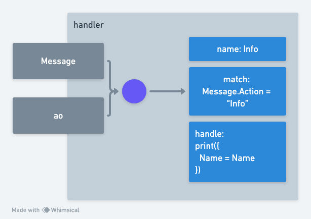

<!-- # Processes -->

# プロセス

<!-- Processes possess the capability to engage in communication via message passing, both receiving and dispatching messages within the network. Additionally, they hold the potential to instantiate further processes, enhancing the network's computational fabric. This dynamic method of data dissemination and interaction within the network is referred to as a 'holographic state', underpinning the shared and persistent state of the network. -->

プロセスは、メッセージパッシングを通じて通信を行う能力を持っており、ネットワーク内でメッセージの受信と送信を行うことができます。さらに、プロセスは他のプロセスを新たにインスタンス化する能力も持ち、ネットワークの計算基盤を拡張します。このネットワーク内での動的なデータの伝達と相互作用の方法は「ホログラフィック状態」と呼ばれ、ネットワークの共有および永続的な状態を支えるものです。


<!-- When building a Process with `aos` you have the ability to add `handlers`, these handlers can be added by calling the `Handlers.add` function, passing a "name", a "match" function, and a "handle" function. -->

`aos`でプロセスを構築する際、`handlers`を追加することができます。これらのハンドラは、`Handlers.add`関数を呼び出し、「name」、「match」関数、および「handle」関数を渡すことで追加できます。



<!-- The core module contains a helper library that gets injected into the handler function, this library is called `ao`. -->

コアモジュールには、ハンドラ関数に注入されるヘルパーライブラリが含まれており、このライブラリは`ao`と呼ばれます。

```lua
{
    env = {
        Process = {
            Id = "5WzR7rJCuqCKEq02WUPhTjwnzllLjGu6SA7qhYpcKRs",
            Owner = "_r9LpP4FtClpsGX3TOohubyaeb0IQTZZMcxQ24tTsGo",
            Tags = {...}
        },
        Module = {
            Id = "UAUszdznoUPQvXRbrFuIIH6J0N_LnJ1h4Trej28UgrE",
            Owner = "_r9LpP4FtClpsGX3TOohubyaeb0IQTZZMcxQ24tTsGo",
            Tags = {..}
        }
    },
    id = "5WzR7rJCuqCKEq02WUPhTjwnzllLjGu6SA7qhYpcKRs",
    isTrusted = "function: 0x5468d0",
    result = "function: 0x547120",
    send = "function: 0x547618",
    spawn = "function: 0x5468b0"
}
```

この`ao`ヘルパーで注目すべき主な関数は次のとおりです。

- ao.send(Message) - メッセージをプロセスに送信します
- ao.spawn(Module, Message) - 新しいプロセスを作成します

## Ethereumで署名されたプロセスまたはモジュール

`ao`の`Process`または`Module`において、[ANS-104 DataItem](https://specs.g8way.io/?tx=xwOgX-MmqN5_-Ny_zNu2A8o-PnTGsoRb_3FrtiMAkuw)がEthereumのキーを使用して署名された場合、  
それぞれ`env.Process.Owner`または`env.Module.Owner`フィールドの値は、署名者の[EIP-55](https://github.com/ethereum/ercs/blob/master/ERCS/erc-55.md)準拠のEthereumアドレスになります。  
例えば：`0xfB6916095ca1df60bB79Ce92cE3Ea74c37c5d359`

## ao.send Example

```lua
ao.send({
    Target = Chatroom,
    Action = "Broadcast",
    Data = "Hello from my Process!"
})
```

## ao.spawn Example

```lua
ao.spawn(ao.env.Module.Id, {
    ["Memory-Limit"] = "500-mb",
    ["Compute-Limit"] = "900000000000000000"
})
```

## ao.env

> NOTE: `ao.env` is important context data that you may need as a developer creating processes.

The `ao.env` property contains the `Process` and `Module` Reference Objects

```lua
env = {
    Process = {
        Id = "5WzR7rJCuqCKEq02WUPhTjwnzllLjGu6SA7qhYpcKRs",
        Owner = "_r9LpP4FtClpsGX3TOohubyaeb0IQTZZMcxQ24tTsGo",
        Tags = {...}
    },
    Module = {
        Id = "UAUszdznoUPQvXRbrFuIIH6J0N_LnJ1h4Trej28UgrE",
        Owner = "_r9LpP4FtClpsGX3TOohubyaeb0IQTZZMcxQ24tTsGo",
        Tags = {..}
    }
}
```

`Process`と`Module`の両方は、`ao`データプロトコルの属性を含んでいます。

## まとめ

ネットワーク内のプロセスは、メッセージパッシングを通じて通信し、新しいプロセスを作成することで、共有および永続的なデータの「ホログラフィック状態」に貢献します。開発者は、`aos`を使用して特定のname、match、およびhandle関数を用いて`Handlers.add`関数でハンドラを追加することでプロセスを構築できます。コアモジュール内の`ao`ヘルパーライブラリは、このプロセスを支援し、メッセージを送信するための`ao.send`や、新しいモジュールを作成するための`ao.spawn`、そして重要な`ao.env`プロパティを提供します。`ao.env`には、プロセスとモジュールに関する重要な情報が含まれています。`ao`データプロトコルは、これらの要素の構造と属性を定義しています。
