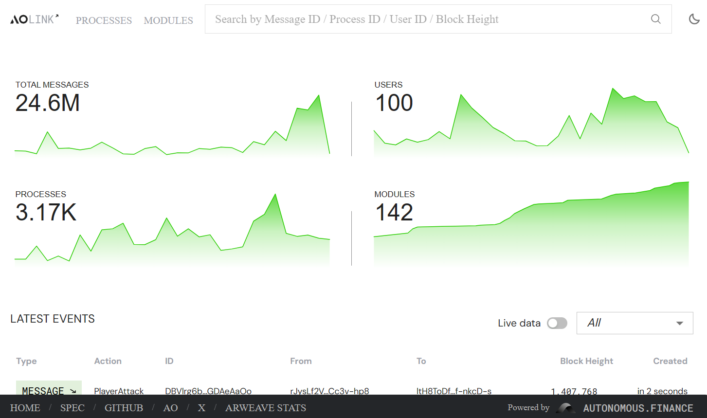
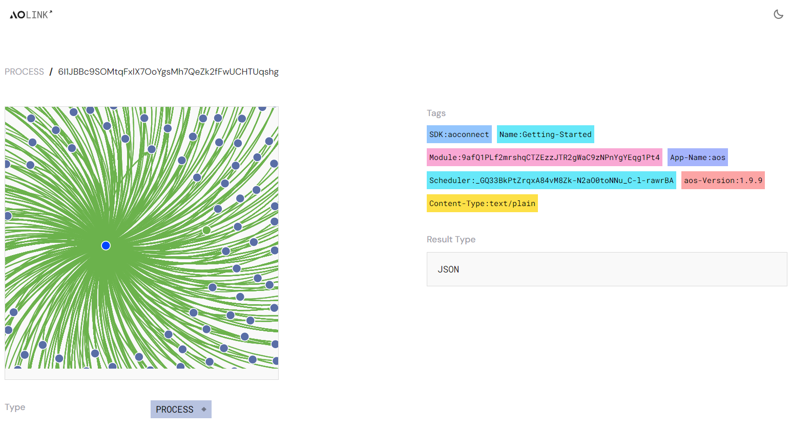
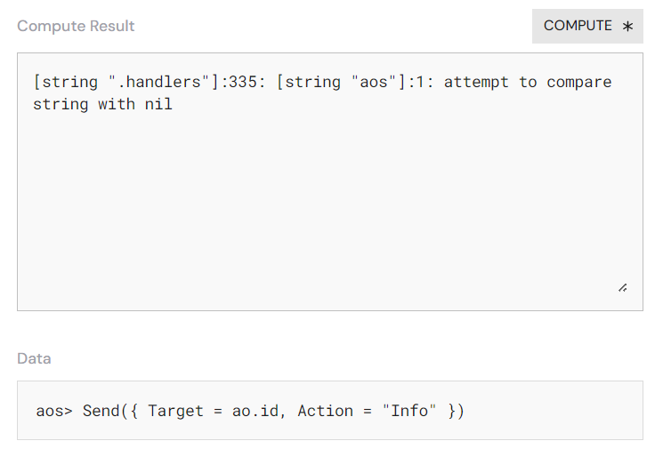
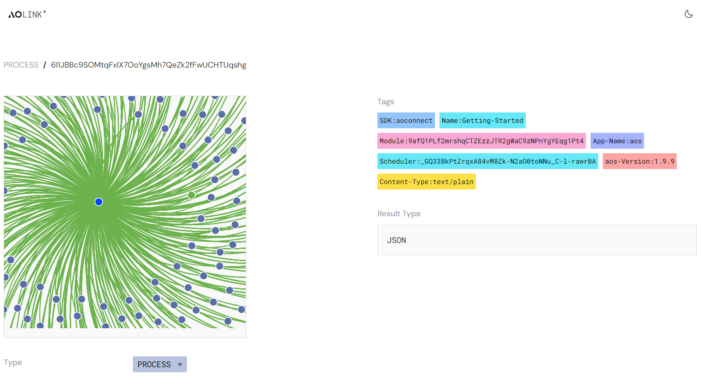
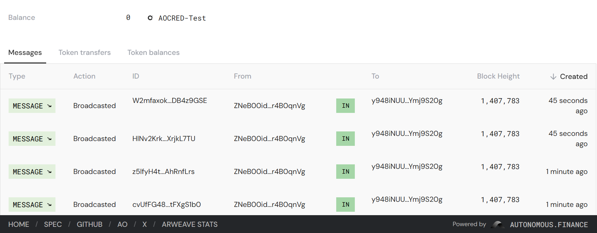

# ao.linkを使用したトラブルシューティング

分散型コンピュータとネットワークで作業する際には、自分のコードだけでなく、メッセージ、トークン残高、プロセスのトークン転送を追跡できる必要があります。ここで[https://ao.link](https://ao.link)があなたのツールボックスに不可欠なツールとなります。

## 分析

AOLinkには4つの分析指標があります：

- 総メッセージ数
- 総ユーザー数
- 総プロセス数
- 総モジュール数

これらの分析は、aoネットワークの全体的な処理の健康状態を迅速に把握するのに役立ちます。

## イベント

下部には、aoコンピュータで最近発生した最新のイベントが表示されています。スケジュールされているメッセージと実行されたメッセージのリストがあります。これらのイベントは、aoデータプロトコルタイプのいずれかです。プロセスIDまたはメッセージIDをクリックすると、それぞれの詳細を取得できます。

### メッセージの詳細

メッセージの詳細には、以下の重要な情報が含まれています：

- 送信元
- 送信先
- ブロック高
- 作成日時
- タグ
- データ
- 結果のタイプ
- データ

さらにトラブルシューティングやデバッグを行いたい場合は、「Compute」をクリックしてCU（計算ユニット）の結果を確認するオプションがあります。

リンクされたメッセージをさらに理解することもできます。

### プロセスの詳細

プロセスの詳細には、プロセスに関する情報が提供されており、どのモジュールからインスタンス化されたかを示すタグを見るのに便利です。左側には、グラフで表示されたプロセスとのインタラクションが見えます。この場合、これはDevChatであり、登録やメッセージのブロードキャストによって相互作用したすべてのプロセスが表示されています。

「Fetch」ボタンを押すことで、Info Handlerを簡単にチェックできます。

下部にはプロセスの残高や送信されたすべてのメッセージが表示されており、タブを使用してトークンの転送とトークンの残高に分けるオプションがあります。

## さらなる質問は？

ao.linkに関するすべての質問やサポートについては、自律ファイナンスのコミュニティDiscordに気軽にお問い合わせください。
https://discord.gg/4kF9HKZ4Wu

## まとめ

AOLinkは、aoコンピュータ内のイベントを追跡するための優れたツールです。ぜひ試してみてください。また、パーマウェブに別のスキャナーツールも利用可能です：https://ao_marton.g8way.io/ - ぜひチェックしてください！
