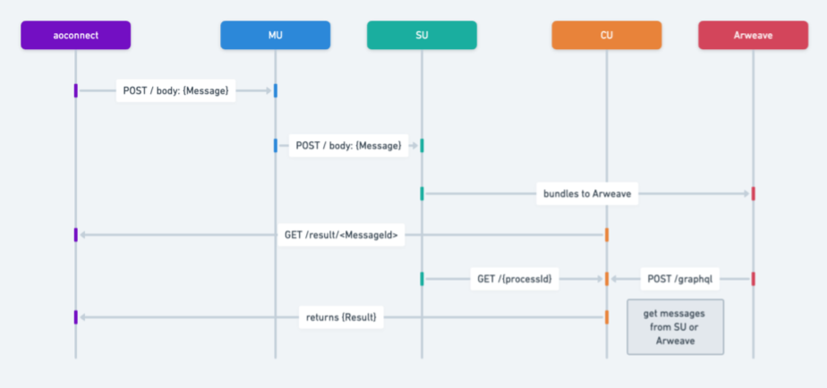

# 消息

消息作为 ao 中的基本数据协议单元，依据 [ANS-104 DataItems](https://specs.g8way.io/?tx=xwOgX-MmqN5_-Ny_zNu2A8o-PnTGsoRb_3FrtiMAkuw) 制作而成，从而与 Arweave 的原生结构保持一致。 当消息体进入进程时，其结构如下：

```lua
{
    Cron = false,
    Data = "Hello aos",
    Epoch = 0,
    From = "5WzR7rJCuqCKEq02WUPhTjwnzllLjGu6SA7qhYpcKRs",
    Id = "ayVo53qvZswpvxLlhMf8xmGjwxN0LGuHzzQpTLT0_do",
    Nonce = 1,
    Owner = "z1pq2WzmaYnfDwvEFgUZBj48anUsxxN64ZjbWOsIn08",
    Signature = "...",
    Tags = {
        Type = "Message",
        Variant = "ao.TN.1",
        ["Data-Protocol"] = "ao",
        ["From-Module"] = "lXfdCypsU3BpYTWvupgTioLoZAEOZL2_Ihcqepz6RiQ",
        ["From-Process"] = "5WzR7rJCuqCKEq02WUPhTjwnzllLjGu6SA7qhYpcKRs"
    },
    Target = "5WzR7rJCuqCKEq02WUPhTjwnzllLjGu6SA7qhYpcKRs",
    Timestamp = 1704936415711,
    ["Block-Height"] = 1340762,
    ["Forwarded-By"] = "z1pq2WzmaYnfDwvEFgUZBj48anUsxxN64ZjbWOsIn08",
    ["Hash-Chain"] = "hJ0B-0yxKxeL3IIfaIIF7Yr6bFLG2vQayaF8G0EpjbY"
}
```

该架构将任务类型与消息类型合并，使进程能够全面了解消息的上下文，以便进行有效的处理。

下面是发送消息时，消息在 ao 计算机内流转的流程图。



消息工作流程从 MU（信使单元）开始，消息的签名在此处进行验证。紧接着，SU（调度程序单元）为消息分配 Epoch 和 Nonce，将消息与任务类型捆绑在一起，并将其分发给 Arweave。 随后，`aoconnect` 库从 CU（计算单元）拿到结果。 然后，CU 从 SU（调度器单元）读取此前流转到当前消息 Id 的所有消息，处理它们以推断出结果。 完成后，计算结果被传送回给 `aoconnect`，`aoconnect` 库被集成在 `aos` 等客户端接口中。

## 概括

消息作为 ao 网络的主要数据协议类型，利用 Arweave 原生的 ANS-104 数据项。消息包含多个字段，包括数据内容、来源、目标以及签名和随机数等加密元素。 接着他们被发给信使单元 (MU) ，以确保它们经过签名，通过调度器单元 (SU) 对它们进行时间戳和排序，然后捆绑并发布到 Arweave。 然后，`aoconnect` 库从计算单元 (CU) 读取结果，CU 通过处理消息来计算出结果后通过 `aoconnect` 发回响应，供 `aos` 等客户端使用。 CU 是这些进程的执行环境。
