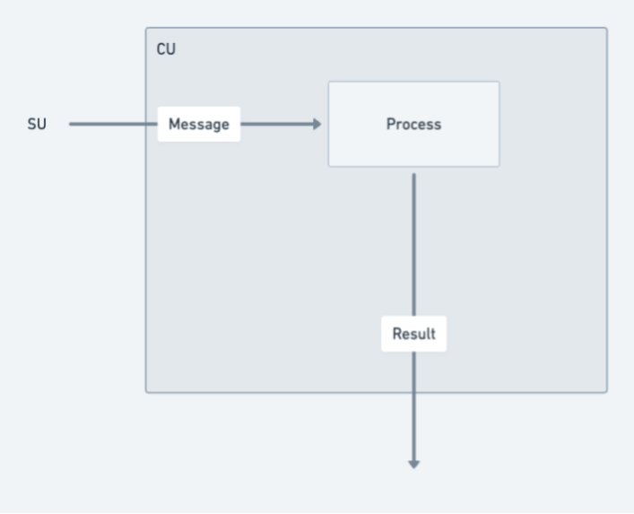
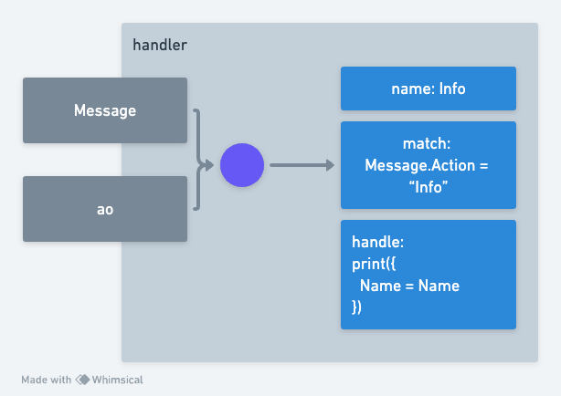

# 进程

进程之间具有通过消息传递进行通信的能力，包括在网络内接收和发送消息。 此外，它们还具有实例化更多进程的潜力，从而增强网络的计算结构。这种网络内数据传播和交互的动态方法被称为 `全息状态`，支撑网络状态的共享和持久化。



当使用 `aos` 构建进程时，你可以添加`处理程序`(`handlers`)，可以通过调用 `Handlers.add` 函数并传递 “name”、“match”函数和“handle”函数来添加这些处理程序。



核心模块包含一个注入到处理函数中的帮助程序库，该库称为 `ao`。

```lua
{
    env = {
        Process = {
            Id = "5WzR7rJCuqCKEq02WUPhTjwnzllLjGu6SA7qhYpcKRs",
            Owner = "_r9LpP4FtClpsGX3TOohubyaeb0IQTZZMcxQ24tTsGo",
            Tags = {...}
        },
        Module = {
            Id = "UAUszdznoUPQvXRbrFuIIH6J0N_LnJ1h4Trej28UgrE",
            Owner = "_r9LpP4FtClpsGX3TOohubyaeb0IQTZZMcxQ24tTsGo",
            Tags = {..}
        }
    },
    id = "5WzR7rJCuqCKEq02WUPhTjwnzllLjGu6SA7qhYpcKRs",
    isTrusted = "function: 0x5468d0",
    result = "function: 0x547120",
    send = "function: 0x547618",
    spawn = "function: 0x5468b0"
}
```

在这个 `ao` 辅助库中要查看的主要函数是

- ao.send(Message) - 向进程发送消息
- ao.spawn(Module, Message) - 创建一个新进程

## ao.send 示例

```lua
ao.send({
    Target = Chatroom,
    Action = "Broadcast",
    Data = "Hello from my Process!"
})
```

## ao.spawn 示例

```lua
ao.spawn(ao.env.Module.Id, {
    ["Memory-Limit"] = "500-mb",
    ["Compute-Limit"] = "900000000000000000"
})
```

## ao.env

> 注意：`ao.env` 是开发人员创建进程时可能要用到的重要上下文数据。

`ao.env` 属性包含 `Process` 和 `Module` 引用对象

```lua
env = {
    Process = {
        Id = "5WzR7rJCuqCKEq02WUPhTjwnzllLjGu6SA7qhYpcKRs",
        Owner = "_r9LpP4FtClpsGX3TOohubyaeb0IQTZZMcxQ24tTsGo",
        Tags = {...}
    },
    Module = {
        Id = "UAUszdznoUPQvXRbrFuIIH6J0N_LnJ1h4Trej28UgrE",
        Owner = "_r9LpP4FtClpsGX3TOohubyaeb0IQTZZMcxQ24tTsGo",
        Tags = {..}
    }
}
```

`Process` 和 `Module` 都包含 `ao` 数据协议的属性。

## 概括

网络中的进程通过消息传递进行通信，并且可以创建新进程，从而形成共享和持久数据的 `"全息状态"`。 开发人员可以使用 `aos` 构建进程，通过 `Handlers.add` 函数添加具有特定名称、以及匹配和处理函数的处理程序。 核心模块中的 `ao` 辅助库有助于此过程，提供 `ao.send` 函数来分发消息以及 `ao.spawn` 函数来创建新模块，以及同等重要的 `ao.env` 属性，它包含进程和模块的必要信息。`ao` 数据协议概述了这些元素的结构和属性。
