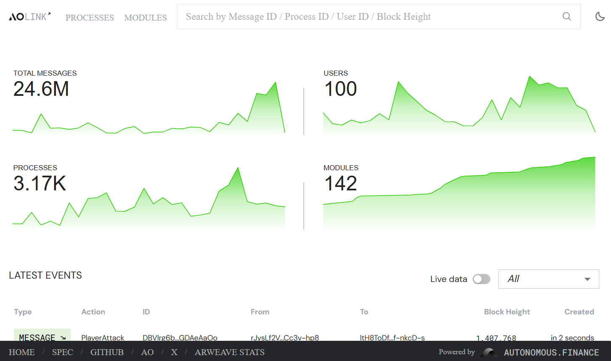
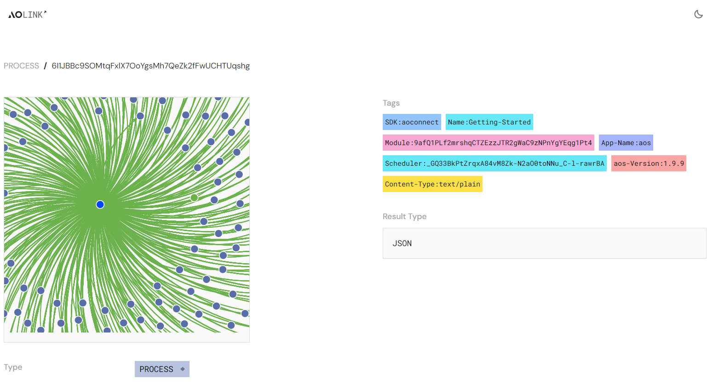

# Troubleshooting using ao.link

Working with a decentralized computer and network, you need to be able to troubleshoot more than your own code. You need to be able to track messages and processes. This is where [https://ao.link](https://ao.link) becomes an essential tool in your toolbox.

## Analytics

AOLink has a set of 4 analytic measures:

- Total Messages
- Total Users
- Total Processes
- Total Modules

These analytics give you a quick view into the ao network's total processing health.

## Events

Below, the analytics are the latest events that have appeared on the ao computer. You have a list of messages being scheduled and that have been executed. These events are any of the ao Data Protocol Types. And you can click on the Process ID or the Message ID to get details about each.

### Message Details

The message details give you key details about:

- From
- To
- Block Height
- Created
- Tags
- Data
- Result Type
- Data

If you want to further troubleshoot and debug, you have the option to look at the result of the CU (Compute Unit) by clicking on "Compute".

### Process Details

The process details provide you with information about the process it's useful to see in the tags with what module this got instantiated from.
If you notice on the left you see the interaction with the process displayed on a graph.
In this case, this is DevChat, and you can see all the processes that have interacted by Registering and Broadcasting Messages.

## Further Questions?

Feel free to reach out on the community Discord of DataOS.
https://discord.gg/4kF9HKZ4Wu

## Summary

AOLink is an excellent tool for tracking events in the ao computer. Give it a try. Also, there is another scanner tool available on the permaweb: https://ao_marton.g8way.io/ - check it out!
