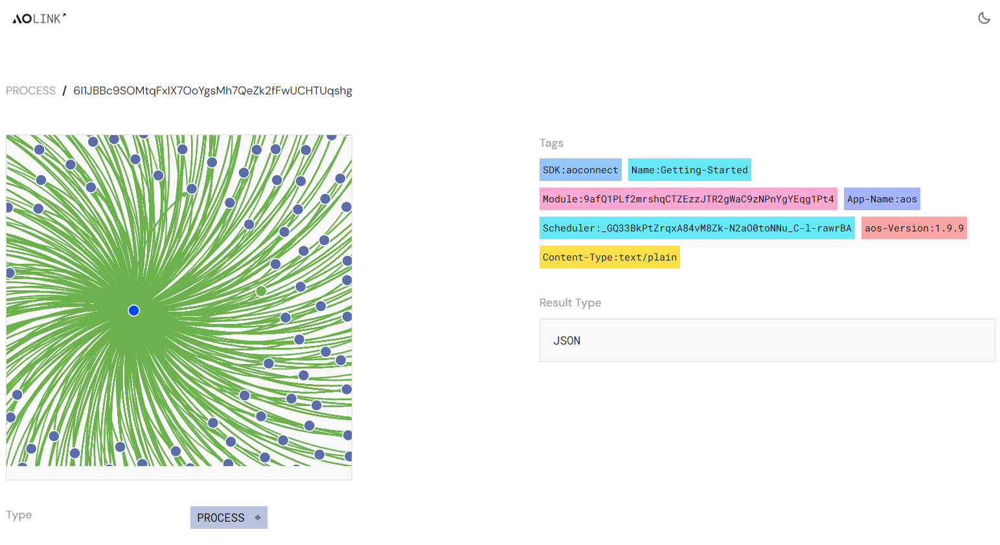

# 使用 ao.link 进行 Debug

使用去中心计算机和网络，你必须可以排查自己代码之外的问题。你需要跟踪进程和消息，这就是 [https://ao.link](https://ao.link) 工具箱的必要之处。

## 分析

AOLink 4种分析指标:

- 消息总数 Total Messages
- 用户总数 Total Users
- 进程总数 Total Processes
- 模块总数 Total Modules

这些指标可以让你快速了解 ao 网络的总体运行状况。

## 事件 Events

下面是 ao 计算机里的最新事件。 它们是一个已执行的消息列表。 这些事件可以是任何 ao 数据协议类型。 你可以单击进程 ID 或消息 ID 来获取详细信息。

### 消息细节

The message details give you key details about:
消息细节包括以下关键信息：

- From
- To
- Block Height
- Created
- Tags
- Data
- Result Type
- Data

如果你想进一步排除故障和调试，你可以通过单击 “Compute” 来查看 CU（计算单元）的结果。

### 进程细节

进程细节提供进程的详细信息，在标签（Tag）中查看该进程的实例化所使用的各个模块，这非常有用
左侧的图表显示的是进程的交互图。
在本例中，这是 DevChat，你可以看到通过注册和广播消息进行交互的所有进程。
这个例子是 DevChat 进程的实例，你可以看到通过注册和消息广播与之交互的所有进程

## 更多问题?

请随时访问 DataOS 的 Discord 社区。
https://discord.gg/4kF9HKZ4Wu

## 总结

AOLink 是一款很好的工具，用于追踪 ao 计算机中的事件，请试一试。此外 permaweb 上还有另一个扫描工具：https://ao_marton.g8way.io/ - 试一试吧！
