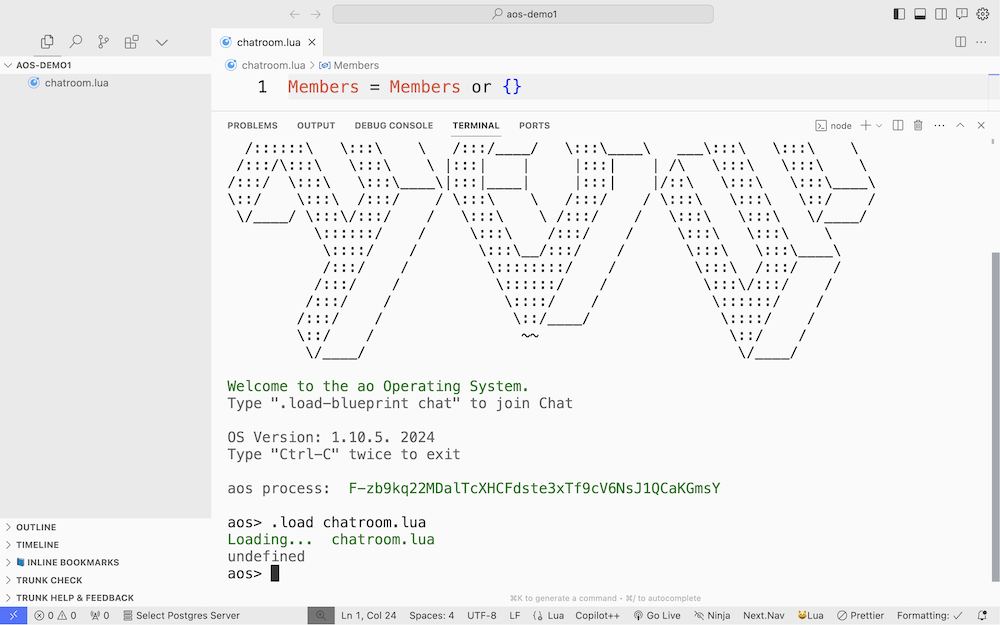
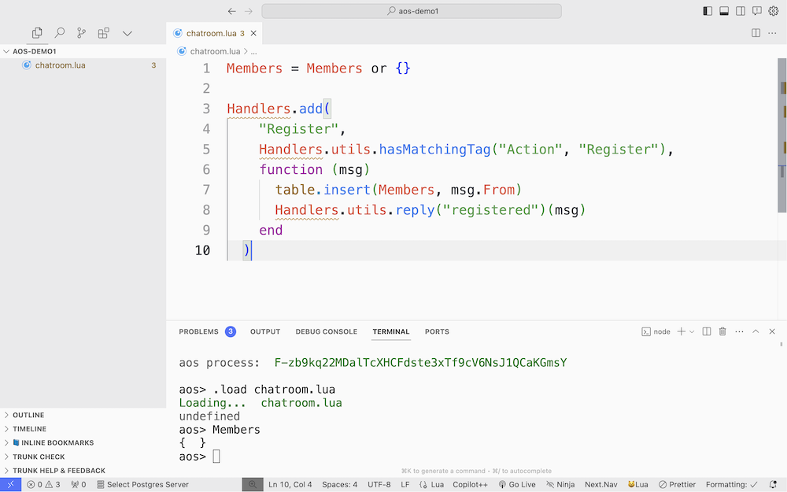

# 在 aos 中建立一个聊天室

::: info
如果你想学习如何在 `ao` 中创建聊天室，你至少需要了解发送和接收消息的基本方法。如果还没有，建议你先查看[消息传递](messaging)教程。
:::

在本教程中，我们将使用 Lua 脚本语言在 `ao` 中构建一个聊天室。 聊天室将具有两个主要功能：

1. **注册**：允许进程加入聊天室。
2. **广播**：从一个进程向所有注册参与者发送消息。

让我们首先为我们的聊天室建立框架。

## 视频教程

<iframe width="680" height="350" src="https://www.youtube.com/embed/oPCx-cfubF0?si=D5yWxmyFMV-4mh2P" title="YouTube video player" frameborder="0" allow="accelerometer; autoplay; clipboard-write; encrypted-media; gyroscope; picture-in-picture; web-share" allowfullscreen></iframe>

## 第 1 步：基础

- 打开你喜欢的代码编辑器。

::: info
你可能会发现在代码编辑器中安装[推荐插件](../../references/editor-setup.md) 有助于增强你的 Lua 脚本编写体验。
:::

- 创建一个名为 `chatroom.lua` 的文件。


## 步骤 2：创建成员列表

- 在 `chatroom.lua` 中，你将首先初始化一个列表来跟踪参与者：

  ```lua
  Members = Members or {}
  ```


- 保存 `chatroom.lua` 文件

## 步骤 3：将聊天室加载到 aos 中

保存 `chatroom.lua` 后，将聊天室代码加载到 `aos` 中。

- 如果你尚未启动 `aos`，请在终端中保存 chatroom.lua 的目录中启动
- 在 `aos` CLI 中，键入以下脚本以将你的脚本加载到 `aos` 进程中：

  ```lua
  .load chatroom.lua
  ```

  

  如上面的屏幕截图所示，你可能会收到 `undefined` 响应。该返回没有问题，但我们仍然希望确保文件正确加载。

  ::: info
  在 aos 的 Lua 求值环境中，当你执行一段没有显式返回值的代码时，`undefined` 是标准响应，表示没有返回结果。在加载资源或执行操作时可以观察到这一点。例如，执行 `X = 1` 将产生 `undefined`，因为该语句不包含 return 语句。

  但是，如果执行 `X = 1; return X`，环境将返回值 `1`。 在此框架内工作时，理解这种行为至关重要，因为它有助于澄清执行修改状态的命令与旨在产生直接输出的命令之间的区别。
  :::

- 在 `aos` 中输入 `Members` 或你为用户列表命名的任何内容。 它应该返回一个空数组 `{}`。

  

  如果你看到一个空数组，则你的脚本已成功加载到 `os` 中。

## 步骤 4：创建聊天室功能

### 注册 handler

注册 handler 将允许进程加入聊天室。

1. **添加注册 handler:** 使用以下代码修改 `chatroom.lua` 以包含 `Members` 的handler以注册到聊天室：

   ```lua
   -- 修改 `chatroom.lua` 以包含 `Members` 的handler
   -- 使用以下代码注册聊天室：

   Handlers.add(
     "Register",
     Handlers.utils.hasMatchingTag("Action", "Register"),
     function (msg)
       table.insert(Members, msg.From)
       Handlers.utils.reply("registered")(msg)
     end
   )
   ```

   

   该handler将允许进程通过响应标签 `Action = "Register"` 来注册到聊天室。注册成功后，将显示一条打印消息确认 `registered`。

2. **重新加载并测试：** 让我们将自己注册到聊天室，并重新加载和测试脚本。

   - 使用 `.load chatroom.lua` 在 aos 中保存并重新加载脚本。
   - 检查注册 handler 是否加载了以下脚本：

   ```lua
   Handlers.list
   ```

   

   这将返回聊天室应用中所有 handler 列表。 由于这很可能是你第一次在 `aos` 中进行开发，因此你应该会看到一个名为 `Register` 的 handler。

   - 让我们通过注册自己到聊天室来测试注册过程：

   ```lua
   Send({ Target = ao.id, Action = "Register" })
   ```

   如果成功，你应该会看到一条 `message added to your outbox` 信息，然后你会看到一条新的打印消息，上面写着 `registered`。

   

   - 最后，让我们检查一下是否已成功添加到 `Members` 列表中：

   ```lua
   Members
   ```

   如果成功，你现在将在 `Members` 列表中看到你的进程 ID。

   

### 添加广播 handler

现在你已经有了一个聊天室，让我们创建一个handler，允许你向聊天室的所有成员广播消息。

- 将以下 handler 添加到 `chatroom.lua` 文件中：

  ```lua
  Handlers.add(
    "Broadcast",
    Handlers.utils.hasMatchingTag("Action", "Broadcast"),
    function (msg)
      for _, recipient in ipairs(Members) do
        ao.send({Target = recipient, Data = msg.Data})
      end
      Handlers.utils.reply("Broadcasted.")(msg)
    end
  )
  ```

  该 handler 将允许你向聊天室的所有成员广播消息。

- 让我们通过向聊天室发送消息来测试广播 handler：

  ```lua
  Send({Target = ao.id, Action = "Broadcast", Data = "Broadcasting My 1st Message" })
  ```

  - 如果成功，你应该会看到一条 `message added to your outbox`，然后你会看到一条新的打印消息，上面写着 `Broadcasting My 1st Message`，因为你是聊天室中的成员`Members`，所以可以收到消息。

## 步骤 5：邀请 Morpheus 加入聊天室

现在你已成功注册自己到聊天室，让我们邀请 Morpheus 加入我们的聊天室。 为此，我们将向他发送邀请，来将他注册到聊天室。

Morpheus 是一个自主代理，其handler将响应标签 `Action = "Join"`，然后让他使用你的 `Register` 标签注册到聊天室。

- 让我们向 Morpheus 发送加入聊天室的邀请：

  ```lua
  Send({ Target = Morpheus, Action = "Join" })
  ```

- 要确认 Morpheus 已加入聊天室，请检查 `Members` 列表：

  ```lua
  Members
  ```

  如果成功，你将收到来自 Morpheus 的广播消息。

## 步骤 6：邀请 Trinity 加入聊天室

Morpheus 将向你提供 Trinity 的进程 ID，并告诉你邀请她加入聊天室。使用下列命令查看 Morpheus 的消息：

```lua
Inbox[#Inbox].Data
```

使用 Morpheus 相同的流程将她的进程 ID 保存为 `Trinity` 并邀请她加入聊天室。

如果她成功加入聊天室，她就会向你提出下一个挑战，创建一个[代币](token)。

## 让其他人加入聊天室

### 引导其他人

- 邀请 aos 用户：
  鼓励其他 aos 用户加入你的聊天室。 他们可以注册到你的聊天室并进行消息广播。

- 提供加入说明：
  与他们共享一个简单的脚本以方便入门：

```lua
-- 嘿，我们在 aos 上聊天吧！ 在你的 aos 环境中发送以下命令来加入我的聊天室：
Send({ Target = [Your Process ID], Action = "Register" })
-- 然后，你可以使用以下方式广播消息：
Send({Target = [Your Process ID], Action = "Broadcast", Data = "Your Message" })
```

## 下一步

恭喜！ 你已在 `ao` 中成功建立了一个聊天室，并邀请了 Morpheus 加入你。你还创建了一个广播 handler 用于向聊天室的所有成员发送消息。

接下来，你将继续与 Morpheus 互动，但这次你将在对话中添加 Trinity。她将带领你应对接下来的挑战。 祝你好运！
