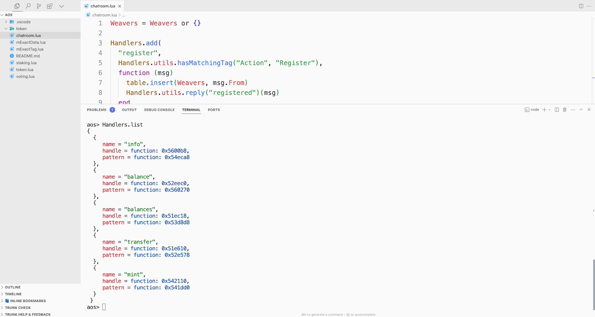

# 创建 token

::: info
你现在已经准备好创建自己的 token ，token 是去中心化世界里价值和交换的象征。在学习如何创建 token 之前，请务必去学习下[消息传递](messaging)和[创建聊天室](chatroom) 课程。
:::

创建 token 时，我们将继续使用 `ao` 中的 [Lua 语言](../../references/lua.md) 来铸造一个 token ，并遵循 [token 规范](../../references/token.md) 中的原则。

## Video Tutorial

<iframe width="680" height="350" src="https://www.youtube.com/embed/yge5Oo7K1vM?si=f3vt2eAbL3ON-DBz" title="YouTube video player" frameborder="0" allow="accelerometer; autoplay; clipboard-write; encrypted-media; gyroscope; picture-in-picture; web-share" referrerpolicy="strict-origin-when-cross-origin" allowfullscreen></iframe>

## 继续深入兔子洞

在我们上一篇教程[创建聊天室](chatroom)中，我们学习了如何在 `ao` 中创建一个聊天室，邀请 `Morpheus` 和 `Trinity` 到我们创建的聊天室，然后 `Trinity` 现在要求我们为她创建一个 token ，以证明我们值得继续深入兔子洞。

**让我们开始吧。**

## 创建 token 的两种途径

创建 token 时有两条路径可供选择：

1. **使用蓝图(Bludprint)**：这是一个预制的模板，可以帮助你在 `ao` 中快速构建 token 。这是一种很好的入门方式，并且可以根据你的需求进行定制。

   点击此处了解有关[ token 蓝图](../../guides/aos/blueprints/token.md)的更多信息。

2. **手动创建**：这是从头开始在 `ao` 中构建 token 的分步指南。这条路径适合那些想要了解 token 内部运作以及如何从头开始构建 token 的人。

   请在此处查看完整的[创建 token ](../../guides/aos/token.md)指南。

## 蓝图方法

在本教程中，我们将使用 token 蓝图为 `Trinity` 创建 token 。 这是一个预先设计的模板，可帮助你在 `ao` 中快速构建 token 。

### 如何使用 token 蓝图

1. 确保你的终端运行在教程前面的步骤的同一目录中。
2. 打开终端。
3. 启动 `aos` 进程。
4. 输入 `.load-blueprint token`

这将加载 token 函数到 `ao` 的 handler。 请务必注意， 你也可以自行创建其他 token 代码取代蓝图代码。

### 验证蓝图是否已加载

输入 `Handlers.list` 以查看新加载的handler。

你应该看到已加载到 `aos` 进程中的新handler列表。 如果你一直遵循本教程中前面的步骤，除了 token handler 之外，你还应该看到聊天室的 handler。

**例子：**



### 测试 token

现在 token 蓝图已加载，我们可以通过使用 `Action = "Info"` 标签向自己发送消息来测试 token。

```lua
Send({ Target = ao.id, Action = "Info" })
```

这将向控制台打印一条消息，但要读取该消息，我们需要从最新消息中调用 `.Data`。

```lua
Inbox[#Inbox].Data

-- 将 `#Inbox` 替换为最后收到的消息的编号。
```

这会将 token 信息打印到控制台。它应该显示你的可用 token 的总余额。

### 向 Trinity 发送 token

现在我们已经测试了 token 并且它按预期工作，我们可以将一些 token 发送到 `Trinity`。 我们将使用 `Action = "Transfer"` 标签向 `Trinity` 发送 1000 个 token 。

```lua
Send({ Target = ao.id, Action = "Transfer", Recipient = Trinity, Quantity = "1000"})
```

当 `Trinity` 收到 token 时，她将用一条消息响应此转账，以确认她已收到 token 。

她的回应看起来像这样：

`Trinity:` "Token received. Interesting. I wasn't sure you'd make it this far. I'm impressed, but we are not done yet. I want you to use this token to tokengate the chatroom. Do that, and then I will believe you could be the one."

使用下列命令查看 Trinity 的消息：

```lua
Inbox[#Inbox].Data
```

你已经完成了创建 token 并将其发送给 `Trinity`。 你现在已准备好继续下一步。 [token 门控聊天室](tokengating)。
