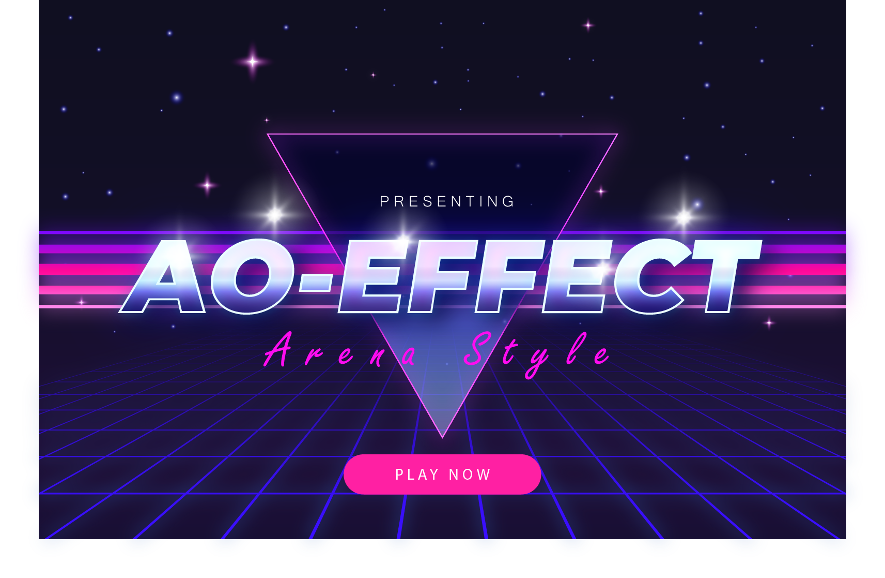

---
prev:
  text: "Bots and Games"
  link: "./index"
---

# 我们来玩个游戏吧!

你是冠军，你通过教程获得了力量！ 现在，让我们休息一下，开始一些令人兴奋的事情。 怎么样？我们来一款能为你的学习之旅增添乐趣的游戏！



## 什么样的游戏？

`ao-effect` 是一款游戏，你可以直接从你的终端与全球好友进行实时竞赛。我们为这次冒险建立了一个全球游戏进程。

规则很简单。 每个玩家一开始都在 40x40 的网格上，生命值为 100，能量为 0。随着时间的推移，你的能量会补充到最大 100。在网格中导航，找到其他玩家，在他们处于攻击范围内时，使用你的能量进行攻击。战斗将持续进行，直到只剩下一名玩家或规定的游戏结束时间。

查看[竞技场机制](arena-mechanics.md) 和[扩展竞技场](build-game.md) 指南，以更深入地了解游戏。

> 注意：如果某些命令语法看起来不熟悉，请不要担心。专注于在更高层次上的目标，理解每个命令的目的，最重要的是，享受游戏！

## 准备 `ao-effect` 的冒险

要加入这场全球冒险活动，你需要做好一些准备。 别担心，就像数数 1-2-3 一样简单！

1.**安装 aos**
启动你的终端并运行：

```bash
npm i -g https://get_ao.g8way.io
```

2.**启动 aos**
接下来，创建 aos 实例：

```bash
aos
```

3.**设置游戏ID**
让我们保留我们的游戏服务器 ID 以便快速访问：

```lua
Game = "tm1jYBC0F2gTZ0EuUQKq5q_esxITDFkAG6QEpLbpI9I"
```

瞧！ 你已准备好加入游戏。

## 如何注册游戏

准备好加入了吗？ 只需几个简单的步骤：

### 注册游戏服务器

`ao` 中进程之间的所有通信都是通过消息进行的。要注册，请将此消息发送到游戏服务器：

```lua
Send({ Target = Game, Action = "Register" })
```

这会将你置于 `Waiting` 大厅。需要支付少量费用来确认你的位置。

### 确认你的位置

为了确认你的位置，你需要一些代币。你可以通过向游戏发送以下消息来获取它们：

```lua
Send({ Target = Game, Action = "RequestTokens"})
```

收到代币后，请通过支付游戏入场费来确认你的位置，如下所示：

```lua
Send({ Target = Game, Action = "Transfer", Recipient = Game, Quantity = "1000"})
```

等待几秒钟，你将在终端中看到有关玩家付款和状态的实时更新。

## 让游戏开始

### 游戏机制

游戏开始：如果至少有 2 名玩家付款，则游戏在 2 分钟 `WaitTime` 后开始。不付费的玩家将被踢除。如果没有足够的玩家付费，那么付费的玩家将获得退款。

游戏开始后，玩家会随机的落到网格点上。

### 该你移动了

移动：你能做的第一件事就是移动，不需要能量！你可以向任何方向移动一个方块——上、下、左、右或对角线。除了方向之外，你还必须传递你的玩家 ID，以帮助游戏识别你的移动。就是这样：

```lua
Send({ Target = Game, Action = "PlayerMove", Player = ao.id, Direction = "DownRight"})
```

网格上可用的移动如下：

```lua
Up = {x = 0, y = -1},
Down = {x = 0, y = 1},
Left = {x = -1, y = 0},
Right = {x = 1, y = 0},
UpRight = {x = 1, y = -1},
UpLeft = {x = -1, y = -1},
DownRight = {x = 1, y = 1},
DownLeft = {x = -1, y = 1}
```

> 请记住：方向区分大小写！

如果你离开网格，你就会出现在对面。

### 出击时间到了

发起攻击：随着游戏的进行，你会积累能量。 用它攻击 3x3 网格范围内的其他玩家。 你的攻击不会伤害你自己，但会影响范围内的其他人。

```lua
Send({ Target = Game, Action = "PlayerAttack", Player = ao.id, AttackEnergy = "energy_integer"})
```

生命值从 100 开始，并随着其他玩家的攻击而减少。 达到 0 时，游戏就结束了。

## 总结一下

当只剩下一名玩家或游戏时间到时，游戏结束。获胜者将获得奖励，然后返回大厅进行另一轮比赛。

喜欢这个游戏吗？如果有一种方法可以让你的体验变得更好或提高你获胜的几率，该怎么办？ 查看下一篇指南来了解一下🤔
